# Taskatek Platform Design Document

## 1. Executive Summary

### 1.1 Vision
Taskatek (تاسْكاتِك) is an Arabic-first, AI-powered project management platform that replicates ClickUp's comprehensive feature set with full RTL support, enterprise scalability, and AI-native workflows through the integrated Taskatek Brain module.

### 1.2 Core Value Proposition
- **Arabic-First Experience**: RTL-native UI with seamless bilingual support
- **AI-Powered Intelligence**: Integrated Taskatek Brain for automated project management, content generation, and knowledge management
- **Enterprise Scalability**: Support for complex organizational hierarchies and 1,000+ integrations
- **Complete Feature Parity**: 15+ views, advanced automations, real-time collaboration, and comprehensive task management

### 1.3 Target Audience
- Arabic-speaking organizations and teams in GCC region
- Enterprises requiring Arabic-native project management tools
- Teams needing AI-assisted project planning and execution
- Organizations using Zoho, Odoo, SAP requiring seamless integration

## 2. System Architecture

### 2.1 Architecture Overview

**Three-Tier Architecture Pattern**

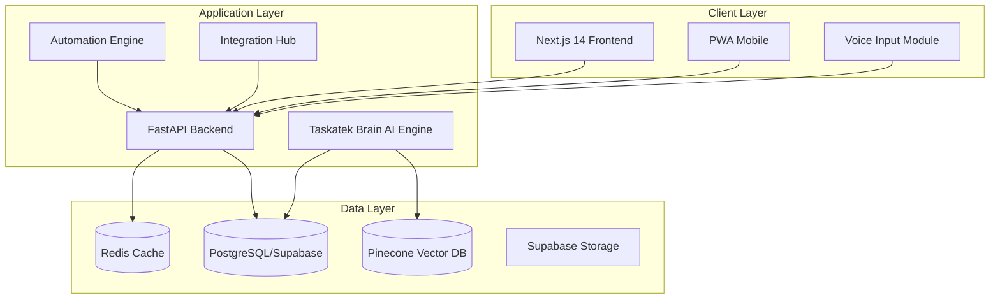

### 2.2 Technology Stack Rationale

| Component | Technology | Justification |
|-----------|-----------|---------------|
| Frontend Framework | Next.js 14 (App Router) | Server-side rendering for RTL, optimal SEO for Arabic content, automatic code splitting |
| UI Layer | Tailwind CSS + shadcn/ui | RTL-first configuration, component reusability, Arabic typography control |
| State Management | Zustand + React Query | Lightweight state management, optimized server state caching for real-time updates |
| Backend Framework | FastAPI | High performance for AI workflows, async support for real-time features, auto-generated API docs |
| Database | PostgreSQL (Supabase) | ACID compliance for enterprise data, built-in realtime subscriptions, Arabic text indexing |
| Caching Layer | Redis | Session management, rate limiting, real-time presence tracking |
| AI Infrastructure | LangChain + Arabic-tuned LLM | Modular agent architecture, Arabic language optimization, enterprise prompt management |
| Vector Database | Pinecone | Semantic search across Arabic content, scalable embedding storage |
| Real-time Engine | Supabase Realtime + WebSockets | Bidirectional communication, collaborative editing, presence awareness |

### 2.3 Deployment Architecture

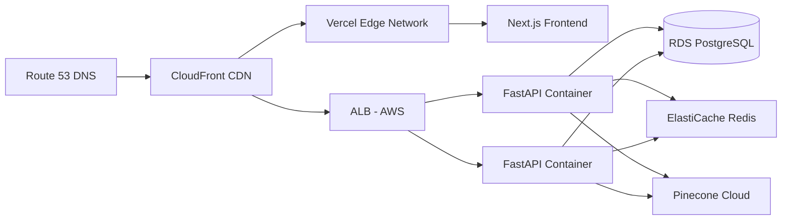

**Regional Considerations**
- Primary deployment: AWS me-central-1 (UAE) for low latency to GCC users
- CDN edge locations across Middle East
- Supabase instance in closest available region
- Compliance with local data residency requirements

## 3. Data Model Design

### 3.1 Core Entity Relationships

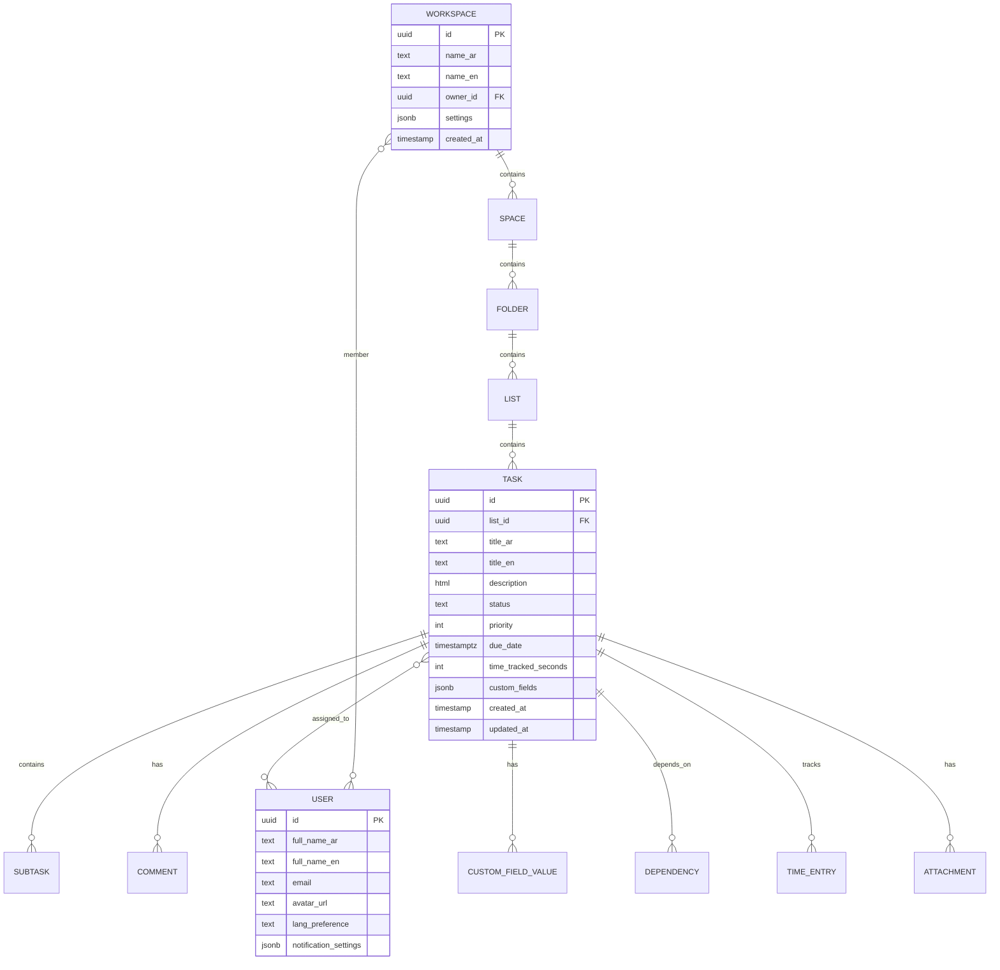

### 3.2 Bilingual Data Strategy

**Dual-Column Approach**
- All user-facing text fields maintain `_ar` and `_en` suffixes
- Application layer determines display based on user preference
- Search operations query both columns with language-specific tokenization
- Default values populate both fields to prevent null display issues

**Field Naming Convention**
```
title_ar / title_en
name_ar / name_en
description_ar / description_en
```

### 3.3 Custom Fields Architecture

**Flexible Schema Design**

| Field Type | Storage Format | Validation Rules |
|------------|----------------|------------------|
| Text | JSON: `{value: string}` | Max length configurable per field |
| Number | JSON: `{value: number}` | Min/max range validation |
| Date | JSON: `{value: ISO8601}` | Timezone-aware storage |
| Dropdown | JSON: `{value: string, options: []}` | Value must exist in options array |
| Multi-select | JSON: `{values: [string]}` | Each value validated against options |
| User | JSON: `{user_ids: [uuid]}` | Foreign key validation to profiles table |
| Label | JSON: `{label_ids: [uuid]}` | Color-coded tags with Arabic names |

**Storage Pattern**
```
tasks.custom_fields = {
  "field_uuid_1": {type: "dropdown", value: "عالي", field_name_ar: "الأولوية"},
  "field_uuid_2": {type: "number", value: 5, field_name_ar: "التقييم"}
}
```

## 4. Feature Design

### 4.1 Authentication & Authorization

**Multi-Provider Authentication Flow**

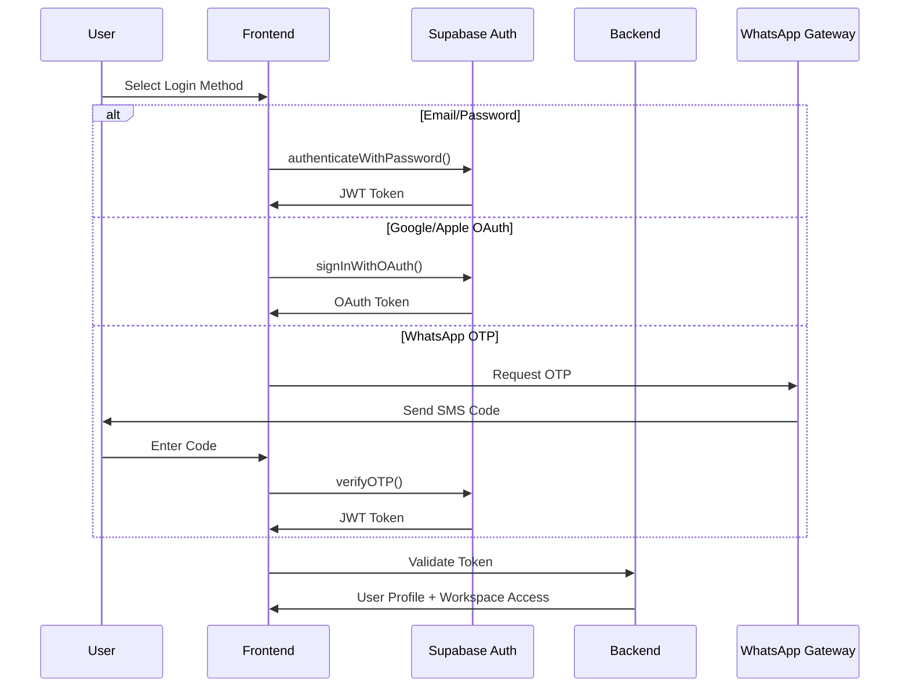

**Authorization Model**

| Role | Workspace Permissions | Task Permissions |
|------|---------------------|------------------|
| Owner | Full CRUD, billing, member management | All operations |
| Admin | CRUD spaces/folders/lists, invite members | All operations |
| Member | View assigned spaces, create tasks | Edit assigned tasks only |
| Guest | View specific tasks only | Comment only |

**Permission Inheritance**
- Workspace permissions cascade to all child spaces
- Space permissions can be overridden at folder level
- Task-level permissions for external collaborators
- Row-level security enforced at database layer

### 4.2 Hierarchy Management (Workspace → Task)

**Five-Level Hierarchy**

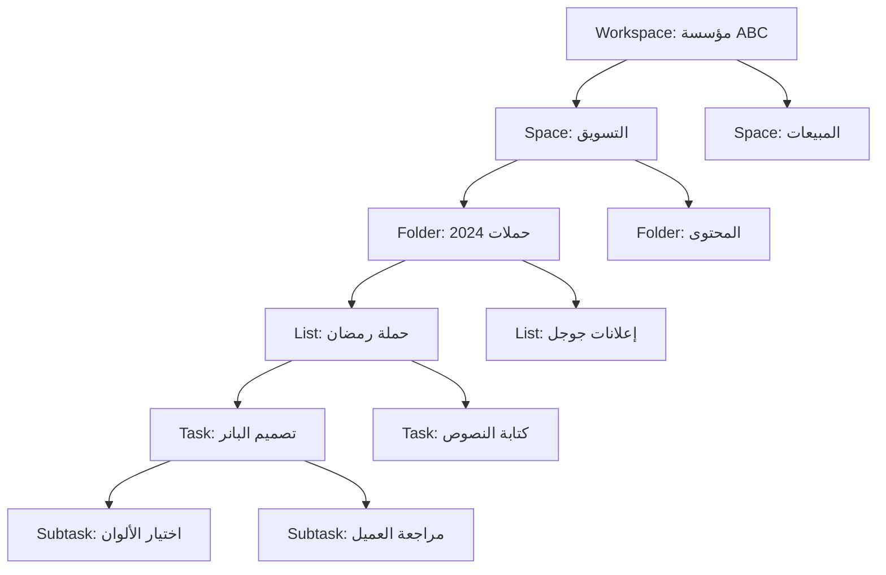

**Navigation Patterns**
- Breadcrumb trail with RTL arrow direction (←)
- Collapsible sidebar tree with Arabic indentation
- "Everything View" aggregates across entire hierarchy
- Quick switcher with fuzzy search (Arabic + English)

**Drag-and-Drop Behavior**

| Action | Validation Rule | Side Effect |
|--------|----------------|-------------|
| Move task between lists | User has edit permission on both lists | Preserve custom field values, reset status to target list's default |
| Move folder between spaces | User has admin permission | All child lists inherit new space permissions |
| Reorder tasks in list | User has view permission | Update `position` field, trigger realtime broadcast |
| Convert task to subtask | Tasks cannot be nested >2 levels deep | Inherit parent's assignees if empty |

### 4.3 Task Management System

**Task Entity Composition**

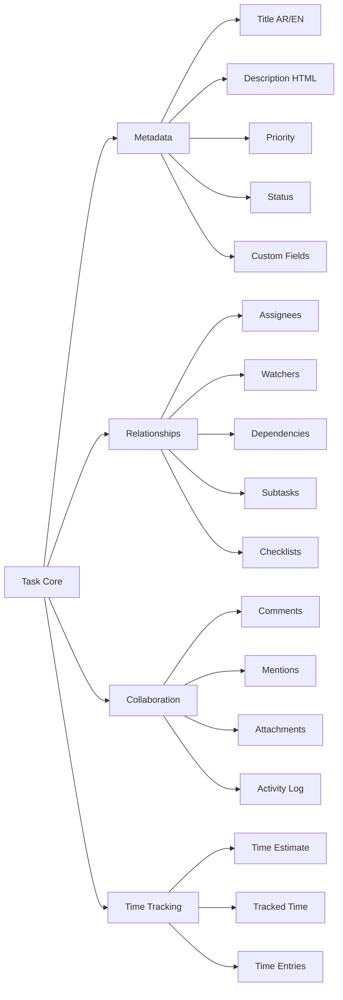

**Rich Text Editor Requirements**
- Arabic text direction auto-detection
- Support for mixed RTL/LTR content within single document
- Markdown shortcuts with Arabic equivalents
- Inline mentions: `@اسم_المستخدم` triggers autocomplete
- Paste images directly into description
- Code block syntax highlighting (for technical teams)

**Status Workflow Engine**

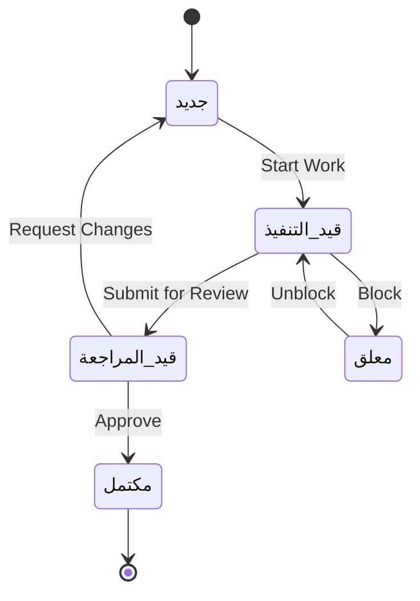

**Custom Status Configuration**
- Each list maintains its own status column definitions
- Status types: `open`, `in_progress`, `review`, `blocked`, `completed`
- Color coding with Arabic labels
- Automation triggers on status transitions

**Dependency Management**

| Dependency Type | Blocking Behavior | Notification Trigger |
|----------------|-------------------|---------------------|
| Blocks | Cannot start dependent task until blocker is completed | Notify dependent task assignee when blocker completes |
| Waiting On | Visual indicator, no hard block | Daily digest of tasks waiting on incomplete dependencies |
| Related To | Reference only, no blocking | None |

**Voice-to-Task Workflow**

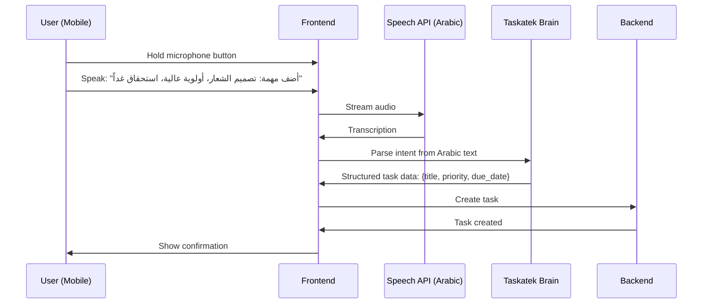

**WhatsApp Integration Flow**

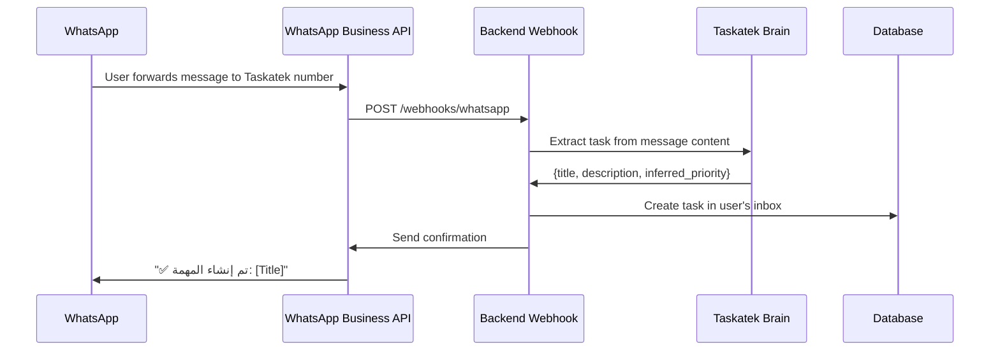

### 4.4 View System Architecture

**View Abstraction Layer**

All views consume the same underlying task data through a unified filtering and transformation pipeline:

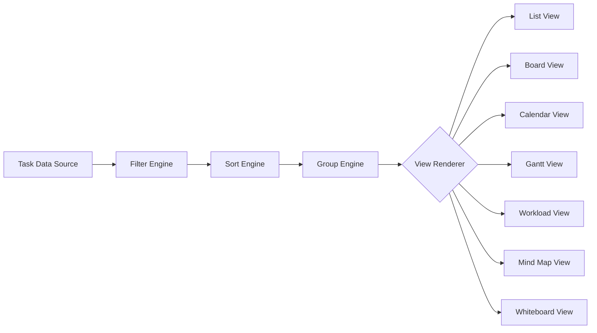

**View Configuration Schema**

Each view saves user preferences:

| Configuration | Data Type | Example |
|---------------|-----------|---------|
| Filters | Array of conditions | `[{field: "priority", operator: "equals", value: "high"}]` |
| Sort | Array of sort rules | `[{field: "due_date", direction: "asc"}]` |
| Grouping | Field name | `status`, `assignee`, `custom_field_uuid` |
| Visible Fields | Array of field IDs | `["title", "assignee", "due_date", "custom_field_1"]` |
| View-Specific Settings | JSON object | Board: `{column_field: "status"}`, Calendar: `{date_field: "due_date"}` |

**View-Specific Design**

**1. Board (Kanban) View**
- Columns represent status or custom dropdown field
- Horizontal scroll for many columns (RTL-aware)
- Drag task cards between columns to update field value
- Swim lanes for secondary grouping (e.g., by assignee)
- WIP limits with visual warnings
- Collapsed columns to save space

**2. Calendar View**
- Month/week/day modes
- RTL calendar grid (weeks start Sunday/Saturday based on locale)
- Drag to reschedule tasks
- Multi-day task spanning
- Color coding by priority/project/assignee
- Hijri calendar overlay option for Arabic users

**3. Gantt Chart View**
- Horizontal timeline with task bars
- Dependency lines between tasks
- Critical path highlighting
- Drag to adjust duration or dependencies
- Milestone markers
- Resource allocation indicators
- Baseline comparison (planned vs. actual)

**4. Workload View**
- Heat map showing team member capacity
- Time estimates aggregated per person per day
- Overallocation warnings (>8 hours/day)
- Drag tasks to reassign and balance workload
- Vacation/time-off integration

**5. Mind Map View**
- Radial tree layout with workspace/space at center
- Nodes represent tasks with click-to-expand subtasks
- Visual nesting with Arabic text in nodes
- Pan/zoom canvas
- Create tasks by adding nodes
- Export as image for presentations

**6. Whiteboard View**
- Infinite canvas for visual planning
- Sticky notes linked to tasks
- Freehand drawing with Arabic text tool
- Embed images, links, task cards
- Real-time collaborative cursors
- Templates: User story mapping, retrospectives, brainstorming

### 4.5 Collaboration Features

**Real-Time Comment System**

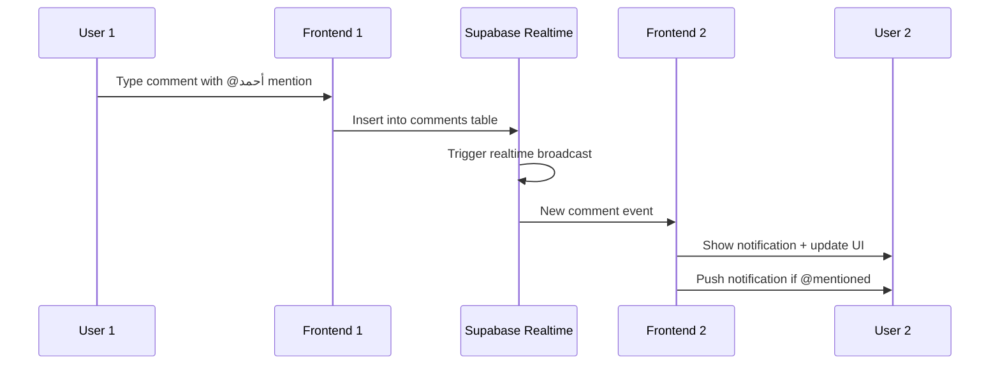

**Comment Features**
- Rich text with Arabic support
- @mentions trigger notifications and task assignment
- Emoji reactions (😊👍✅)
- Attach files to comments
- Thread replies for organized discussions
- Edit history with "edited" indicator
- Resolve threads when discussion is complete

**Arabic Mention Autocomplete**
- Triggered by `@` character
- Fuzzy search across Arabic and English names
- Show avatar + role next to name
- Insert as `<span data-user-id="uuid">@اسم</span>` in HTML

**Taskatek Docs (Notion-Style)**

**Document Structure**
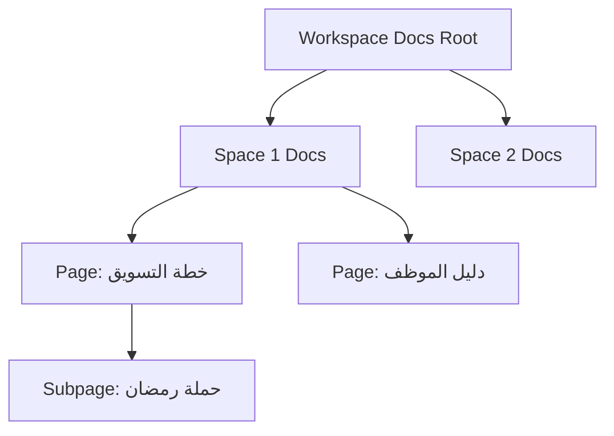

**Block-Based Editor**
- Paragraph, heading, list, table, code, quote blocks
- `/` command menu in Arabic: `/عنوان`, `/جدول`, `/مهمة`
- Embed task views directly in docs
- Arabic spell-check and grammar suggestions via Taskatek Brain
- Collaborative editing with presence indicators
- Version history with named snapshots

**Chat View Architecture**

| Channel Type | Purpose | Permissions |
|-------------|---------|-------------|
| Workspace General | Company-wide announcements | All members read, admins write |
| Space Channels | Project-specific discussions | Space members |
| Direct Messages | 1-on-1 or group chats | Participants only |
| Task Threads | Focused task discussion | Inherits task permissions |

**Chat Features**
- Arabic text input with auto-suggest
- File sharing with preview (images, PDFs)
- Voice messages (Arabic transcription via Taskatek Brain)
- Convert message to task with one click
- Pin important messages
- Search across all channels with Arabic stemming

**File Attachment System**

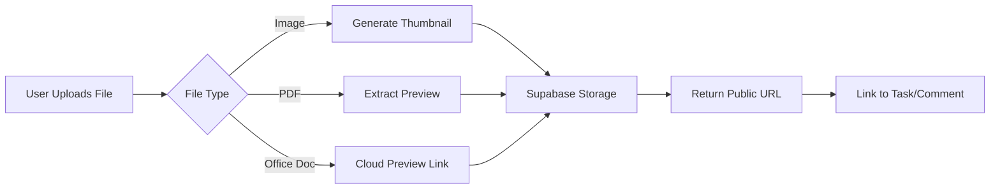

**Storage Policies**
- Max file size: 100MB per file (configurable)
- Virus scanning before storage
- Automatic compression for images >2MB
- Retention policy: deleted tasks move files to trash for 30 days
- Arabic filename support with UTF-8 encoding

### 4.6 Automation System

**No-Code Automation Builder**

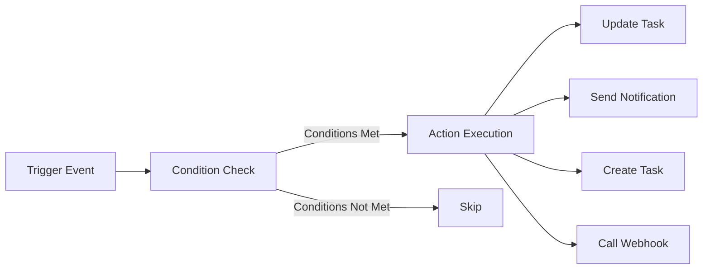

**Trigger Types**

| Trigger Category | Examples |
|-----------------|----------|
| Task Events | Task created, status changed, assignee added, due date approaching, task completed |
| Time-Based | Daily at 9 AM, every Friday, 3 days before due date |
| Field Changes | Priority set to high, custom field "مرحلة" equals "معتمد" |
| User Actions | Comment added, file attached, time logged |
| External | Webhook received, email received at project address |

**Condition Builder**

Logical expression editor:
- `IF priority = "high" AND assignee = "أحمد" AND due_date < today + 2 days`
- Support for AND/OR grouping
- Arabic field names in dropdown
- Date math for relative comparisons

**Action Types**

| Action | Configuration Options |
|--------|---------------------|
| Update Field | Select field, set new value (static or dynamic) |
| Assign Task | Select user or role (e.g., "Space Owner") |
| Send Notification | Email, in-app, WhatsApp, Slack |
| Create Task | Template with variables: `{task.title}`, `{assignee.name}` |
| Move Task | Select destination list |
| Post Comment | Template message with variables |
| Call Webhook | HTTP POST with task data JSON |
| Run AI Agent | Taskatek Brain action (summarize, generate subtasks) |

**Pre-Built Automation Templates**

1. **Status → WhatsApp Notification**
   - Trigger: Status changed to "مكتمل"
   - Action: Send WhatsApp to assignee: "✅ تم إكمال: {task.title}"

2. **Weekly Report**
   - Trigger: Every Friday at 5 PM
   - Action: Generate report of completed tasks, send to workspace owner

3. **Overdue Escalation**
   - Trigger: Task overdue by 1 day
   - Condition: Priority = "high"
   - Action: Assign to manager, send email notification

4. **AI Subtask Generation**
   - Trigger: Task created with description >100 words
   - Action: Taskatek Brain generates suggested subtasks

**Automation Execution Log**
- Track all automation runs with timestamp
- Show input data and output result
- Error logging with retry mechanism
- Usage analytics: most-used automations, success rate

### 4.7 Integration Hub (1,000+ Integrations)

**Integration Architecture Layers**

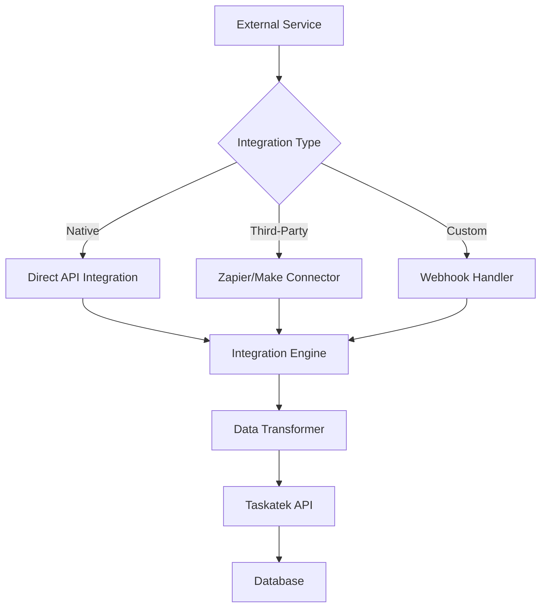

**Priority Integrations (GCC Focus)**

| Service | Sync Direction | Use Case |
|---------|---------------|----------|
| WhatsApp Business | Bidirectional | Message → Task, Task → Notification |
| Zoho CRM | Bidirectional | Deal → Project, Task → Activity |
| Odoo ERP | Pull from Odoo | Sales Order → Project, Invoice → Task |
| SAP S/4HANA | Pull from SAP | Purchase Request → Approval Task |
| Gmail/Outlook | Inbound | Email → Task with AI parsing |
| Slack | Bidirectional | Channel ↔ Chat View sync |
| Figma | Pull from Figma | Design file → Attachment |
| Zoom | Inbound | Meeting recording → Taskatek Brain notetaker |

**OAuth 2.0 Connection Flow**

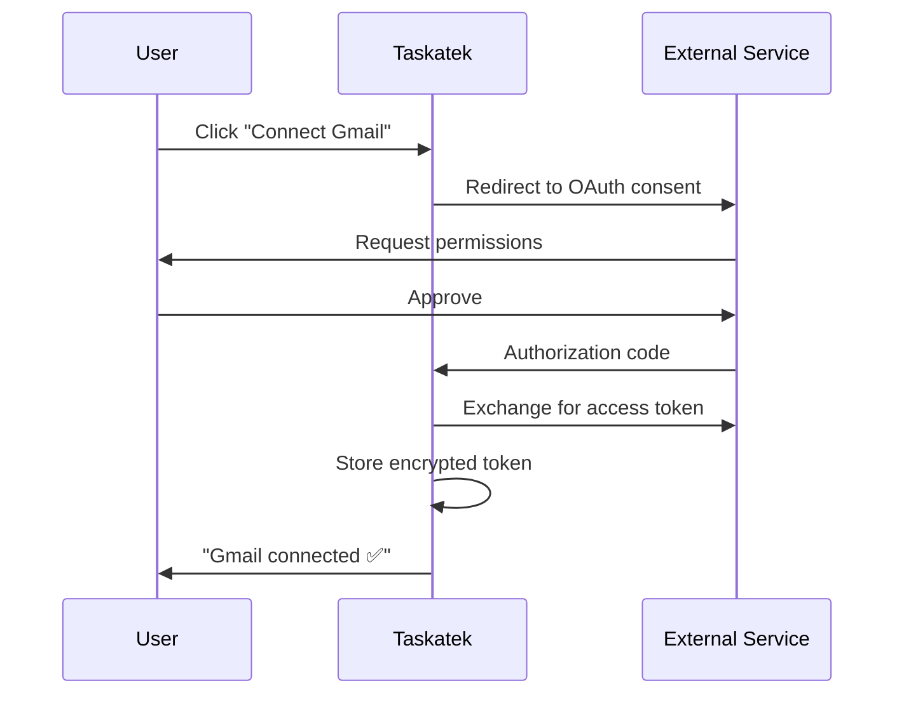

**Webhook System**

Taskatek provides unique webhook URLs per workspace:
```
POST https://api.taskatek.io/webhooks/{workspace_id}/{secret_token}
```

**Incoming Webhook Handler**
- Parse JSON payload
- Map fields to Taskatek task schema
- Create task or update existing (based on external ID)
- Return success response

**Outgoing Webhooks**
- Configured per automation
- Retry logic: 3 attempts with exponential backoff
- Payload includes full task object + event type
- Signature verification using HMAC-SHA256

## 5. Taskatek Brain (AI Module) Design

### 5.1 AI Architecture

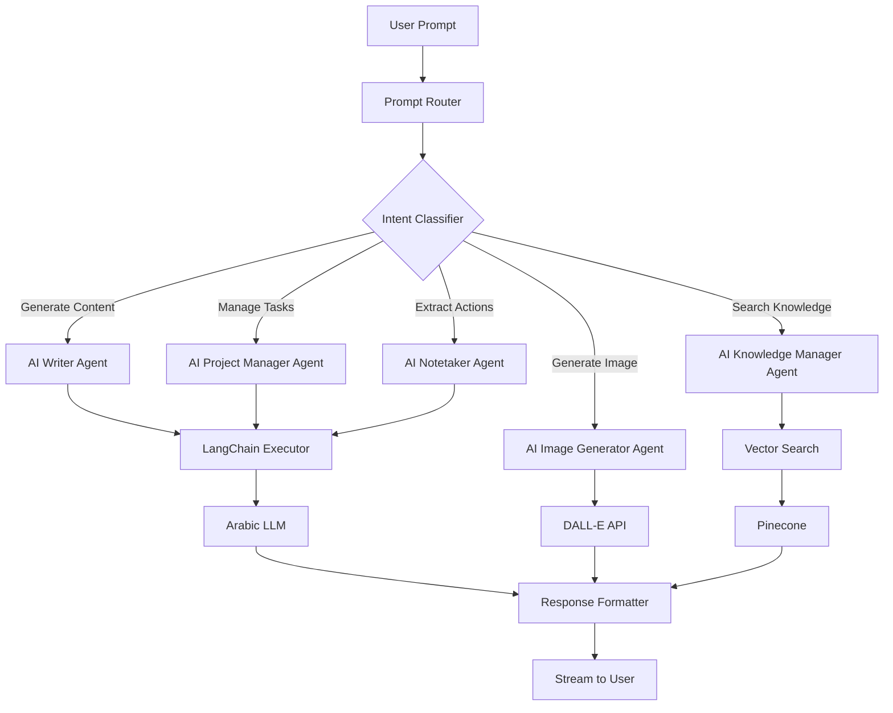

### 5.2 Agent Specifications

**1. AI Writer Agent**

| Capability | Input Example | Output |
|-----------|---------------|--------|
| Marketing Plan | `اكتب خطة تسويق 5 خطوات لمنتج جديد` | Structured 5-step plan in Arabic with tasks |
| Email Draft | `اكتب بريد اعتذار للعميل عن التأخير` | Professional Arabic email with subject line |
| Meeting Summary | `لخص هذا الاجتماع: [transcript]` | Key points, decisions, action items |
| Task Description | `اكتب وصف تفصيلي لمهمة: تصميم شعار` | Detailed requirements and acceptance criteria |

**Prompt Engineering Strategy**
- System prompt defines Arabic-first output
- Few-shot examples for consistent formatting
- Temperature: 0.7 for creative content, 0.3 for summaries
- Max tokens: 1000 for plans, 500 for emails

**2. AI Project Manager Agent**

| Capability | Input Example | Behavior |
|-----------|---------------|----------|
| Task Creation | `أنشئ مشروع لإطلاق منتج جديد` | Generates workspace structure + 20-30 tasks with dependencies |
| Assignment Optimization | `كلف المهام حسب الخبرة` | Analyzes team members' past tasks, assigns based on skills |
| Priority Suggestion | `رتب الأولويات حسب الموعد` | Scores tasks by due date, dependencies, time estimate |
| Risk Detection | `ابحث عن المخاطر في المشروع` | Identifies overdue dependencies, overallocated resources |

**Context Awareness**
- Agent has access to:
  - Current workspace hierarchy
  - Team member profiles and workload
  - Task completion history
  - Custom fields and statuses

**3. AI Notetaker Agent**

**Zoom Integration Flow**

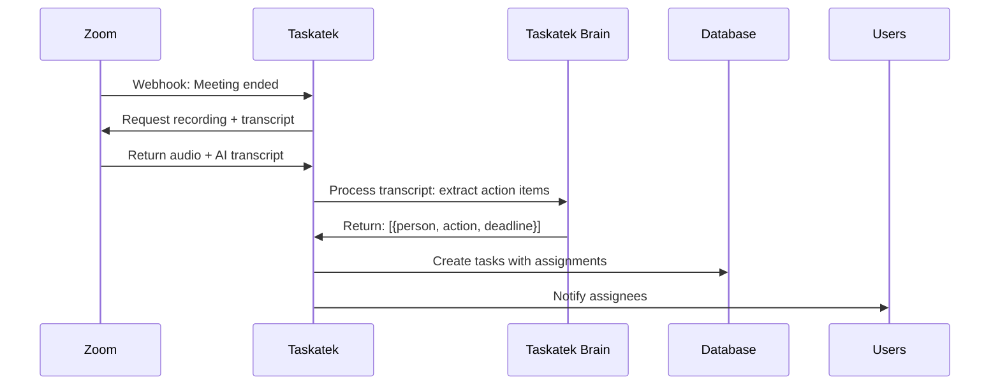

**Extraction Rules**
- Identify action verbs: "سوف نقوم", "يجب", "المطلوب"
- Extract person names from speaker labels or @mentions
- Infer deadlines from phrases: "قبل نهاية الأسبوع", "غداً"
- Categorize by keywords: decision, action item, question, note

**4. AI Knowledge Manager Agent**

**Semantic Search Architecture**

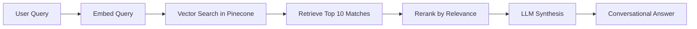

**Indexing Strategy**

| Content Type | Embedding Frequency | Metadata |
|-------------|--------------------|-----------| 
| Tasks | On create/update | title, description, comments, status, space |
| Docs | On save | full text, headings, linked tasks |
| Comments | On post | text, task context, author |
| Attachments | On upload | filename, OCR text (for images/PDFs) |

**Query Examples**
- `ابحث عن "تقرير Q3"` → Returns tasks/docs containing Q3 report
- `ما هي المهام المتعلقة بالعميل ABC؟` → Semantic search across all fields
- `من عمل على مشاريع التصميم؟` → Filters by assignee history + keyword

**5. AI Image Generator Agent**

**DALL-E Wrapper**
- Translate Arabic prompts to English for DALL-E API
- Style presets: logo, banner, illustration, photo-realistic
- Resolution options: 1024x1024, 1792x1024
- Store generated images in Supabase Storage
- Attach to task or save to workspace assets library

**Example Workflow**
1. User: `صمم شعار لمشروع "نور"`
2. Brain translates: "Design a logo for project 'Noor' (meaning light), modern, Arabic calligraphy"
3. Calls DALL-E with translated prompt
4. Returns image, user selects, saves as task attachment

### 5.3 Privacy & Data Governance

**Data Usage Policy**

| Data Type | Used for Training | Used for Context |
|-----------|------------------|------------------|
| Task Content | ❌ No (opt-in only) | ✅ Yes (within user's workspace) |
| User Prompts | ❌ No | ✅ Yes (for session continuity) |
| Generated Responses | ❌ No | ✅ Yes (cached for 24 hours) |

**User Controls**
- Workspace-level toggle: "Enable AI Learning" (default: OFF)
- Individual task/doc marking: "Exclude from AI indexing"
- Clear AI chat history button
- Export AI interaction logs for compliance

**Brain Logs Table**
- Stores all AI interactions for audit trail
- Fields: user_id, agent_type, prompt, response, timestamp
- Retention: 90 days (configurable)
- Accessible only to workspace owner

### 5.4 Brain UI Integration

**Sidebar Chat Interface**

```
┌─────────────────────────┐
│  💬 Taskatek Brain      │
├─────────────────────────┤
│                         │
│  User: اكتب خطة...      │
│                         │
│  Brain: ✨ بالتأكيد!    │
│  الخطوة 1: ...         │
│  الخطوة 2: ...         │
│  [Create Tasks Button]  │
│                         │
├─────────────────────────┤
│  [ Type message... ]    │
└─────────────────────────┘
```

**Features**
- Always visible on right side (left in LTR mode)
- Collapsible to icon-only mode
- Streaming responses with typing indicator
- Action buttons: "Create Tasks", "Save as Doc", "Copy"
- Context awareness: knows currently open task/project

**Inline AI Assistance**

- **In Task Description Editor**: AI suggestion panel
  - "Expand this into subtasks"
  - "Proofread Arabic text"
  - "Translate to English"

- **In Comments**: AI-generated reply suggestions
  - Analyze comment sentiment
  - Suggest diplomatic response

## 6. Localization & RTL Strategy

### 6.1 Internationalization Architecture

**Language Detection Flow**

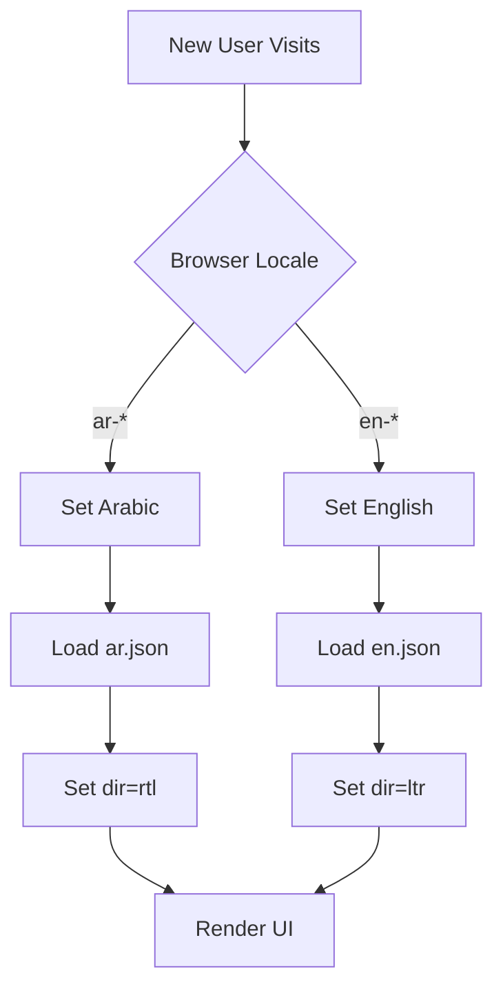

**Translation File Structure**

```
/locales
  /ar.json
    {
      "common": {
        "save": "حفظ",
        "cancel": "إلغاء"
      },
      "tasks": {
        "create_task": "إنشاء مهمة",
        "due_date": "تاريخ الاستحقاق"
      }
    }
  /en.json
    {
      "common": {
        "save": "Save",
        "cancel": "Cancel"
      },
      "tasks": {...}
    }
```

**Namespace Organization**
- `common`: Shared UI elements
- `tasks`: Task management
- `automation`: Automation builder
- `brain`: AI module
- `validation`: Form error messages

### 6.2 RTL-Specific Design Patterns

**Tailwind RTL Configuration**

CSS logical properties usage:
- `ms-4` instead of `ml-4` (margin-inline-start)
- `ps-2` instead of `pl-2` (padding-inline-start)
- `start-0` instead of `left-0`

**Component Mirroring**

| Component | RTL Behavior |
|-----------|--------------|
| Sidebar | Moves to right side |
| Dropdown menus | Open to left |
| Toast notifications | Slide from right |
| Breadcrumbs | Arrows point left (←) |
| Progress bars | Fill right-to-left |
| Kanban drag | Scroll right-to-left |

**Typography Considerations**
- Arabic font: Tajawal (weights: 400, 500, 700)
- Larger line height for Arabic (1.8 vs 1.5 for English)
- Increased letter spacing for readability
- Mixed content: wrap RTL/LTR spans with `<bdi>` tags

### 6.3 Arabic-Specific Features

**Date Formatting**
- Hijri calendar support via `@formkit/tempo`
- Date picker shows both Gregorian and Hijri
- Relative dates: "منذ 3 أيام", "بعد أسبوع"

**Number Formatting**
- Arabic-Indic numerals option: ١٢٣ vs 123
- User preference toggle
- Currency: SAR, AED with proper Arabic formatting

**Search & Sorting**
- Arabic collation for alphabetical sorting (أ ب ت...)
- Diacritic-insensitive search (ignore harakat)
- Stemming for Arabic search (remove prefixes/suffixes)

**Validation Messages**
- All form errors in Arabic
- Example: `"يجب أن يحتوي العنوان على 3 أحرف على الأقل"`
- Zod schema with Arabic error maps

## 7. Performance & Scalability Design

### 7.1 Performance Targets

| Metric | Target | Measurement Method |
|--------|--------|-------------------|
| Initial Page Load | <2s (3G network) | Lighthouse Performance Score >90 |
| Task List Render (100 tasks) | <500ms | React Profiler |
| Realtime Update Latency | <200ms | WebSocket ping time |
| AI Response Start (TTFB) | <1s | Time to first streamed token |
| Search Results | <300ms | Backend API response time |
| Mobile App Launch | <1.5s | PWA First Contentful Paint |

### 7.2 Optimization Strategies

**Frontend Optimization**

| Technique | Implementation |
|-----------|---------------|
| Code Splitting | Next.js automatic route-based splitting + dynamic imports for heavy components (Gantt, Whiteboard) |
| Image Optimization | Next.js Image component with WebP, automatic sizing, lazy loading |
| Bundle Size | Tree-shaking unused Tailwind classes, separate vendor chunks, Gzip/Brotli compression |
| Caching | React Query with stale-while-revalidate, Service Worker for offline access |
| Virtual Scrolling | `react-window` for lists >50 items |
| Debouncing | Search input: 300ms, autosave: 2s |

**Backend Optimization**

```mermaid
graph LR
    A[API Request] --> B{Redis Cache Hit?}
    B -->|Yes| C[Return Cached Response]
    B -->|No| D[Database Query]
    D --> E[Transform Data]
    E --> F[Store in Redis]
    F --> G[Return Response]
```

**Caching Strategy**

| Data Type | TTL | Invalidation Trigger |
|-----------|-----|---------------------|
| User Profile | 1 hour | Profile update |
| Workspace Hierarchy | 15 minutes | Space/folder CRUD |
| Task List (filtered) | 5 minutes | Task create/update in list |
| Custom Fields Schema | 1 hour | Custom field definition change |
| Integration Tokens | 24 hours | Manual disconnect |

**Database Optimization**

**Indexing Strategy**
```
CREATE INDEX idx_tasks_list_status ON tasks(list_id, status);
CREATE INDEX idx_tasks_assignee ON tasks USING GIN(assignee_ids);
CREATE INDEX idx_tasks_search_ar ON tasks USING gin(to_tsvector('arabic', title_ar || ' ' || description_ar));
CREATE INDEX idx_tasks_search_en ON tasks USING gin(to_tsvector('english', title_en || ' ' || description_en));
```

**Query Optimization**
- Use `EXPLAIN ANALYZE` for slow queries (>100ms)
- Pagination with cursor-based approach (not OFFSET/LIMIT for large datasets)
- Batch loading via DataLoader pattern to prevent N+1 queries
- Read replicas for reporting queries

**Connection Pooling**
- PgBouncer in front of PostgreSQL
- Pool size: min=10, max=100 connections
- Transaction mode for short queries, session mode for long transactions

### 7.3 Scalability Architecture

**Horizontal Scaling Strategy**

```mermaid
graph TD
    A[Load Balancer] --> B[FastAPI Pod 1]
    A --> C[FastAPI Pod 2]
    A --> D[FastAPI Pod N]
    
    B --> E[(PostgreSQL Primary)]
    C --> E
    D --> E
    
    E --> F[(Read Replica 1)]
    E --> G[(Read Replica 2)]
    
    B --> H[Redis Cluster]
    C --> H
    D --> H
```

**Scaling Thresholds**

| Resource | Scale Up Trigger | Scale Down Trigger |
|----------|-----------------|-------------------|
| API Pods | CPU >70% for 5 min | CPU <30% for 10 min |
| Database | Connections >80% of pool | Upgrade to larger instance |
| Redis | Memory >75% | Add cluster nodes |
| Pinecone | Query latency >500ms | Upgrade tier |

**Multi-Tenancy Isolation**

- **Data Isolation**: All tables include `workspace_id` column with RLS policies
- **Resource Isolation**: Rate limiting per workspace (not per user)
- **Storage Isolation**: Supabase Storage buckets per workspace
- **AI Isolation**: Separate Pinecone namespace per workspace

### 7.4 Real-Time Scalability

**WebSocket Connection Management**

```mermaid
graph LR
    A[User Browser] --> B[WebSocket Gateway]
    B --> C[Redis Pub/Sub]
    C --> D[WebSocket Gateway 2]
    C --> E[WebSocket Gateway 3]
    
    D --> F[User Browser 2]
    E --> G[User Browser 3]
```

**Presence Tracking**
- Redis sorted set per workspace: `workspace:{id}:presence`
- Score = last_seen timestamp
- Cleanup: remove entries older than 60 seconds
- Broadcast presence updates every 30 seconds

**Optimistic UI Updates**
- Frontend immediately reflects user action
- Server validates and broadcasts to others
- On conflict, revert with error toast

## 8. Security & Compliance Design

### 8.1 Security Architecture

**Defense in Depth Layers**

```mermaid
graph TD
    A[User Request] --> B[WAF - CloudFlare]
    B --> C[Rate Limiting]
    C --> D[JWT Validation]
    D --> E[Permission Check]
    E --> F[Row-Level Security]
    F --> G[Encrypted Data Access]
    G --> H[Audit Log]
```

### 8.2 Authentication Security

**JWT Token Strategy**

| Token Type | Expiry | Storage | Usage |
|-----------|--------|---------|-------|
| Access Token | 15 minutes | Memory only | API requests |
| Refresh Token | 30 days | HttpOnly cookie | Renew access token |
| Session Token | 24 hours | Encrypted localStorage | Offline mode |

**Password Requirements**
- Minimum 8 characters
- At least one uppercase, lowercase, number, special character
- Bcrypt hashing with cost factor 12
- Password history: prevent reuse of last 5 passwords
- Account lockout: 5 failed attempts = 15-minute freeze

**Multi-Factor Authentication (Future)**
- TOTP-based (Google Authenticator)
- SMS backup codes
- Enforced for workspace owners and admins

### 8.3 Authorization Model

**Row-Level Security (RLS) Policies**

Example PostgreSQL policy:
```
CREATE POLICY workspace_isolation ON tasks
  USING (
    workspace_id IN (
      SELECT workspace_id FROM workspace_members 
      WHERE user_id = auth.uid()
    )
  );
```

**API Permission Checks**

Every endpoint validates:
1. User is authenticated (valid JWT)
2. User has workspace access
3. User has specific permission for action (create/read/update/delete)
4. Resource belongs to user's accessible workspace

### 8.4 Data Protection

**Encryption Standards**

| Layer | Method | Key Management |
|-------|--------|---------------|
| Data in Transit | TLS 1.3 | AWS Certificate Manager |
| Data at Rest | AES-256 | AWS KMS |
| Sensitive Fields | Field-level encryption | Application-managed keys |
| Backups | Encrypted snapshots | AWS KMS |

**Sensitive Data Handling**

Fields requiring encryption:
- Integration API keys
- OAuth tokens
- WhatsApp credentials
- User phone numbers (for WhatsApp OTP)

**Data Retention Policies**

| Data Type | Retention Period | Deletion Method |
|-----------|-----------------|----------------|
| Deleted Tasks | 30 days in trash | Hard delete + cascade |
| Audit Logs | 1 year | Automated purge |
| AI Interaction Logs | 90 days | Automated purge |
| User Accounts (deleted) | 14 days grace period | Full anonymization |

### 8.5 Compliance Considerations

**GDPR Compliance (for EU users)**
- Right to access: Export all user data in JSON format
- Right to deletion: Anonymize user data, delete workspace if owner
- Right to portability: Download task data in CSV/JSON
- Consent management: Clear opt-ins for AI features, analytics

**Regional Data Residency**
- GCC customers: data stored in AWS me-central-1 (UAE)
- EU customers: data stored in eu-central-1 (Frankfurt)
- Workspace setting to lock data region

**Audit Trail**

All actions logged to `audit_logs` table:
- user_id, action_type, resource_type, resource_id, timestamp
- IP address, user agent
- Before/after state for updates
- Immutable append-only log

### 8.6 Rate Limiting & DDoS Protection

**Rate Limits**

| Endpoint Category | Limit | Window |
|------------------|-------|--------|
| Authentication | 5 attempts | 15 minutes |
| Task CRUD | 100 requests | 1 minute |
| AI Brain | 20 prompts | 1 hour |
| Search | 30 queries | 1 minute |
| File Upload | 10 uploads | 1 hour |
| Webhook | 1000 calls | 1 hour |

**Implementation**
- Redis-based sliding window counter
- Response header: `X-RateLimit-Remaining`, `X-RateLimit-Reset`
- 429 status code with retry-after header
- Workspace-level quotas for enterprise plans

**DDoS Mitigation**
- CloudFlare WAF rules
- Challenge page for suspicious traffic
- IP reputation filtering
- Geographic blocking (optional per workspace)

## 9. Testing Strategy

### 9.1 Testing Pyramid

```mermaid
graph TD
    A[E2E Tests - 10%] --> B[Integration Tests - 30%]
    B --> C[Unit Tests - 60%]
    
    A --> D[Critical User Flows]
    B --> E[API + Database]
    C --> F[Business Logic]
```

### 9.2 Test Coverage Requirements

| Layer | Tool | Target Coverage | Critical Areas |
|-------|------|----------------|---------------|
| Frontend Unit | Vitest + React Testing Library | 80% | Utility functions, hooks, form validation |
| Backend Unit | Pytest | 90% | Business logic, permission checks, data transformations |
| Integration | Pytest + Supabase Test DB | 100% | All CRUD operations, RLS policies |
| E2E | Cypress + Playwright | Critical flows only | Auth, task creation, collaboration, AI interactions |
| AI Accuracy | Custom test suite | 92%+ accuracy | Prompt → expected output validation |

### 9.3 Arabic-Specific Testing

**Localization Tests**
- All UI text uses translation keys (no hardcoded strings)
- Missing translation detection
- RTL layout correctness (screenshot comparison)
- Arabic text rendering (no tofu characters □)

**Test Data Sets**
- Arabic names with various diacritics
- Mixed RTL/LTR content in single fields
- Long Arabic text (paragraph wrapping)
- Arabic special characters in search queries

**Browser Matrix**
- Chrome/Edge (latest 2 versions)
- Safari iOS (latest)
- Firefox (latest)
- Samsung Internet (for Android users in GCC)

### 9.4 AI Testing Methodology

**Prompt Test Cases**

Example test:
```
Input: "اكتب خطة تسويق 5 خطوات"
Expected Output Structure:
  - Contains exactly 5 numbered steps
  - Each step has title and description
  - All text in Arabic
  - No code or technical jargon
  - Professional tone
```

**Evaluation Metrics**
- Accuracy: Output matches expected structure (92% threshold)
- Relevance: LLM-as-judge scores relevance 1-5 (avg >4.2)
- Latency: Response starts streaming within 1 second
- Language consistency: No English in Arabic-only prompts

**Regression Testing**
- Store 100 golden prompt/response pairs
- Run weekly validation after LLM updates
- Alert if accuracy drops below threshold

## 10. Deployment & DevOps

### 10.1 CI/CD Pipeline

```mermaid
graph LR
    A[Git Push] --> B[GitHub Actions]
    B --> C{Run Tests}
    C -->|Pass| D[Build Docker Image]
    C -->|Fail| E[Notify Team]
    D --> F[Push to ECR]
    F --> G{Branch?}
    G -->|main| H[Deploy to Production]
    G -->|develop| I[Deploy to Staging]
    H --> J[Run Smoke Tests]
    I --> J
    J --> K[Health Check]
```

**Pipeline Stages**

| Stage | Actions | Failure Behavior |
|-------|---------|-----------------|
| Lint | ESLint (frontend), Ruff (backend) | Block merge |
| Type Check | TypeScript, mypy | Block merge |
| Unit Tests | Vitest, pytest | Block merge |
| Integration Tests | API + DB tests on test instance | Block merge |
| Build | Docker multi-stage build | Block merge |
| Security Scan | Trivy container scan | Warn only |
| Deploy | AWS ECS update service | Rollback on health check fail |
| E2E Tests (Post-Deploy) | Cypress on staging | Alert team |

### 10.2 Infrastructure as Code

**Docker Compose (Local Development)**

Services:
- `frontend`: Next.js on port 3000
- `backend`: FastAPI on port 8000
- `postgres`: PostgreSQL 15 with Arabic collation
- `redis`: Redis 7 for caching
- `pgadmin`: Database management UI

**AWS Architecture (Production)**

```mermaid
graph TD
    A[Route 53] --> B[CloudFront]
    B --> C[Vercel - Next.js]
    B --> D[ALB - API]
    
    D --> E[ECS Fargate - FastAPI]
    E --> F[(RDS PostgreSQL)]
    E --> G[ElastiCache Redis]
    E --> H[S3 - Supabase Storage]
    
    I[CloudWatch] --> E
    I --> F
    I --> G
```

**Resource Specifications**

| Component | Instance Type | Scaling |
|-----------|--------------|---------|
| ECS Tasks | 2 vCPU, 4GB RAM | 2-10 tasks (target CPU 70%) |
| RDS | db.t4g.large (2 vCPU, 8GB) | Scale up based on connections |
| ElastiCache | cache.t4g.medium | 1 primary + 1 replica |
| S3 | Standard storage class | Lifecycle: archive >90 days to Glacier |

### 10.3 Monitoring & Observability

**Metrics Collection**

```mermaid
graph LR
    A[Application] --> B[CloudWatch Metrics]
    A --> C[Sentry Error Tracking]
    A --> D[LogRocket Session Replay]
    
    B --> E[Grafana Dashboard]
    C --> E
    
    E --> F[PagerDuty Alerts]
```

**Key Metrics**

| Category | Metric | Alert Threshold |
|----------|--------|----------------|
| Availability | Uptime | <99.9% over 24h |
| Performance | P95 API latency | >1s |
| Errors | Error rate | >1% of requests |
| Database | Connection pool usage | >90% |
| AI | Brain response failures | >5% |
| Users | Active WebSocket connections | Track trends |

**Logging Strategy**

Log levels:
- ERROR: All exceptions, failed auth attempts
- WARN: Rate limit hits, slow queries (>500ms)
- INFO: User actions (create task, login)
- DEBUG: Detailed request/response (dev only)

**Log aggregation**: CloudWatch Logs with JSON structured logging

Example log format:
```json
{
  "timestamp": "2024-01-15T10:30:00Z",
  "level": "INFO",
  "user_id": "uuid",
  "workspace_id": "uuid",
  "action": "task.created",
  "resource_id": "task_uuid",
  "ip": "1.2.3.4",
  "duration_ms": 45
}
```

### 10.4 Backup & Disaster Recovery

**Backup Strategy**

| Data Type | Frequency | Retention | Storage |
|-----------|-----------|-----------|---------|
| PostgreSQL | Daily snapshot | 30 days | RDS automated backups |
| Redis | No backup | Ephemeral cache | N/A |
| S3 Files | Cross-region replication | Indefinite | S3 versioning enabled |
| Configuration | Git-based | Indefinite | GitHub repository |

**Recovery Time Objectives (RTO)**

| Scenario | Target RTO | Recovery Procedure |
|----------|-----------|-------------------|
| Database corruption | 1 hour | Restore from latest snapshot |
| Regional outage | 4 hours | Failover to secondary region |
| Accidental data deletion | 15 minutes | Restore specific workspace from backup |
| Complete infrastructure loss | 8 hours | Rebuild from IaC + restore data |

**Disaster Recovery Testing**
- Quarterly DR drill
- Restore staging environment from production backup
- Validate data integrity and application functionality

### 10.5 Release Management

**Versioning Strategy**

Semantic versioning: `MAJOR.MINOR.PATCH`
- MAJOR: Breaking API changes, major redesign
- MINOR: New features, backward-compatible
- PATCH: Bug fixes, performance improvements

**Release Cadence**
- Production releases: Bi-weekly (every 2 weeks)
- Hotfixes: As needed (critical bugs, security patches)
- Major versions: Quarterly

**Feature Flags**

Use LaunchDarkly or similar:
- Gradual rollout of new features (10% → 50% → 100% of users)
- A/B testing for UI variations
- Kill switch for problematic features
- Per-workspace feature enabling for beta testing

**Deployment Windows**
- Production deploys: Tuesday/Thursday 10 AM-2 PM UTC (low traffic)
- Avoid Friday/weekend deploys
- Emergency hotfixes: Anytime with manager approval

## 11. Success Metrics & KPIs

### 11.1 Product Metrics

| Metric | Target | Measurement Tool |
|--------|--------|-----------------|
| Monthly Active Users (MAU) | 10,000 (Year 1) | Mixpanel |
| Daily Active Users / MAU | >30% | Mixpanel |
| Task Creation Rate | 50 tasks/user/month | Database analytics |
| AI Brain Usage | 40% of users interact weekly | Custom dashboard |
| Feature Adoption (Views) | 80% use ≥3 different views | Session tracking |
| Integration Usage | 60% connect ≥1 integration | Integration logs |

### 11.2 Technical Metrics

| Metric | Target | Current Baseline |
|--------|--------|-----------------|
| API Availability | 99.9% uptime | To be measured |
| P95 Page Load Time | <2s | To be measured |
| Error Rate | <0.5% | To be measured |
| Test Coverage | >85% | To be measured |
| Security Vulnerabilities | 0 critical, <5 medium | Continuous scan |

### 11.3 User Satisfaction

| Metric | Target | Collection Method |
|--------|--------|------------------|
| NPS (Net Promoter Score) | >50 | Quarterly in-app survey |
| Customer Satisfaction (CSAT) | >4.5/5 | Post-interaction survey |
| Support Ticket Volume | <5% of MAU submit tickets | Support system analytics |
| Feature Request Votes | Track top 10 | In-app feedback board |

## 12. Future Enhancements (Post-MVP)

### 12.1 Planned Features (Roadmap)

**Phase 2 (Months 4-6)**
- Mobile native apps (iOS/Android with React Native)
- Advanced reporting and analytics dashboards
- Time tracking integration with invo# Taskatek Platform - System Design Document

## 1. Executive Overview

### 1.1 Project Vision
Taskatek is an Arabic-first, AI-powered project management platform that replicates ClickUp's comprehensive feature set with native RTL support, enterprise scalability, and GCC market focus. The platform combines traditional project management capabilities with an integrated AI assistant (Taskatek Brain) to enhance productivity through intelligent automation and Arabic language processing.

### 1.2 Strategic Objectives
- Deliver pixel-perfect RTL experience for Arabic users while maintaining LTR compatibility
- Provide enterprise-grade task management with 15+ view types and hierarchical workspace organization
- Enable intelligent task automation through AI agents fine-tuned for Arabic language
- Support 1,000+ integrations with focus on GCC-critical business systems
- Achieve real-time collaboration capabilities matching modern SaaS standards

### 1.3 Success Metrics
- User engagement: 90%+ Arabic interface adoption in target markets
- Performance: <200ms response time for core operations
- AI accuracy: >92% for Arabic prompt interpretation
- Test coverage: 90% across all modules
- Integration reliability: 99.5% uptime for critical connectors

## 2. System Architecture

### 2.1 Architectural Style
**Hybrid Monolith-to-Microservices Architecture**

The system employs a pragmatic architectural approach that balances rapid development with future scalability:

- **Frontend**: Modern monolithic Next.js application with modular component architecture
- **Backend**: FastAPI monolith with clear service boundaries for future extraction
- **AI Module**: Isolated microservice architecture for independent scaling
- **Database**: Shared PostgreSQL with schema-based logical separation
- **Real-time**: Dedicated Supabase Realtime + WebSocket layer

**Rationale**: This approach enables MVP delivery with 2-5 developers while providing clear migration paths to microservices as team and user base grow.

### 2.2 High-Level Component Architecture

```mermaid
graph TB
    subgraph "Client Layer"
        WEB[Next.js Web App<br/>RTL-First UI]
        MOBILE[PWA Mobile]
    end
    
    subgraph "API Gateway Layer"
        GATEWAY[API Gateway<br/>Rate Limiting & Auth]
    end
    
    subgraph "Application Layer"
        BACKEND[FastAPI Backend<br/>Core Business Logic]
        REALTIME[Supabase Realtime<br/>WebSocket Server]
        BRAIN[Taskatek Brain Service<br/>AI Agents & LLM]
    end
    
    subgraph "Data Layer"
        PG[(PostgreSQL<br/>Supabase)]
        REDIS[(Redis Cache<br/>Sessions & Queue)]
        VECTOR[(Pinecone<br/>Vector DB)]
        STORAGE[Supabase Storage<br/>Files & Media]
    end
    
    subgraph "Integration Layer"
        QUEUE[BullMQ Job Queue]
        WEBHOOKS[Webhook Manager]
        CONNECTORS[Integration Connectors<br/>WhatsApp, Zoho, SAP]
    end
    
    subgraph "External Services"
        LLM[OpenAI/Anthropic API]
        AUTH[OAuth Providers]
        NOTIFY[Notification Services]
    end
    
    WEB --> GATEWAY
    MOBILE --> GATEWAY
    GATEWAY --> BACKEND
    GATEWAY --> REALTIME
    GATEWAY --> BRAIN
    
    BACKEND --> PG
    BACKEND --> REDIS
    BACKEND --> STORAGE
    BACKEND --> QUEUE
    
    BRAIN --> LLM
    BRAIN --> VECTOR
    BRAIN --> PG
    
    REALTIME --> PG
    REALTIME --> REDIS
    
    QUEUE --> WEBHOOKS
    QUEUE --> CONNECTORS
    
    BACKEND --> AUTH
    BACKEND --> NOTIFY
```

### 2.3 Technology Stack Rationale

| Layer | Technology | Justification |
|-------|-----------|---------------|
| **Frontend Framework** | Next.js 14 (App Router) | Server Components for SEO, built-in API routes, excellent RTL support, Vercel deployment optimization |
| **UI Library** | shadcn/ui + Tailwind CSS | Unstyled primitives enable full RTL customization, utility-first CSS simplifies directional styling |
| **Backend Framework** | FastAPI (Python 3.11+) | Async-native for real-time operations, excellent LangChain ecosystem for AI, automatic OpenAPI documentation |
| **Primary Database** | PostgreSQL (Supabase) | JSONB for flexible task metadata, built-in real-time subscriptions, row-level security for multi-tenancy |
| **Vector Database** | Pinecone | Managed service reduces operational overhead, optimized for semantic search across Arabic content |
| **Caching Layer** | Redis | Session management, rate limiting, job queue backing, real-time presence tracking |
| **Job Queue** | BullMQ | Robust retry mechanisms for integrations, priority queues for AI requests, Redis-backed persistence |
| **AI Orchestration** | LangChain | Pre-built agents framework, memory management, prompt templating for Arabic |
| **Drag & Drop** | @dnd-kit | RTL-aware, accessibility compliant, tree structure support for hierarchies |

### 2.4 Deployment Architecture

```mermaid
graph TB
    subgraph "Client Distribution"
        CDN[Vercel Edge CDN<br/>Static Assets & SSR]
    end
    
    subgraph "AWS me-central-1 (Bahrain) - Primary Region"
        ALB[Application Load Balancer]
        
        subgraph "Container Cluster"
            NEXT1[Next.js Container 1]
            NEXT2[Next.js Container 2]
            API1[FastAPI Container 1]
            API2[FastAPI Container 2]
            BRAIN1[Brain Service Container]
        end
        
        subgraph "Data Services"
            SUPABASE[Supabase Instance<br/>PostgreSQL + Realtime]
            REDIS_CLUSTER[Redis Cluster<br/>ElastiCache]
        end
    end
    
    subgraph "External Managed Services"
        PINECONE_CLOUD[Pinecone Cloud]
        OPENAI_API[OpenAI/Anthropic API]
    end
    
    subgraph "Monitoring & Logging"
        SENTRY[Sentry Error Tracking]
        LOGROCKET[LogRocket Session Replay]
    end
    
    CDN --> ALB
    ALB --> NEXT1
    ALB --> NEXT2
    ALB --> API1
    ALB --> API2
    ALB --> BRAIN1
    
    NEXT1 --> SUPABASE
    NEXT2 --> SUPABASE
    API1 --> SUPABASE
    API2 --> SUPABASE
    API1 --> REDIS_CLUSTER
    API2 --> REDIS_CLUSTER
    
    BRAIN1 --> PINECONE_CLOUD
    BRAIN1 --> OPENAI_API
    BRAIN1 --> SUPABASE
    
    NEXT1 -.-> SENTRY
    API1 -.-> SENTRY
    NEXT1 -.-> LOGROCKET
```

**Deployment Strategy**:
- **Frontend**: Vercel for Next.js (global CDN, automatic previews, zero-config)
- **Backend & AI**: Docker containers on AWS ECS (me-central-1 for GCC latency optimization)
- **Database**: Supabase managed PostgreSQL (automatic backups, connection pooling)
- **Initial Scale**: 2 Next.js instances, 2 API instances, 1 Brain instance (vertical scaling first)

## 3. Data Architecture

### 3.1 Domain Model

```mermaid
erDiagram
    WORKSPACE ||--o{ SPACE : contains
    SPACE ||--o{ FOLDER : contains
    FOLDER ||--o{ LIST : contains
    LIST ||--o{ TASK : contains
    TASK ||--o{ SUBTASK : contains
    TASK ||--o{ COMMENT : has
    TASK }o--o{ USER : assigned_to
    TASK ||--o{ ATTACHMENT : has
    TASK }o--o{ TASK : depends_on
    
    WORKSPACE {
        uuid id PK
        text name_ar
        text name_en
        uuid owner_id FK
        jsonb settings
        timestamptz created_at
    }
    
    SPACE {
        uuid id PK
        uuid workspace_id FK
        text name_ar
        text name_en
        text icon
        int position
        jsonb custom_fields_schema
    }
    
    FOLDER {
        uuid id PK
        uuid space_id FK
        text name_ar
        text name_en
        int position
    }
    
    LIST {
        uuid id PK
        uuid folder_id FK
        text name_ar
        text name_en
        text color
        int position
        jsonb statuses
    }
    
    TASK {
        uuid id PK
        uuid list_id FK
        text title_ar
        text title_en
        html description
        text status
        int priority
        timestamptz due_date
        int time_estimate_minutes
        int time_tracked_seconds
        jsonb custom_fields
        int position
        timestamptz created_at
        timestamptz updated_at
    }
    
    USER {
        uuid id PK
        text full_name_ar
        text full_name_en
        text email
        text avatar_url
        text lang_preference
        jsonb notification_settings
    }
    
    COMMENT {
        uuid id PK
        uuid task_id FK
        uuid user_id FK
        html content
        jsonb mentions
        timestamptz created_at
    }
    
    BRAIN_LOG {
        uuid id PK
        uuid user_id FK
        text prompt
        text response
        text agent_type
        float confidence_score
        timestamptz created_at
    }
```

### 3.2 Data Storage Strategy

| Data Type | Storage Solution | Reasoning |
|-----------|-----------------|-----------|
| **Structured Task Data** | PostgreSQL (Supabase) | ACID compliance for task relationships, JSONB for flexible custom fields, full-text search for Arabic |
| **File Attachments** | Supabase Storage (S3-compatible) | Integrated with auth, automatic CDN distribution, cost-effective for large files |
| **Semantic Search Embeddings** | Pinecone | Specialized for vector similarity search, managed scaling, Arabic text embedding support |
| **Session Data** | Redis | Sub-millisecond access for user sessions, automatic expiry, presence tracking |
| **Job Queue State** | Redis (BullMQ) | Persistent queue with atomic operations, retry mechanism, priority support |
| **Audit Logs** | PostgreSQL (separate schema) | Compliance requirements, queryable history, integrated with main database |

### 3.3 Data Localization Strategy

**Bilingual Field Pattern**:
All user-facing content uses paired fields (`name_ar` / `name_en`, `title_ar` / `title_en`) to support:
- Native editing in preferred language
- Automatic translation prompts when one field is empty
- Language-agnostic API responses (client selects field based on locale)
- Full-text search across both languages simultaneously

**Rich Text Handling**:
- Store as sanitized HTML (supports mixed RTL/LTR content)
- Preserve directionality markers in markup
- Arabic text editor provides grammar checking via Taskatek Brain

### 3.4 Caching Strategy

| Cache Layer | TTL | Invalidation Trigger |
|-------------|-----|---------------------|
| User Profile | 1 hour | Profile update event |
| Workspace Hierarchy | 5 minutes | Space/Folder/List CRUD |
| Task List (per view) | 30 seconds | Task update via WebSocket |
| Custom Field Schemas | 15 minutes | Schema modification |
| Integration Credentials | 24 hours | Manual refresh or auth error |
| AI Response (identical prompts) | 1 hour | User feedback (thumbs down) |

**Cache-Aside Pattern**: Application checks Redis first, falls back to PostgreSQL, then populates cache.

## 4. Core Feature Design

### 4.1 Authentication & Authorization

#### 4.1.1 Authentication Flow

```mermaid
sequenceDiagram
    actor User
    participant App as Next.js App
    participant Supabase as Supabase Auth
    participant OAuth as OAuth Provider
    participant WhatsApp as WhatsApp API
    
    User->>App: Select Login Method
    
    alt Email/Password
        App->>Supabase: signInWithPassword()
        Supabase-->>App: JWT + Refresh Token
    else OAuth (Google/Apple)
        App->>Supabase: signInWithOAuth()
        Supabase->>OAuth: Redirect to Provider
        OAuth-->>Supabase: Authorization Code
        Supabase-->>App: JWT + Refresh Token
    else WhatsApp OTP
        App->>WhatsApp: Send OTP to Phone
        WhatsApp-->>User: SMS with Code
        User->>App: Enter OTP
        App->>Supabase: verifyOtp()
        Supabase-->>App: JWT + Refresh Token
    end
    
    App->>App: Store JWT in HttpOnly Cookie
    App->>App: Redirect to Dashboard
```

**Authentication Methods**:
1. **Email/Password**: Standard Supabase Auth with password strength requirements
2. **OAuth Providers**: Google, Apple (native mobile SDK integration)
3. **WhatsApp OTP**: Custom implementation using Twilio/MessageBird for GCC market preference
4. **Magic Link**: Email-based passwordless login for desktop users

**Session Management**:
- JWT stored in HttpOnly cookies (XSS protection)
- Refresh token rotation every 7 days
- Redis-backed session tracking for concurrent device limit (5 per user)
- Automatic logout after 30 days of inactivity

#### 4.1.2 Authorization Model

**Role-Based Access Control (RBAC) with Resource-Level Permissions**:

| Role | Workspace | Space | Task | Brain Usage |
|------|-----------|-------|------|-------------|
| **Owner** | Full control, billing | Full control | Full control | Unlimited |
| **Admin** | View settings | Full control | Full control | Unlimited |
| **Member** | View only | Assigned spaces only | Assigned tasks + create | 100 requests/day |
| **Guest** | No access | Single space (read-only) | Assigned tasks (read-only) | 10 requests/day |

**Implementation via Supabase Row-Level Security (RLS)**:
- Policies enforce permissions at database level
- No application-layer permission checks needed for reads
- User context automatically injected via JWT claims

**Custom Permission Overrides**:
- Task-level: Watchers can comment but not edit
- Space-level: Custom roles defined via JSONB permission matrix
- Folder-level inheritance with explicit deny support

### 4.2 Workspace Hierarchy Management

#### 4.2.1 Hierarchical Navigation Structure

```mermaid
graph TD
    W[Workspace: مؤسسة التقنية] --> S1[Space: المشروع التسويقي]
    W --> S2[Space: عميل جديد]
    W --> S3[Space: التطوير الداخلي]
    
    S1 --> F1[Folder: الحملات]
    S1 --> F2[Folder: المحتوى]
    
    F1 --> L1[List: حملة Q1]
    F1 --> L2[List: حملة Q2]
    
    L1 --> T1[Task: تصميم الشعار]
    L1 --> T2[Task: كتابة النصوص]
    
    T1 --> ST1[Subtask: اختيار الألوان]
    T1 --> ST2[Subtask: مراجعة العميل]
```

**Hierarchy Rules**:
- **Workspace**: Top-level container (1 per organization, unlimited for Enterprise plan)
- **Space**: Logical project grouping (icon + color coded)
- **Folder**: Optional organizational layer (can be skipped: Space → List directly)
- **List**: Contains tasks with unified status workflow
- **Task**: Atomic work unit with full metadata
- **Subtask**: Checklist-style sub-items (inherit parent assignee by default)

#### 4.2.2 Drag-and-Drop Reordering

**RTL-Aware Drag Behavior**:
- Horizontal drag zones flip for RTL (right = previous, left = next)
- Visual drop indicators respect text directionality
- Keyboard navigation: Arrow keys follow reading direction

**Reordering Operations**:

| Operation | Scope | Persistence Strategy |
|-----------|-------|---------------------|
| Task within List | Single list | Update `position` field (integer), recalculate on conflict |
| Task across Lists | Cross-list | Transaction: update `list_id` + `position`, broadcast WebSocket event |
| List within Folder | Single folder | Same as task reordering |
| Space reordering | Workspace-level sidebar | Persist to `user_preferences` table (per-user ordering) |

**Conflict Resolution**:
- Last-write-wins for position conflicts (rare due to real-time sync)
- Automatic gap filling when positions collide (1000-unit spacing)

### 4.3 Task Management

#### 4.3.1 Task Data Model

**Core Task Fields**:

| Field Category | Fields | Input Type | Validation |
|----------------|--------|------------|------------|
| **Identity** | `title_ar`, `title_en` | Text (256 chars) | At least one required |
| **Description** | `description` (HTML) | Rich text editor | Sanitized HTML, max 50KB |
| **Status** | `status` | Dropdown (customizable per list) | Must match list's status schema |
| **Priority** | `priority` | 1-4 (Urgent/High/Normal/Low) | Integer enum |
| **Dates** | `due_date`, `start_date` | DateTime picker (Hijri + Gregorian) | `start_date` <= `due_date` |
| **Time** | `time_estimate_minutes`, `time_tracked_seconds` | Integer | Non-negative |
| **Assignment** | `assignee_ids` (array) | Multi-select users | Must be workspace members |
| **Custom Fields** | `custom_fields` (JSONB) | Dynamic based on space schema | Type validation per field definition |

**Custom Fields Schema**:
Spaces define custom field templates stored in `spaces.custom_fields_schema`:

```json
{
  "fields": [
    {
      "id": "budget",
      "name_ar": "الميزانية",
      "name_en": "Budget",
      "type": "currency",
      "currency": "SAR",
      "required": false
    },
    {
      "id": "client_approval",
      "name_ar": "موافقة العميل",
      "type": "boolean",
      "default": false
    }
  ]
}
```

Tasks store values in `tasks.custom_fields`:
```json
{
  "budget": 50000,
  "client_approval": true
}
```

#### 4.3.2 Task Operations Flow

```mermaid
sequenceDiagram
    actor User
    participant UI as Next.js UI
    participant API as FastAPI Backend
    participant DB as PostgreSQL
    participant RT as Realtime Service
    participant Brain as Taskatek Brain
    
    User->>UI: Create Task (voice input)
    UI->>Brain: Transcribe Arabic Audio
    Brain-->>UI: Text: "تصميم شعار للحملة"
    UI->>API: POST /tasks {title_ar, voice_metadata}
    API->>DB: INSERT task + audit log
    DB-->>API: Task object
    API->>RT: Broadcast task.created event
    RT-->>UI: WebSocket update
    API-->>UI: HTTP 201 + task data
    UI->>UI: Update local state + animate
    
    Note over Brain: AI suggests fields
    Brain->>API: PATCH /tasks/{id} {priority: 2, due_date: "next_friday"}
    API->>DB: UPDATE task
    API->>RT: Broadcast task.updated
```

**Voice-to-Task Feature**:
1. User clicks microphone icon in task creation modal
2. Browser Web Speech API records Arabic audio (fallback: upload to server)
3. Sent to Taskatek Brain → OpenAI Whisper API (Arabic model)
4. Transcribed text populates `title_ar` field
5. Brain analyzes text for implicit metadata:
   - Keywords like "عاجل" → set priority to Urgent
   - Date mentions "الجمعة" → set due_date to next Friday
   - Names mentioned → suggest assignees

#### 4.3.3 Time Tracking

```mermaid
stateDiagram-v2
    [*] --> Idle
    Idle --> Tracking: User clicks "Play"
    Tracking --> Paused: User clicks "Pause"
    Paused --> Tracking: User clicks "Resume"
    Tracking --> Idle: User clicks "Stop"
    Paused --> Idle: User clicks "Stop"
    Idle --> ManualLog: User opens time log modal
    ManualLog --> Idle: Submit logged time
    
    note right of Tracking
        Timer runs in browser
        Syncs to server every 60s
        Persists to localStorage
    end note
```

**Time Tracking Modes**:

| Mode | Use Case | Implementation |
|------|----------|----------------|
| **Auto Timer** | Active work session | Client-side interval (1s), sync to API every 60s, store in `tasks.time_tracked_seconds` |
| **Manual Log** | Retrospective entry | Modal form: date + duration, validated against overlap, creates `time_entries` record |
| **Idle Detection** | Prevent inflated tracking | Detect mouse/keyboard inactivity >5min, prompt to adjust time |

**Multi-User Time Tracking**:
- Each user has independent timer per task
- Aggregated view shows total team time
- Billable vs non-billable flag per entry

#### 4.3.4 WhatsApp-to-Task Integration

**Inbound Message Flow**:

```mermaid
sequenceDiagram
    actor User
    participant WA as WhatsApp Business
    participant Webhook as Webhook Receiver
    participant Queue as BullMQ
    participant Brain as Taskatek Brain
    participant API as Task API
    
    User->>WA: Forward message to Taskatek number
    WA->>Webhook: POST /webhooks/whatsapp (message payload)
    Webhook->>Queue: Enqueue {user_phone, message_text, media_urls}
    Queue->>Brain: Process message (NLP extraction)
    
    alt Contains task-like content
        Brain->>API: POST /tasks {title_ar: extracted, description: full_message}
        API-->>Brain: Task created
        Brain->>WA: Reply "تم إنشاء المهمة: [task_link]"
    else Ambiguous content
        Brain->>WA: Reply "هل تريد إنشاء مهمة؟ [نعم/لا]"
        User->>WA: Reply "نعم"
        WA->>Webhook: Confirmation received
        Webhook->>API: Create task
    end
```

**WhatsApp Integration Requirements**:
- Verified WhatsApp Business Account (Meta Business verification)
- Webhook endpoint with signature validation (HMAC-SHA256)
- Rate limiting: 10 tasks/hour per phone number (prevent spam)
- User linking: Phone number → Taskatek account (OAuth during onboarding)

### 4.4 Multi-View System

#### 4.4.1 View Architecture

**View Abstraction Layer**:
All views consume the same task data API but apply different rendering strategies:

| View Type | Primary Component | Data Transformation | RTL Consideration |
|-----------|------------------|---------------------|-------------------|
| **List View** | `ListView.tsx` | Flat array, grouped by status | Text alignment, icon positions |
| **Board (Kanban)** | `KanbanBoard.tsx` | Grouped by status → columns | Horizontal scroll direction, column order |
| **Calendar** | `CalendarView.tsx` | Indexed by `due_date` | Week starts Saturday (GCC), Hijri calendar toggle |
| **Gantt Chart** | `GanttChart.tsx` | Timeline bars from `start_date` to `due_date` | Timeline flows right-to-left |
| **Workload** | `WorkloadHeatmap.tsx` | Aggregated by assignee + date | Heatmap legend position |
| **Mind Map** | `MindMapView.tsx` | Tree structure from dependencies | Node arrangement (central → outer) |
| **Table View** | `TableView.tsx` | Spreadsheet-style grid | Column headers aligned right |

#### 4.4.2 Kanban Board Implementation

```mermaid
graph LR
    subgraph "Kanban Board RTL Layout"
        direction RL
        DONE[تم] --> REVIEW[مراجعة]
        REVIEW --> PROGRESS[قيد التنفيذ]
        PROGRESS --> TODO[جديد]
    end
    
    subgraph "Drag & Drop Zones"
        TODO -.Drop Zone.-> PROGRESS
        PROGRESS -.Drop Zone.-> REVIEW
        REVIEW -.Drop Zone.-> DONE
    end
```

**Kanban-Specific Features**:
- **WIP Limits**: Configurable per column (e.g., "In Progress" max 5 tasks)
- **Swimlanes**: Horizontal grouping by assignee/priority (nested dragging)
- **Collapsed Columns**: Hide completed tasks, persist preference per user
- **Drag Preview**: Ghost card follows cursor, respects RTL direction

**State Management**:
- Optimistic updates: Card moves immediately in UI
- Background API call updates database
- WebSocket sync ensures other users see change within 1s
- Rollback on API error with toast notification

#### 4.4.3 Calendar View

**Dual Calendar System**:

| Calendar Type | Use Case | Display Format | Conversion Logic |
|---------------|----------|----------------|------------------|
| **Gregorian** | International projects | Jan 2025 | Native JavaScript Date |
| **Hijri** | GCC organizations, religious planning | محرم 1447 | `hijri-date-converter` library |

**Calendar Features**:
- Toggle between Gregorian/Hijri via header button
- Tasks displayed on `due_date` as colored dots (priority-based color)
- Click date → quick-create task with pre-filled due date
- Drag task between dates → update `due_date` (API call)
- Month/Week/Day views (FullCalendar.js library)
- Weekend highlighting: Friday-Saturday for GCC locales

#### 4.4.4 Gantt Chart

**Gantt Visualization Requirements**:
- **Timeline Direction**: Right-to-left for Arabic (today on right, future on left)
- **Task Dependencies**: Arrow connectors between dependent tasks
- **Critical Path**: Highlight longest dependency chain in red
- **Baseline Comparison**: Ghost bars for original estimate vs actual progress
- **Zoom Levels**: Day/Week/Month/Quarter granularity

**Gantt Data Structure**:
```typescript
interface GanttTask {
  id: string;
  title: string; // Localized based on user preference
  start: Date;
  end: Date;
  progress: number; // 0-100%
  dependencies: string[]; // Array of task IDs
  assignee: User;
  criticalPath: boolean;
}
```

**Performance Optimization**:
- Virtualized rendering for 1000+ task timelines (react-window)
- Only load visible date range + 1 month buffer
- Dependency calculation done server-side (PostgreSQL recursive CTE)

### 4.5 Real-Time Collaboration

#### 4.5.1 Real-Time Event Architecture

```mermaid
sequenceDiagram
    participant U1 as User 1 Browser
    participant U2 as User 2 Browser
    participant RT as Supabase Realtime
    participant DB as PostgreSQL
    participant API as FastAPI
    
    U1->>API: Update Task Status
    API->>DB: UPDATE tasks SET status = 'done'
    DB->>DB: Trigger pg_notify('task_updated')
    DB-->>RT: Broadcast via replication slot
    RT-->>U2: WebSocket: task.updated event
    U2->>U2: Update UI without refetch
    
    Note over U2: Shows "User 1 marked as Done" toast
    
    RT-->>U1: Echo event (confirmation)
    U1->>U1: Animate status change
```

**Real-Time Channel Subscriptions**:

| Channel Pattern | Subscriber Scope | Event Types | Payload Size Limit |
|----------------|------------------|-------------|-------------------|
| `workspace:{id}` | All workspace members | `task.created`, `space.created` | 1KB |
| `task:{id}` | Task assignees + watchers | `task.updated`, `comment.created`, `time.logged` | 5KB |
| `presence:{workspace_id}` | Active users in workspace | `user.joined`, `user.left`, `user.typing` | 500B |

**Conflict Resolution Strategy**:
- **Last-Write-Wins** for simple fields (title, description)
- **Operational Transform** for rich text (comments, descriptions)
- **Version Vectors** for custom fields (detect concurrent edits, prompt merge)

#### 4.5.2 Commenting System

```mermaid
sequenceDiagram
    actor User
    participant Editor as Comment Editor
    participant API as Comment API
    participant Mentions as Mention Parser
    participant Notify as Notification Service
    participant RT as Realtime
    
    User->>Editor: Type "@أحمد السعيد"
    Editor->>API: GET /users/search?q=أحمد
    API-->>Editor: User suggestions
    Editor->>Editor: Show dropdown (Arabic names)
    User->>Editor: Select user + write comment
    User->>Editor: Submit comment
    Editor->>Mentions: Parse @mentions from HTML
    Mentions-->>Editor: Extract user IDs [uuid-1, uuid-2]
    Editor->>API: POST /comments {task_id, content, mentions: []}
    API->>Notify: Queue mention notifications
    API->>RT: Broadcast comment.created
    RT-->>User: Echo comment
    Notify->>Notify: Send email/push to @mentioned users
```

**Comment Features**:
- **Rich Text**: Bold, italic, lists (Arabic text direction preserved)
- **@Mentions**: Autocomplete from workspace members (search by Arabic name)
- **Assign Comment → Task**: Convert comment to subtask with one click
- **Reactions**: Emoji reactions (👍🏻, ✅, ❤️) with real-time count updates
- **Threaded Replies**: Nest replies up to 2 levels deep
- **Edit History**: Track edits with "Edited" badge, show diff on hover

**Arabic Text Handling**:
- Preserve bidirectional text (mixed Arabic/English URLs, mentions)
- Right-aligned input field for RTL, auto-detect direction per paragraph
- Arabic smart quotes: « » instead of " "

#### 4.5.3 Taskatek Docs (Collaborative Documents)

**Document Architecture**:
- Each Space can have unlimited Docs (Notion-style pages)
- Block-based editor (heading, paragraph, checklist, table, embed)
- Real-time collaborative editing via Yjs CRDT (conflict-free)
- Stored as JSONB in `documents` table, rendered to HTML on client

**Arabic Proofreading Integration**:
- User selects text → clicks "تدقيق لغوي" button
- Sent to Taskatek Brain → Arabic grammar API (e.g., Yamli, custom LLM)
- Suggestions returned inline (green underline for corrections)
- Click suggestion → apply change (tracked in edit history)

**Document-Task Linking**:
- Embed tasks inline via `/task {task_id}` slash command
- Live status updates (if task marked done, embedded card updates)
- Create task from document: Highlight text → "Create Task" → pre-fills title

### 4.6 Automation Engine

#### 4.6.1 Automation Architecture

```mermaid
graph LR
    TRIGGER[Trigger<br/>When event occurs] --> CONDITION{Condition<br/>Check if criteria met}
    CONDITION -->|Yes| ACTION1[Action 1<br/>Update field]
    CONDITION -->|No| END[Skip]
    ACTION1 --> ACTION2[Action 2<br/>Send notification]
    ACTION2 --> ACTION3[Action 3<br/>Create subtask]
```

**Automation Components**:

| Component | Type | Examples | Implementation |
|-----------|------|----------|----------------|
| **Trigger** | Event-based | Task status changed, Task created, Due date approaching, Comment added | PostgreSQL triggers → BullMQ job |
| **Condition** | Boolean logic | Priority is Urgent, Assignee is [User], Custom field equals [Value] | JSON-based rule evaluation engine |
| **Action** | Side effect | Update task field, Send WhatsApp message, Create task, Assign user, Move to list | Executor functions (modular, testable) |

#### 4.6.2 Pre-Built Automation Templates

**GCC-Focused Templates**:

| Automation Name (Arabic) | Trigger | Condition | Action | Use Case |
|-------------------------|---------|-----------|--------|----------|
| **إشعار واتساب عند التأخير** | Daily 9 AM | Task overdue | Send WhatsApp to assignee | Project manager oversight |
| **تقرير أسبوعي الجمعة** | Every Friday 3 PM | - | Generate PDF report → Email | Weekly stakeholder updates |
| **تعيين تلقائي حسب المهارة** | Task created with tag | Tag = "تصميم" | Assign to designers group | Skill-based routing |
| **أرشفة المهام المكتملة** | 30 days after completion | Status = Done | Move to Archive space | Workspace cleanup |

**No-Code Automation Builder UI**:
- Drag-and-drop interface (Zapier-style)
- Arabic field labels and condition builders
- Test mode: Preview actions before activation
- Usage analytics: Show trigger frequency, success rate

#### 4.6.3 AI-Suggested Automations

**Learning Mechanism**:
- Taskatek Brain analyzes user behavior patterns:
  - "User always assigns tasks tagged 'تسويق' to Ahmed"
  - "Tasks in this list are moved to 'Review' after 3 days"
- Suggests automations via sidebar notification
- User clicks "Create Automation" → pre-filled template
- Feedback loop: Track adoption rate, refine suggestions

### 4.7 Integration Framework

#### 4.7.1 Integration Architecture

```mermaid
graph TB
    subgraph "Taskatek Platform"
        API[Task API]
        WEBHOOK_IN[Inbound Webhook Handler]
        QUEUE[BullMQ Job Queue]
        WEBHOOK_OUT[Outbound Webhook Sender]
    end
    
    subgraph "Integration Layer"
        CONNECTORS[Pre-Built Connectors<br/>WhatsApp, Zoho, SAP, Slack]
        OAUTH[OAuth 2.0 Manager]
        TRANSFORMER[Data Transformer]
    end
    
    subgraph "External Systems"
        WHATSAPP[WhatsApp Business API]
        ZOHO[Zoho CRM]
        SAP[SAP ERP]
        SLACK[Slack Workspace]
        CUSTOM[Custom Webhook Endpoints]
    end
    
    API --> QUEUE
    QUEUE --> CONNECTORS
    CONNECTORS --> OAUTH
    CONNECTORS --> TRANSFORMER
    TRANSFORMER --> WHATSAPP
    TRANSFORMER --> ZOHO
    TRANSFORMER --> SAP
    TRANSFORMER --> SLACK
    
    CUSTOM --> WEBHOOK_IN
    WEBHOOK_IN --> API
    
    API --> WEBHOOK_OUT
    WEBHOOK_OUT --> CUSTOM
```

#### 4.7.2 Integration Priority Tiers

**Phase 1 (MVP) - GCC Critical (20 integrations)**:

| Integration | Sync Direction | Use Case | Authentication |
|-------------|---------------|----------|----------------|
| **WhatsApp Business** | Bidirectional | Task notifications, voice notes → tasks | API Key + Phone verification |
| **Zoho CRM** | Bidirectional | Sync clients as tasks, deals → projects | OAuth 2.0 |
| **Odoo ERP** | Unidirectional (Import) | Purchase orders → tasks | XML-RPC API |
| **SAP Business One** | Unidirectional (Import) | Production orders → task lists | SAP HANA connector |
| **Slack** | Bidirectional | Task mentions in channels, notifications | OAuth 2.0 |
| **Google Workspace** | Bidirectional | Calendar sync, Drive attachments | OAuth 2.0 (Google) |
| **Microsoft 365** | Bidirectional | Outlook calendar, Teams notifications | OAuth 2.0 (Microsoft) |

**Phase 2 (Growth) - Popular SaaS (50 integrations)**:
Figma, Zoom, Asana (migration), Trello (import), GitHub, GitLab, Jira, HubSpot, Salesforce, Stripe (invoicing)

**Phase 3 (Scale) - Long Tail (1,000+ integrations)**:
- Zapier partnership (access 5,000+ apps via Zapier triggers)
- Generic webhook builder (user-defined mappings)
- API marketplace (3rd-party connector submissions)

#### 4.7.3 Webhook System

**Outbound Webhooks** (Taskatek → External System):

Event subscription model:
```json
{
  "webhook_url": "https://example.com/taskatek-events",
  "events": ["task.created", "task.completed"],
  "filters": {
    "space_id": "uuid-123",
    "priority": ["urgent", "high"]
  },
  "secret": "sha256-signature-verification-key"
}
```

**Reliability Features**:
- Retry policy: 3 attempts with exponential backoff (1min, 10min, 1hr)
- Delivery logs: Track success/failure per webhook
- Signature validation: HMAC-SHA256 header for recipient verification
- Rate limiting: Max 100 events/minute per webhook

**Inbound Webhooks** (External System → Taskatek):
- Unique URL per integration: `https://api.taskatek.com/webhooks/{integration_name}/{user_token}`
- IP whitelisting for trusted sources (SAP, Zoho)
- Duplicate detection: Idempotency keys (prevent double-processing)

## 5. Taskatek Brain - AI Module

### 5.1 AI Agent Architecture

```mermaid
graph TB
    USER[User Input<br/>Arabic/English Text or Voice] --> ROUTER[Intent Router<br/>LangChain Agent Executor]
    
    ROUTER -->|Writing request| WRITER[AI Writer Agent]
    ROUTER -->|Task management| PM[AI Project Manager Agent]
    ROUTER -->|Meeting transcript| NOTETAKER[AI Notetaker Agent]
    ROUTER -->|Search query| KNOWLEDGE[AI Knowledge Manager Agent]
    ROUTER -->|Image request| IMAGEGEN[AI Image Generator Agent]
    
    subgraph "Supporting Services"
        LLM[LLM Provider<br/>OpenAI GPT-4/Anthropic Claude]
        VECTOR[(Pinecone Vector DB<br/>Task & Doc Embeddings)]
        MEMORY[Conversation Memory<br/>Redis-backed Buffer]
    end
    
    WRITER --> LLM
    PM --> LLM
    PM --> VECTOR
    NOTETAKER --> LLM
    KNOWLEDGE --> VECTOR
    IMAGEGEN --> DALLE[DALL-E API]
    
    WRITER --> MEMORY
    PM --> MEMORY
    NOTETAKER --> MEMORY
    KNOWLEDGE --> MEMORY
```

### 5.2 AI Agent Specifications

#### 5.2.1 AI Writer Agent

**Capabilities**:
- Generate marketing plans, email drafts, meeting agendas (Arabic/English)
- Rewrite content in different tones (formal/casual)
- Translate between Arabic and English (preserving context)
- Grammar and spelling correction (Arabic focus)

**Prompt Engineering**:
```
System Prompt (Arabic context):
أنت مساعد كتابة محترف يتحدث العربية بطلاقة. تخصصك في إنشاء محتوى إداري وتسويقي 
للشركات في منطقة الخليج. استخدم لغة عربية فصيحة مع مصطلحات تقنية معاصرة.

User Prompt Template:
المهمة: {task_type} (مثال: خطة تسويقية، بريد إلكتروني)
السياق: {context}
الطول المطلوب: {length} (قصير/متوسط/طويل)
النبرة: {tone} (رسمية/ودية/إقناعية)
```

**Quality Controls**:
- Output length validation (min 50 words for plans, max 500 for emails)
- Detect if output is in wrong language → retry with emphasized language instruction
- Profanity filter (Arabic curse words list)
- Fact-checking disclaimer: "محتوى مُنشأ بالذكاء الاصطناعي - يُرجى المراجعة"

#### 5.2.2 AI Project Manager Agent

**Capabilities**:
- Auto-create task breakdown from project description
- Assign tasks based on team member skills/workload
- Suggest task priorities using urgency/importance matrix
- Estimate task durations based on historical data
- Identify project risks from task dependencies

**Workflow Example**:

Input:
```
إنشاء مشروع: "إطلاق تطبيق جوال للتجارة الإلكترونية"
الموعد النهائي: 3 أشهر
الفريق: 2 مطورين، 1 مصمم، 1 مدير منتج
```

Output (Auto-Generated Tasks):
```
Space: إطلاق تطبيق التجارة
  List: المرحلة 1 - التخطيط
    ✓ تحليل المتطلبات (تعيين: مدير المنتج، 5 أيام)
    ✓ تصميم تجربة المستخدم (تعيين: المصمم، 10 أيام)
  List: المرحلة 2 - التطوير
    ○ بناء واجهة المستخدم (تعيين: مطور 1، 20 يوم، يعتمد على: تصميم UX)
    ○ تطوير API الخلفية (تعيين: مطور 2، 20 يوم)
  List: المرحلة 3 - الاختبار والإطلاق
    ○ اختبار الجودة (تعيين: الفريق، 7 أيام)
```

**Assignment Algorithm**:
1. Extract required skills from task description (NLP keywords: "تصميم" → Designer)
2. Query team member workload from database
3. Match skills + lowest current workload
4. Suggest assignment (user confirms before applying)

#### 5.2.3 AI Notetaker Agent

**Integration Points**:
- **Zoom**: Install Taskatek Zoom app → auto-join meetings, record transcript
- **Google Meet**: Browser extension captures audio
- **Manual Upload**: User uploads audio file (.mp3, .m4a)

**Processing Pipeline**:
```mermaid
sequenceDiagram
    participant Meeting as Zoom Meeting
    participant Bot as Taskatek Bot
    participant Whisper as OpenAI Whisper API
    participant LLM as GPT-4 Turbo
    participant Tasks as Task API
    
    Meeting->>Bot: Meeting ends, recording available
    Bot->>Whisper: POST audio file (Arabic language hint)
    Whisper-->>Bot: Full transcript (timestamped)
    Bot->>LLM: Analyze transcript for action items
    
    Note over LLM: Prompt: "استخرج المهام والمسؤوليات<br/>من هذا الاجتماع"
    
    LLM-->>Bot: Structured JSON: [{task, assignee, deadline}]
    Bot->>Tasks: Bulk create tasks
    Tasks-->>Bot: Task IDs
    Bot->>Meeting: Post summary to Zoom chat
```

**Action Item Extraction Accuracy**:
- Target: >92% precision (correctly identified action items)
- Training data: 1,000 annotated Arabic meeting transcripts
- Validation: Human review of first 50 AI-generated tasks per user (feedback loop)

#### 5.2.4 AI Knowledge Manager Agent

**Semantic Search Capabilities**:
- Search across tasks, comments, documents, attachments (OCR text)
- Multilingual query: "ابحث عن تقرير Q3" matches "Q3 Report" in English tasks
- Contextual ranking: Prioritize results from user's active workspaces

**Vector Embedding Strategy**:

| Content Type | Embedding Model | Vector Dimensions | Update Frequency |
|--------------|----------------|-------------------|------------------|
| Task titles/descriptions | `text-embedding-3-large` (OpenAI) | 3072 | On create/update (async job) |
| Document blocks | Same model | 3072 | On document save (debounced 5s) |
| Comments | Same model | 3072 | Batch nightly (non-critical) |

**Search Query Flow**:
1. User types natural language query: "مهام التسويق المتأخرة"
2. Query embedded using same model → 3072-dim vector
3. Pinecone similarity search (cosine distance, top 20 results)
4. Re-rank using metadata filters (user's workspace, date relevance)
5. Return top 10 with highlighted snippets

**Privacy Controls**:
- Users only search content they have permission to view (RLS enforced)
- Option to exclude specific spaces from indexing (sensitive projects)
- Admin can disable Brain features entirely (compliance requirement)

#### 5.2.5 AI Image Generator Agent

**Wrapper Implementation**:
- Thin layer over DALL-E 3 API (OpenAI)
- Accepts Arabic prompts, translates to English for DALL-E (better results)
- Returns 1024x1024 images, auto-uploads to Supabase Storage
- Attaches to task/document where requested

**Prompt Enhancement**:
```
User Input (Arabic): "صمم شعار لمشروع تقني"

Enhanced Prompt (English):
"Professional tech startup logo, modern minimalist style, 
geometric shapes, blue and white color scheme, Arabic calligraphy element,
vector art style, clean background"
```

**Usage Limits**:
- Free tier: 5 images/month
- Pro tier: 50 images/month
- Enterprise: Unlimited (user's OpenAI key)

### 5.3 Arabic Language Optimization

#### 5.3.1 LLM Selection Strategy

**Phase 1 (MVP)**: OpenAI GPT-4 Turbo + Anthropic Claude 3.5 Sonnet
- Reason: Best out-of-box Arabic performance, no fine-tuning needed
- Cost: ~$0.01 per 1K tokens (input), $0.03 per 1K tokens (output)
- Latency: 2-5 seconds per response (streaming enabled)

**Phase 2 (Optimization)**: Fine-tuned Llama 3.1 70B (LoRA adapter)
- Training data: GCC business communication corpus (emails, reports, plans)
- Hosting: AWS SageMaker or self-hosted on AWS Inferentia chips
- Cost reduction: 70% cheaper than GPT-4 at scale
- Latency target: <1 second for simple queries

#### 5.3.2 Arabic Prompt Engineering Best Practices

| Challenge | Solution |
|-----------|----------|
| **Mixed language responses** | Explicitly state output language: "أجب بالعربية فقط" |
| **Formal vs Dialectal Arabic** | Use Modern Standard Arabic (MSA) in system prompts, accept dialects in user input |
| **English technical terms** | Allow transliteration: "مهندس السوفتوير" (software engineer) |
| **Right-to-left formatting** | Preserve RTL markers in output, validate with bidirectional text checks |
| **Date/number localization** | Post-process: Convert "December 25" → "٢٥ ديسمبر" using Intl API |

### 5.4 Conversation Memory & Context

**Memory Types**:

| Memory Type | Storage | Retention | Use Case |
|-------------|---------|-----------|----------|
| **Short-term (Buffer)** | Redis | Current session | Follow-up questions within 10 minutes |
| **Long-term (Summaries)** | PostgreSQL `brain_logs` | 90 days | Learn user preferences, writing style |
| **Workspace Context** | Pinecone metadata | Indefinite | Automatically inject relevant workspace info into prompts |

**Context Injection Example**:
```
User Query: "كيف حالة المشروع؟"

Auto-Injected Context:
- Current workspace: "مؤسسة التقنية"
- Active space: "المشروع التسويقي"
- User's role: Project Manager
- Recent tasks: 3 overdue, 12 in progress

Enriched Prompt to LLM:
"المستخدم يسأل عن حالة المشروع. المشروع الحالي: 'المشروع التسويقي' 
لديه 3 مهام متأخرة و12 مهمة قيد التنفيذ. قدم ملخص مع التركيز على المهام المتأخرة."
```

### 5.5 AI Ethics & Data Privacy

**Principles**:
1. **No Training on User Data**: User tasks/docs never used to train models without explicit opt-in
2. **Data Locality**: Option to use EU/GCC-hosted LLMs (compliance with local data laws)
3. **Transparency**: Every AI-generated content tagged with "🤖 Taskatek Brain" badge
4. **Human-in-Loop**: Critical actions (task deletion, bulk assignments) require user confirmation
5. **Bias Mitigation**: Regular audits of AI suggestions for gender/cultural bias in Arabic content

**User Controls**:
- Toggle Brain features on/off per workspace
- Delete Brain conversation history (GDPR right to erasure)
- View AI confidence scores for suggestions (e.g., "85% confident this is an action item")

## 6. Internationalization (i18n) & Localization

### 6.1 RTL-First Design System

#### 6.1.1 Tailwind CSS Configuration

**Directional Utilities**:
Tailwind configured to flip spacing, positioning, and layout utilities based on `dir` attribute:

```javascript
// tailwind.config.ts
module.exports = {
  plugins: [
    require('tailwindcss-rtl'),
  ],
  theme: {
    extend: {
      // RTL-aware utilities
      spacing: {
        // Logical properties
        'ms-4': 'margin-inline-start: 1rem', // Auto-flips in RTL
      }
    }
  }
}
```

**Component RTL Patterns**:

| UI Element | LTR Behavior | RTL Behavior | Implementation |
|------------|--------------|--------------|----------------|
| **Sidebar** | Left edge | Right edge | `class="fixed start-0"` (start = left in LTR, right in RTL) |
| **Dropdown menus** | Align left | Align right | `class="origin-top-start"` |
| **Icons in buttons** | Left of text | Right of text | Flexbox with `flex-row-reverse` in RTL |
| **Breadcrumbs** | Home > Page | الصفحة < الرئيسية | Rotate separators: `class="rtl:rotate-180"` |
| **Progress bars** | Fill left→right | Fill right→left | `transform: scaleX(-1)` in RTL |

#### 6.1.2 Typography System

**Arabic Font Stack**:
```css
:root[dir="rtl"] {
  font-family: 'Tajawal', 'IBM Plex Sans Arabic', -apple-system, sans-serif;
  font-weight: 400; /* Regular weight better for Arabic readability */
  line-height: 1.8; /* Extra spacing for diacritics */
}

:root[dir="ltr"] {
  font-family: 'Inter', -apple-system, BlinkMacSystemFont, sans-serif;
  line-height: 1.5;
}
```

**Font Loading Strategy**:
- Self-hosted Tajawal (Regular, Medium, Bold) in `/public/fonts`
- Preload in `<head>`: `<link rel="preload" href="/fonts/tajawal-regular.woff2" as="font">`
- Fallback to system fonts if custom font fails (prevent FOUT)

**Typography Scale** (optimized for Arabic legibility):

| Element | Arabic Size | English Size | Weight |
|---------|-------------|--------------|--------|
| Headings (H1) | 2.5rem (40px) | 2.25rem (36px) | 700 |
| Body Text | 1.125rem (18px) | 1rem (16px) | 400 |
| Small Text | 0.875rem (14px) | 0.875rem (14px) | 400 |
| Code Blocks | 0.875rem (14px) | 0.875rem (14px) | 500 (monospace) |

*Note: Arabic text appears smaller at same px size due to glyph design, hence +2px adjustment*

### 6.2 Translation Management

#### 6.2.1 Translation File Structure

```
/locales
  /ar
    common.json        # Shared UI labels
    tasks.json         # Task-specific terms
    brain.json         # AI agent responses
    errors.json        # Error messages
  /en
    common.json
    tasks.json
    brain.json
    errors.json
```

**Sample Translation File** (`locales/ar/common.json`):
```json
{
  "navigation": {
    "dashboard": "لوحة التحكم",
    "tasks": "المهام",
    "calendar": "التقويم",
    "settings": "الإعدادات"
  },
  "actions": {
    "create": "إنشاء",
    "edit": "تعديل",
    "delete": "حذف",
    "save": "حفظ",
    "cancel": "إلغاء"
  },
  "placeholders": {
    "search_tasks": "ابحث في المهام...",
    "task_title": "عنوان المهمة",
    "add_comment": "أضف تعليق..."
  }
}
```

#### 6.2.2 Dynamic Language Switching

**User Preference Storage**:
- Stored in `profiles.lang_preference` (ar/en)
- Synced to browser localStorage for instant load
- Respects browser `navigator.language` on first visit (auto-detect)

**Switching Mechanism**:
1. User clicks language toggle (globe icon in header)
2. Update preference in database (async)
3. Update localStorage immediately
4. Reload page with new locale (Next.js `useRouter` locale param)
5. All subsequent API calls include `Accept-Language` header

**SEO Considerations**:
- Separate URLs per language: `taskatek.com/ar/dashboard`, `taskatek.com/en/dashboard`
- `hreflang` tags in `<head>` for search engines
- Sitemap includes both Arabic and English URLs

### 6.3 Cultural Localization

#### 6.3.1 Date & Time Formatting

**Dual Calendar Display**:
```typescript
// Component example
<DatePicker 
  value={dueDate}
  calendar={userPreference.calendar} // 'gregor# Taskatek Platform - High-Level Design Document

## 1. Executive Overview

### 1.1 Purpose
Design a full-stack, Arabic-first, AI-powered project management platform that replicates ClickUp functionality with ClickUp Brain capabilities, optimized for the GCC market with comprehensive Arabic language support and RTL interface design.

### 1.2 Core Value Proposition
- **Primary**: Pixel-perfect RTL-first project management platform with native Arabic support
- **Differentiator**: AI-powered task management through Taskatek Brain with Arabic-tuned language models
- **Target Market**: GCC enterprises and teams requiring Arabic-first collaboration tools
- **Tagline**: تاسكاتك، بذكاء (Taskatek, with intelligence)

### 1.3 Strategic Objectives
- Achieve feature parity with ClickUp 2025 while maintaining RTL-first design philosophy
- Provide seamless bilingual experience (Arabic/English) with automatic language detection
- Enable 1,000+ integrations focusing on GCC-critical business tools
- Deliver enterprise-grade scalability with 90%+ test coverage
- Deploy AI capabilities that understand Arabic context and business terminology

## 2. System Architecture

### 2.1 Architecture Pattern
**Type**: Microservices with Event-Driven Architecture

**Rationale**:
- Separates frontend rendering (Next.js) from backend business logic (FastAPI)
- Enables independent scaling of AI Brain module based on usage patterns
- Supports real-time collaboration through event-driven WebSocket connections
- Facilitates gradual rollout of 1,000+ integrations as separate services

### 2.2 High-Level Component Diagram

```mermaid
graph TB
    subgraph "Client Layer"
        WEB[Next.js 14 App - RTL First]
        MOBILE[PWA - Arabic Optimized]
    end
    
    subgraph "API Gateway"
        GATEWAY[API Gateway + Rate Limiter]
    end
    
    subgraph "Application Services"
        AUTH[Authentication Service]
        TASK[Task Management Service]
        COLLAB[Collaboration Service]
        AUTO[Automation Engine]
        BRAIN[Taskatek Brain AI Service]
        INTEG[Integration Hub]
    end
    
    subgraph "Data Layer"
        POSTGRES[(PostgreSQL - Supabase)]
        VECTOR[(Pinecone Vector DB)]
        REDIS[(Redis Cache)]
        STORAGE[Supabase Storage]
    end
    
    subgraph "Real-time Layer"
        REALTIME[Supabase Realtime]
        QUEUE[BullMQ - Job Queue]
    end
    
    subgraph "External Services"
        LLM[OpenAI/Anthropic API]
        ARABIC_LLM[Llama 3.1 Arabic Fine-tuned]
        WHATSAPP[WhatsApp Business API]
        INTEGRATIONS[1000+ Integration APIs]
    end
    
    WEB --> GATEWAY
    MOBILE --> GATEWAY
    GATEWAY --> AUTH
    GATEWAY --> TASK
    GATEWAY --> COLLAB
    GATEWAY --> AUTO
    GATEWAY --> BRAIN
    GATEWAY --> INTEG
    
    AUTH --> POSTGRES
    TASK --> POSTGRES
    TASK --> REDIS
    COLLAB --> POSTGRES
    COLLAB --> REALTIME
    AUTO --> QUEUE
    AUTO --> POSTGRES
    BRAIN --> VECTOR
    BRAIN --> LLM
    BRAIN --> ARABIC_LLM
    BRAIN --> POSTGRES
    INTEG --> QUEUE
    
    TASK --> STORAGE
    COLLAB --> STORAGE
    INTEG --> WHATSAPP
    INTEG --> INTEGRATIONS
```

### 2.3 Technology Stack Justification

| Layer | Technology | Justification |
|-------|-----------|---------------|
| **Frontend** | Next.js 14 (App Router) | Server-side rendering for RTL content, App Router for optimized routing, built-in i18n support |
| **UI Framework** | Tailwind CSS + shadcn/ui | RTL-first configuration, component-based design system, Arabic typography support |
| **State Management** | Zustand + React Query | Lightweight state management, automatic cache invalidation for real-time updates |
| **Backend API** | FastAPI (Python 3.11+) | High-performance async support, strong typing for Arabic text handling, AI/ML library ecosystem |
| **Database** | PostgreSQL (Supabase) | JSONB for flexible custom fields, full-text search with Arabic stemming, built-in realtime capabilities |
| **Cache** | Redis | Session management, rate limiting, real-time presence tracking |
| **Queue** | BullMQ | Background job processing for automations, integration webhooks, AI tasks |
| **Vector DB** | Pinecone | Semantic search across Arabic tasks/docs, AI knowledge retrieval |
| **AI Framework** | LangChain | Agent orchestration, prompt management, multi-LLM support |
| **LLM** | OpenAI/Anthropic + Llama 3.1 | Initial deployment with API providers, migrate to fine-tuned Arabic model |
| **Real-time** | Supabase Realtime + WebSockets | Live collaboration, presence indicators, instant notifications |
| **Drag & Drop** | @dnd-kit | RTL-aware drag-and-drop, accessibility support, touch-friendly |

### 2.4 Deployment Architecture

```mermaid
graph TB
    subgraph "CDN Layer - CloudFront"
        CDN[Static Assets + Edge Caching]
    end
    
    subgraph "AWS me-central-1 Region"
        subgraph "Vercel Platform"
            FE1[Next.js Instance 1]
            FE2[Next.js Instance 2]
            FE3[Next.js Instance N]
        end
        
        subgraph "ECS Cluster"
            API1[FastAPI Container 1]
            API2[FastAPI Container 2]
            BRAIN1[AI Brain Service 1]
            BRAIN2[AI Brain Service 2]
        end
        
        subgraph "Data Tier"
            RDS[(PostgreSQL Primary)]
            REDIS_CLUSTER[(Redis Cluster)]
            S3[(S3 Storage)]
        end
    end
    
    subgraph "External SaaS"
        SUPABASE[Supabase Managed]
        PINECONE[Pinecone Cloud]
        LLM_API[LLM API Providers]
    end
    
    CDN --> FE1
    CDN --> FE2
    CDN --> FE3
    
    FE1 --> API1
    FE2 --> API2
    
    API1 --> RDS
    API2 --> RDS
    API1 --> REDIS_CLUSTER
    API2 --> REDIS_CLUSTER
    
    BRAIN1 --> PINECONE
    BRAIN2 --> PINECONE
    BRAIN1 --> LLM_API
    BRAIN2 --> LLM_API
    
    API1 --> S3
    API2 --> S3
```

## 3. Data Architecture

### 3.1 Domain Model

```mermaid
erDiagram
    WORKSPACE ||--o{ SPACE : contains
    SPACE ||--o{ FOLDER : contains
    FOLDER ||--o{ LIST : contains
    LIST ||--o{ TASK : contains
    TASK ||--o{ SUBTASK : contains
    TASK ||--o{ COMMENT : has
    TASK ||--o{ ATTACHMENT : has
    TASK }o--o{ USER : assigned_to
    TASK ||--o{ TIME_ENTRY : tracks
    TASK }o--o{ TASK : depends_on
    
    WORKSPACE {
        uuid id PK
        text name_ar
        text name_en
        uuid owner_id FK
        jsonb settings
        timestamp created_at
    }
    
    SPACE {
        uuid id PK
        uuid workspace_id FK
        text name_ar
        text name_en
        text icon
        text color
        int sort_order
    }
    
    FOLDER {
        uuid id PK
        uuid space_id FK
        text name_ar
        text name_en
        boolean is_archived
        int sort_order
    }
    
    LIST {
        uuid id PK
        uuid folder_id FK
        text name_ar
        text name_en
        jsonb custom_fields_schema
        int sort_order
    }
    
    TASK {
        uuid id PK
        uuid list_id FK
        text title_ar
        text title_en
        html description
        text status
        int priority
        timestamptz due_date
        int time_estimate
        int time_tracked
        jsonb custom_fields_data
        int sort_order
        timestamp created_at
        timestamp updated_at
    }
    
    USER {
        uuid id PK
        text full_name_ar
        text full_name_en
        text email
        text avatar_url
        text lang_preference
        jsonb settings
    }
    
    COMMENT {
        uuid id PK
        uuid task_id FK
        uuid user_id FK
        html content
        jsonb mentions
        timestamp created_at
    }
    
    ATTACHMENT {
        uuid id PK
        uuid task_id FK
        text file_name
        text file_url
        text mime_type
        int file_size
        timestamp uploaded_at
    }
    
    TIME_ENTRY {
        uuid id PK
        uuid task_id FK
        uuid user_id FK
        timestamp start_time
        timestamp end_time
        int duration_seconds
        text description
    }
```

### 3.2 Bilingual Data Strategy

**Approach**: Dual-column storage with language-specific fields

| Entity | Arabic Field | English Field | Display Logic |
|--------|-------------|---------------|---------------|
| Workspace | name_ar | name_en | Show based on user preference; fallback to non-empty field |
| Space | name_ar | name_en | Same as workspace |
| Folder | name_ar | name_en | Same as workspace |
| List | name_ar | name_en | Same as workspace |
| Task | title_ar, description (HTML) | title_en | Primary language determined by creator; support both in search |

**Search Strategy**:
- Full-text search indexes on both Arabic and English columns
- PostgreSQL with Arabic text search configuration
- Vector embeddings for both languages in Pinecone for semantic search

### 3.3 Custom Fields Architecture

**Implementation**: JSONB schema definition + data storage

**Schema Definition** (stored in List table):
```json
{
  "custom_fields_schema": [
    {
      "id": "field_001",
      "name_ar": "الميزانية",
      "name_en": "Budget",
      "type": "currency",
      "required": false,
      "options": {
        "currency": "SAR"
      }
    },
    {
      "id": "field_002",
      "name_ar": "التصنيف",
      "name_en": "Category",
      "type": "dropdown",
      "options": {
        "choices": [
          {"value": "design", "label_ar": "تصميم", "label_en": "Design"},
          {"value": "dev", "label_ar": "تطوير", "label_en": "Development"}
        ]
      }
    }
  ]
}
```

**Data Storage** (stored in Task table):
```json
{
  "custom_fields_data": {
    "field_001": 50000,
    "field_002": "design"
  }
}
```

## 4. Core Feature Design

### 4.1 Authentication & Authorization

#### 4.1.1 Authentication Flows

**Supported Methods**:
- Email + Password
- Google OAuth 2.0
- Apple Sign In
- WhatsApp OTP

**Flow Diagram**:
```mermaid
sequenceDiagram
    participant U as User
    participant FE as Frontend
    participant AUTH as Auth Service
    participant SUPABASE as Supabase Auth
    participant WHATSAPP as WhatsApp API
    
    alt Email/Password
        U->>FE: Enter credentials
        FE->>SUPABASE: Sign in request
        SUPABASE->>FE: JWT token
    else Google/Apple OAuth
        U->>FE: Click OAuth button
        FE->>SUPABASE: OAuth redirect
        SUPABASE->>FE: JWT token
    else WhatsApp OTP
        U->>FE: Enter phone number
        FE->>AUTH: Request OTP
        AUTH->>WHATSAPP: Send OTP message
        WHATSAPP->>U: OTP via WhatsApp
        U->>FE: Enter OTP
        FE->>AUTH: Verify OTP
        AUTH->>SUPABASE: Create session
        SUPABASE->>FE: JWT token
    end
    
    FE->>FE: Store token in httpOnly cookie
    FE->>FE: Redirect to dashboard
```

#### 4.1.2 Authorization Model

**Role-Based Access Control (RBAC)**:

| Role | Workspace | Space | Task | Brain AI | Automations |
|------|-----------|-------|------|----------|-------------|
| **Owner** | Full control | Full control | Full control | Full access | Create/edit/delete |
| **Admin** | View/edit settings | Full control | Full control | Full access | Create/edit/delete |
| **Member** | View only | Based on permissions | Create/edit assigned | Full access | View/use only |
| **Guest** | No access | View only | View/comment only | Limited access | No access |

**Permission Inheritance**:
- Workspace permissions cascade to all spaces
- Space permissions cascade to folders, lists, tasks
- Explicit permissions override inherited permissions
- Task-level permissions for sensitive items

### 4.2 Hierarchy Management (Workspace → Task)

#### 4.2.1 Hierarchy Navigation

**Everything View** - Global unified view across hierarchy:

| View Mode | Purpose | Filter Capabilities |
|-----------|---------|---------------------|
| **All Tasks** | See every task user has access to | By status, assignee, date, priority, custom fields |
| **My Tasks** | Personal task inbox | By workspace, due date, priority |
| **Assigned to Me** | Tasks where user is assignee | Grouped by workspace/space |
| **Watching** | Tasks user is following | Activity-based sorting |
| **Recent** | Recently viewed/edited tasks | Chronological with quick access |

**Search Capabilities**:
- Real-time search across Arabic and English text
- Search scope: tasks, docs, comments, attachments
- Filters: date ranges, assignees, labels, custom fields
- Saved searches for common queries

#### 4.2.2 Drag-to-Reorder Logic (RTL-Aware)

**Sorting Strategy**:
- Each entity has `sort_order` integer field
- Default increment: 1000 (allows insertion without full reorder)
- RTL-aware visual feedback during drag operations

**Reorder Algorithm**:
1. User drags item from position A to position B
2. Calculate new sort_order value between neighbors
3. If no space between neighbors, trigger batch reorder
4. Update database with new sort_order
5. Broadcast change via WebSocket for real-time updates

### 4.3 Task Management

#### 4.3.1 Task Lifecycle

```mermaid
stateDiagram-v2
    [*] --> Open
    Open --> InProgress: Start work
    InProgress --> UnderReview: Submit for review
    UnderReview --> InProgress: Request changes
    UnderReview --> Completed: Approve
    InProgress --> Blocked: Dependencies/Issues
    Blocked --> InProgress: Unblock
    Open --> Archived: Cancel
    Completed --> Archived: Archive
    Archived --> [*]
```

#### 4.3.2 Task Properties

| Property | Type | Bilingual | Required | Description |
|----------|------|-----------|----------|-------------|
| Title | Text | Yes (title_ar, title_en) | Yes | Task name, 255 char limit |
| Description | Rich HTML | No (single field) | No | Supports Arabic formatting, mentions, links |
| Status | Dropdown | Yes | Yes | Customizable per list |
| Priority | Integer | No | No | 1-4 scale (Urgent, High, Normal, Low) |
| Assignees | User array | N/A | No | Multiple assignees supported |
| Due Date | Timestamp | N/A | No | With timezone support |
| Time Estimate | Integer | N/A | No | In minutes |
| Time Tracked | Integer | N/A | Auto | Accumulated from time entries |
| Labels | Tag array | Yes | No | Color-coded, searchable |
| Dependencies | Task array | N/A | No | Blocks/blocked-by relationships |
| Custom Fields | JSONB | Based on schema | Based on schema | List-defined custom properties |

#### 4.3.3 Subtasks & Checklists

**Subtasks**: Full child tasks with all properties
- Inherit list from parent task
- Can have own assignees, due dates, time tracking
- Progress rolls up to parent (3/5 subtasks completed)
- Can be converted to independent tasks

**Checklists**: Simple checked/unchecked items
- Stored as JSONB array in parent task
- No assignees or due dates
- Quick capture for simple to-do items
- Can be converted to subtasks

#### 4.3.4 Time Tracking

**Tracking Modes**:

| Mode | Use Case | Accuracy |
|------|----------|----------|
| **Timer** | Real-time tracking with play/pause | Second-level |
| **Manual Entry** | Retroactive logging | Minute-level |
| **Automatic** | AI-suggested based on activity | Estimated |

**Time Entry Storage**:
- Separate time_entries table
- Links to task_id and user_id
- Tracks start_time, end_time, duration
- Optional description for manual entries
- Aggregated to task.time_tracked field

#### 4.3.5 Voice-to-Task (Arabic Speech Recognition)

**Flow**:
```mermaid
sequenceDiagram
    participant U as User
    participant FE as Frontend
    participant SPEECH as Speech API
    participant AI as Taskatek Brain
    participant DB as Database
    
    U->>FE: Press voice button
    FE->>FE: Start recording (Arabic)
    U->>FE: Speak task details
    FE->>SPEECH: Send audio blob
    SPEECH->>FE: Return Arabic transcript
    FE->>AI: Parse task from text
    AI->>FE: Structured task data
    FE->>U: Show preview
    U->>FE: Confirm/edit
    FE->>DB: Create task
```

**Speech-to-Text Service Options**:
- Google Cloud Speech-to-Text (Arabic support)
- Azure Speech Services (Gulf Arabic dialect)
- Whisper API (OpenAI) with Arabic model

**AI Parsing**:
- Extract title from first sentence
- Identify assignee from mentions
- Detect due date from temporal phrases
- Determine priority from urgency keywords

#### 4.3.6 WhatsApp-to-Task Integration

**Trigger Methods**:
1. **Forward Message**: User forwards WhatsApp message to Taskatek bot number
2. **Bot Command**: User messages bot with `/task` command

**Processing Flow**:
- WhatsApp Business API receives message webhook
- Extract text content and media attachments
- Use Taskatek Brain to parse task details
- Create task in user's default inbox list
- Send confirmation back via WhatsApp with task link

**Message Format Recognition**:
- Plain text → task title
- Structured format detection (e.g., "العنوان: X, التاريخ: Y")
- Image/document → stored as attachment
- Voice message → transcribed then processed

### 4.4 Views Implementation

#### 4.4.1 View Architecture

**Design Pattern**: Single data source, multiple presentation components

```mermaid
graph LR
    DATA[Task Data Service] --> FILTER[Filter Engine]
    FILTER --> SORT[Sort Engine]
    SORT --> LIST[ListView Component]
    SORT --> BOARD[BoardView Component]
    SORT --> CALENDAR[CalendarView Component]
    SORT --> GANTT[GanttView Component]
    SORT --> WORKLOAD[WorkloadView Component]
    SORT --> MIND[MindMapView Component]
    SORT --> WHITE[WhiteboardView Component]
```

#### 4.4.2 View Specifications

| View | Primary Use Case | Key Features | RTL Considerations |
|------|------------------|--------------|-------------------|
| **List** | Default task browsing | Grouping, inline editing, quick actions | Text alignment, icon positions |
| **Board (Kanban)** | Status-based workflow | Drag columns, WIP limits, swimlanes | Right-to-left column order |
| **Calendar** | Date-driven planning | Month/week/day views, drag-to-reschedule | Week starts Saturday (GCC standard) |
| **Gantt** | Timeline & dependencies | Critical path, milestones, drag duration | Timeline flows right-to-left |
| **Workload** | Capacity planning | Hours per user, color-coded capacity | Names on right side |
| **Mind Map** | Brainstorming & structure | Radial layout, collapsible nodes | Text within nodes RTL |
| **Whiteboard** | Visual collaboration | Infinite canvas, shapes, sticky notes | Arabic text in shapes |

#### 4.4.3 View Persistence

**User Preferences Storage**:
- Current view type per list
- Filter configurations
- Sort preferences
- Column visibility and order
- Grouping settings

**Saved Views**:
- Users can save configured views with names
- Share views with team members
- Set default views per list/space

### 4.5 Collaboration Features

#### 4.5.1 Real-Time Comments

**Comment System Design**:

```mermaid
sequenceDiagram
    participant U1 as User 1
    participant FE1 as Frontend 1
    participant API as API Server
    participant DB as PostgreSQL
    participant RT as Realtime Service
    participant FE2 as Frontend 2
    participant U2 as User 2
    
    U1->>FE1: Type comment with @اسم
    FE1->>API: POST /comments
    API->>DB: Insert comment
    API->>RT: Broadcast new comment
    RT->>FE2: Push comment update
    FE2->>U2: Display new comment
    API->>API: Process @mentions
    API->>U2: Send notification
```

**Mention System (@اسم)**:
- Autocomplete user names in Arabic and English
- Store mentions as structured data in comment JSONB
- Trigger notifications to mentioned users
- Highlight mentions in rendered comments

**Comment-to-Task Conversion**:
- Right-click comment → "Create Task"
- Auto-populate task title from comment text
- Link new task to original task as related item
- Maintain comment reference in task description

#### 4.5.2 Taskatek Docs (Notion-Style)

**Document Structure**:
- Block-based editor (headings, paragraphs, lists, tables, images)
- Nested page hierarchy within workspace
- Real-time collaborative editing
- Version history with restore capability

**Arabic-Specific Features**:
- RTL text blocks
- Arabic grammar and spell-check
- Smart quotes and punctuation for Arabic
- Mixed directionality support (Arabic text with English code snippets)

**Integration with Tasks**:
- Embed tasks in documents
- Create tasks from document content
- Link documents to spaces/folders
- Search across docs and tasks simultaneously

#### 4.5.3 Chat View

**Channel Types**:

| Channel Type | Naming Pattern | Purpose |
|-------------|----------------|---------|
| **Space Channels** | #اسم-المشروع | General space discussion |
| **Task Threads** | Auto-created | Discussion specific to task |
| **Direct Messages** | 1:1 or group | Private conversations |
| **Announcement** | #إعلانات | Workspace-wide announcements |

**Chat Features**:
- Message threads for organized conversations
- File sharing with preview
- Emoji reactions (including Arabic-relevant emojis)
- Search message history
- Pin important messages
- @channel and @here mentions

**Integration with Tasks**:
- Convert messages to tasks
- Reference tasks with #TASK-123 syntax
- Display task preview cards in chat

#### 4.5.4 File Attachment System

**Storage Strategy**:
- Supabase Storage for all file types
- Organize by workspace → task/doc hierarchy
- Generate signed URLs with expiration
- Virus scanning on upload

**Supported File Types**:

| Category | Types | Preview Support |
|----------|-------|----------------|
| **Documents** | PDF, DOCX, XLSX, PPTX | In-browser preview |
| **Images** | JPG, PNG, GIF, SVG, WebP | Thumbnail + lightbox |
| **Videos** | MP4, MOV, WebM | Embedded player |
| **Audio** | MP3, WAV, M4A | Waveform player |
| **Archives** | ZIP, RAR | File list preview |
| **Code** | All text formats | Syntax-highlighted preview |

**Arabic File Name Handling**:
- Support Unicode file names
- Sanitize for storage while preserving display name
- Search by Arabic file names

### 4.6 Automation Engine

#### 4.6.1 Automation Architecture

**Trigger → Condition → Action Pattern**:

```mermaid
graph LR
    EVENT[System Event] --> TRIGGER{Trigger Match?}
    TRIGGER -->|Yes| CONDITION{Conditions Met?}
    TRIGGER -->|No| END[Ignore]
    CONDITION -->|Yes| ACTION[Execute Actions]
    CONDITION -->|No| END
    ACTION --> LOG[Log Execution]
```

#### 4.6.2 Automation Components

**Triggers** (When something happens):

| Category | Examples |
|----------|----------|
| **Task Events** | Task created, status changed, assignee updated, due date approaching |
| **Time-Based** | Every day at 9 AM, every Friday, on specific date |
| **Field Changes** | Priority increased, custom field value changed |
| **User Actions** | Comment added, attachment uploaded, time logged |
| **External** | Webhook received, email received, calendar event |

**Conditions** (If criteria are met):

| Condition Type | Example |
|---------------|----------|
| **Field Value** | Priority is Urgent, Status is Blocked |
| **User Property** | Assignee role is Developer, Creator is in Marketing team |
| **Date Logic** | Due date is within 3 days, Created more than 7 days ago |
| **Comparison** | Time tracked > Time estimate, Subtasks completed = 100% |
| **Custom Formula** | Complex multi-field calculations |

**Actions** (Then do this):

| Action Category | Examples |
|----------------|----------|
| **Task Modification** | Change status, Add assignee, Update due date, Add comment |
| **Notifications** | Send email, WhatsApp message, in-app notification |
| **Integrations** | Post to Slack, Create calendar event, Update Zoho CRM |
| **Data Operations** | Create subtask, Archive task, Copy to another list |
| **AI Actions** | Generate summary, Suggest assignee, Auto-prioritize |

#### 4.6.3 Pre-Built Automation Templates

**GCC-Focused Templates**:

| Template Name (Arabic) | Template Name (English) | Trigger | Action |
|----------------------|------------------------|---------|--------|
| عند تغيير الحالة → أرسل واتساب | Status Change → WhatsApp | Task status changes to "Completed" | Send WhatsApp message to creator |
| كل جمعة → تقرير أسبوعي | Every Friday → Weekly Report | Time: Friday 9 AM | Generate and email weekly report |
| مهمة متأخرة → تنبيه المدير | Overdue Task → Notify Manager | Due date passed | Notify manager and escalate priority |
| مهمة عاجلة → إعلان الفريق | Urgent Task → Team Announcement | Priority set to Urgent | Post in team channel |

**Implementation**:
- Users select template from gallery
- Customize trigger/condition/action parameters
- Preview automation before activation
- Enable/disable automations without deletion

#### 4.6.4 AI-Suggested Automations

**Learning Mechanism**:
- Analyze user's repetitive manual actions
- Detect patterns in task lifecycle
- Compare with workspace automation usage
- Suggest automations with confidence score

**Suggestion Display**:
- Show suggestions in automation builder
- Explain rationale in Arabic/English
- One-click to create from suggestion
- Provide usage statistics from similar workspaces

### 4.7 Integration Hub

#### 4.7.1 Integration Architecture

```mermaid
graph TB
    subgraph "Taskatek Core"
        WEBHOOK[Webhook Manager]
        QUEUE[Integration Queue]
        ADAPTER[Integration Adapters]
    end
    
    subgraph "Priority Integrations - GCC"
        WA[WhatsApp Business]
        ZOHO[Zoho CRM]
        ODOO[Odoo ERP]
        SAP[SAP Business One]
    end
    
    subgraph "Communication"
        SLACK[Slack]
        TEAMS[Microsoft Teams]
        GMAIL[Gmail]
        OUTLOOK[Outlook]
    end
    
    subgraph "Development"
        GITHUB[GitHub]
        GITLAB[GitLab]
        JIRA[Jira]
        FIGMA[Figma]
    end
    
    subgraph "Productivity"
        GCAL[Google Calendar]
        ZOOM[Zoom]
        DRIVE[Google Drive]
        DROPBOX[Dropbox]
    end
    
    WEBHOOK --> QUEUE
    QUEUE --> ADAPTER
    ADAPTER --> WA
    ADAPTER --> ZOHO
    ADAPTER --> ODOO
    ADAPTER --> SAP
    ADAPTER --> SLACK
    ADAPTER --> TEAMS
    ADAPTER --> GITHUB
    ADAPTER --> GCAL
```

#### 4.7.2 Integration Framework

**Adapter Pattern**:
- Each integration implements standard interface
- OAuth 2.0 for authentication where applicable
- API key management for services requiring it
- Webhook registration and validation

**Standard Integration Capabilities**:

| Capability | Description | Example |
|------------|-------------|---------|
| **Two-Way Sync** | Bidirectional data synchronization | Zoho contact ↔ Taskatek task assignee |
| **Trigger Actions** | External event creates Taskatek action | GitHub PR merged → complete task |
| **Push Updates** | Taskatek event updates external system | Task completed → update SAP project status |
| **Data Import** | One-time or scheduled data pull | Import Odoo projects as spaces |
| **Embed** | Display external content in Taskatek | View Figma designs in task |

#### 4.7.3 Integration Priority Tiers

**Tier 1 - GCC Critical** (20 integrations):
- WhatsApp Business API
- Zoho (CRM, Projects, Books)
- Odoo ERP
- SAP Business One
- Microsoft Office 365
- Google Workspace
- Slack
- Zoom

**Tier 2 - Global Popular** (30 integrations):
- GitHub, GitLab, Bitbucket
- Jira, Asana, Monday.com
- Salesforce
- HubSpot
- Figma, Adobe Creative Cloud
- Dropbox, Box
- Zapier, Make (n8n)

**Tier 3 - Long Tail** (950+ integrations):
- Zapier/Make integration provides access to 1,000+ apps
- Custom webhook support for any API
- Developer API for custom integrations

#### 4.7.4 WhatsApp Business Integration (Special Focus)

**Capabilities**:

| Feature | Implementation | Business Value |
|---------|----------------|----------------|
| **Task Creation** | Forward message → task | Quick capture from mobile |
| **Status Updates** | Task status change → WhatsApp notification | Real-time team awareness |
| **Reports** | Daily/weekly reports via WhatsApp | Executive visibility |
| **Commands** | Bot commands for task queries | Hands-free task management |
| **Assignment** | Assign task → assignee receives WhatsApp | Immediate notification |

**WhatsApp Bot Commands**:
- `/مهامي` - Show my tasks
- `/عاجل` - Show urgent tasks
- `/تقرير` - Generate today's report
- `/مهمة [عنوان]` - Create quick task

## 5. Taskatek Brain (AI Module)

### 5.1 AI Agent Architecture

```mermaid
graph TB
    USER[User Input] --> ROUTER[Agent Router]
    ROUTER --> WRITER[AI Writer Agent]
    ROUTER --> PM[AI Project Manager Agent]
    ROUTER --> NOTE[AI Notetaker Agent]
    ROUTER --> KNOWLEDGE[AI Knowledge Manager Agent]
    ROUTER --> IMAGE[AI Image Generator Agent]
    
    WRITER --> LLM[Arabic-Tuned LLM]
    PM --> LLM
    NOTE --> LLM
    KNOWLEDGE --> VECTOR[(Vector DB)]
    IMAGE --> DALLE[DALL-E API]
    
    VECTOR --> EMBED[Embedding Model]
    LLM --> RESPONSE[Response Handler]
    DALLE --> RESPONSE
    EMBED --> RESPONSE
    
    RESPONSE --> USER
```

### 5.2 AI Agent Specifications

#### 5.2.1 AI Writer Agent

**Capabilities**:

| Function | Input | Output | Example Prompt |
|----------|-------|--------|----------------|
| **Marketing Plans** | Brief + target audience | Multi-step action plan | "اكتب خطة تسويق 5 خطوات لمنتج تقني" |
| **Email Drafts** | Context + tone | Professional email | "اكتب بريد احترافي لطلب موعد" |
| **Reports** | Data points + format | Structured report | "لخص تقدم المشروع في تقرير" |
| **Documentation** | Technical specs | User-friendly docs | "اكتب دليل مستخدم للميزة" |
| **Content Ideas** | Topic + platform | Content suggestions | "أفكار محتوى لوسائل التواصل" |

**Prompt Engineering**:
- System prompt emphasizes Arabic business language
- Includes context from workspace (industry, team size)
- Learns user's preferred tone and style
- Outputs formatted markdown ready for Taskatek Docs

#### 5.2.2 AI Project Manager Agent

**Core Functions**:

| Function | Intelligence | Workflow |
|----------|-------------|----------|
| **Auto-Create Tasks** | Parse project description into tasks | User describes project → Agent creates task breakdown → User reviews and confirms |
| **Smart Assignment** | Match task requirements to team skills | Analyze task type + team expertise → Suggest best assignee → Consider workload balance |
| **Auto-Prioritization** | Evaluate urgency and impact | Review all open tasks → Score based on due date, dependencies, business value → Reorder backlog |
| **Dependency Detection** | Identify task relationships | Scan task descriptions → Detect keywords indicating dependencies → Suggest dependency links |
| **Workload Balancing** | Distribute tasks evenly | Calculate team capacity → Identify overloaded members → Suggest reassignments |

**Example Interaction**:
```
User: "كلف المهام حسب الخبرة"
Brain: Analyzing 15 open tasks and 7 team members...
- تصميم الشعار → assigned to أحمد (Design Lead, 15h available)
- برمجة API → assigned to فاطمة (Senior Dev, 20h available)  
- مراجعة المحتوى → assigned to سارة (Content Manager, 10h available)

Confidence: 87% based on skill match and capacity
```

#### 5.2.3 AI Notetaker Agent

**Meeting Integration**:
- Connect to Zoom/Teams/Google Meet
- Real-time transcription with Arabic diarization
- Speaker identification and attribution
- Live summary generation

**Action Item Extraction**:

| Pattern Detection | Example Phrase | Generated Task |
|------------------|----------------|----------------|
| **Assignment** | "أحمد سوف يراجع التصميم" | Task: "مراجعة التصميم", Assigned to: Ahmed |
| **Deadline** | "نحتاج هذا قبل الخميس" | Due date: Next Thursday |
| **Follow-up** | "تابع مع العميل" | Task: "متابعة مع العميل", Priority: Normal |
| **Decision** | "قررنا استخدام الخيار A" | Note in meeting doc + notify stakeholders |

**Output Format**:
- Meeting summary document in Taskatek Docs
- Auto-created tasks linked to meeting
- Key decisions highlighted
- Attendee list with participation metrics

#### 5.2.4 AI Knowledge Manager Agent

**Semantic Search**:
- Vector embeddings for all tasks, docs, comments
- Supports Arabic and English queries
- Returns ranked results with context snippets
- Filters by workspace, date range, content type

**Query Examples**:

| User Query | Search Strategy | Expected Results |
|------------|----------------|------------------|
| "ابحث عن تقرير Q3" | Semantic search for "report" + "Q3" | Documents and tasks tagged Q3 with "تقرير" |
| "من مسؤول عن التصميم" | Entity extraction → assignee search | List of designers + their current tasks |
| "مشاكل متكررة" | Pattern detection in comments | Tasks with repeated issue keywords |
| "أين ناقشنا الميزانية" | Context search in comments/docs | Conversations mentioning budget |

**Smart Suggestions**:
- Related tasks when viewing a task
- Relevant docs when creating new task
- Previous solutions for similar problems
- Team members who worked on similar tasks

#### 5.2.5 AI Image Generator Agent

**Use Cases**:

| Request Type | Processing | Integration |
|-------------|-----------|-------------|
| **Logo Design** | Text prompt → DALL-E → variations | Save to workspace assets + task attachment |
| **Icons** | Style-matched icon generation | Add to custom field options |
| **Thumbnails** | Auto-generate for docs/spaces | Update space/folder icons |
| **Mockups** | Concept visualization | Attach to design tasks |
| **Diagrams** | Convert description to visual | Embed in Taskatek Docs |

**Arabic Prompt Handling**:
- Translate Arabic prompts to English for DALL-E
- Preserve cultural context in translation
- Support Arabic text in generated images
- Style preferences: modern, minimal, GCC aesthetic

### 5.3 LLM Strategy

#### 5.3.1 Phased Approach

**Phase 1 - Launch (Months 1-3)**:
- Use OpenAI GPT-4 Turbo for all agents
- Custom system prompts for Arabic optimization
- Prompt engineering for business Arabic
- Monitor quality and costs

**Phase 2 - Optimization (Months 4-6)**:
- Integrate Anthropic Claude for comparison
- Route simple queries to GPT-3.5 for cost savings
- Build prompt library for common patterns
- Collect user feedback on response quality

**Phase 3 - Custom Model (Months 7-12)**:
- Fine-tune Llama 3.1 on Arabic business corpus
- Train on Taskatek-specific task management patterns
- Deploy to AWS SageMaker for self-hosting
- Gradual migration with A/B testing

#### 5.3.2 Arabic Language Optimization

**Training Data Sources** (for fine-tuning):
- Arabic business communications corpus
- GCC project management terminology
- Taskatek user interactions (opt-in only)
- Arabic news and formal writing
- Technical documentation in Arabic

**Evaluation Metrics**:
- Response accuracy: >92% for business queries
- Arabic grammar correctness: >95%
- Cultural appropriateness: Human review
- Task generation relevance: >90%
- Latency: <3 seconds for 95th percentile

### 5.4 Vector Database Strategy

**Pinecone Index Structure**:

| Index Name | Dimensions | Metadata | Update Frequency |
|------------|-----------|----------|------------------|
| **tasks_index** | 1536 (OpenAI embeddings) | workspace_id, status, created_at | Real-time on task create/update |
| **docs_index** | 1536 | workspace_id, doc_type, updated_at | Real-time on doc save |
| **comments_index** | 1536 | task_id, user_id, created_at | Real-time on comment create |

**Embedding Strategy**:
- Use OpenAI text-embedding-ada-002 for both Arabic and English
- Embed title + description + custom fields for tasks
- Embed full content for docs
- Chunk long documents into 512-token segments

**Search Flow**:
1. User enters query in Arabic or English
2. Generate embedding for query
3. Search relevant Pinecone index
4. Apply metadata filters (workspace, date, etc.)
5. Return top 10 results with similarity scores
6. Re-rank results using cross-encoder for relevance
7. Display with context snippets

### 5.5 Privacy & Data Governance

**AI Data Policies**:

| Principle | Implementation |
|-----------|----------------|
| **No Training on User Data** | User content never sent to LLM providers for training |
| **Opt-In Only** | Users explicitly enable AI features per workspace |
| **Data Residency** | Embeddings stored in user's region (GCC) |
| **Audit Logging** | All AI interactions logged in brain_logs table |
| **Anonymization** | Remove PII before any AI processing |
| **User Control** | Users can delete AI interaction history |

**Compliance**:
- GDPR-compliant data handling
- Saudi PDPL (Personal Data Protection Law) adherence
- UAE Data Privacy Law compliance
- SOC 2 Type II certification roadmap

## 6. Frontend Design System

### 6.1 RTL-First Design Philosophy

**Core Principles**:
1. **Arabic as Primary**: Design for Arabic first, adapt for English
2. **Visual Hierarchy**: Right-to-left reading flow for all layouts
3. **Iconography**: Mirror directional icons (arrows, navigation)
4. **Typography**: Prioritize Arabic font legibility at all sizes
5. **Spacing**: Consistent padding/margin in both directions

### 6.2 Typography System

**Font Selection**:

| Script | Font Family | Weights | Usage |
|--------|------------|---------|-------|
| **Arabic** | Tajawal | 300, 400, 500, 700, 900 | All Arabic text |
| **English/Latin** | Inter | 300, 400, 500, 600, 700 | English text, numbers |
| **Monospace** | JetBrains Mono | 400, 700 | Code snippets, IDs |

**Type Scale**:

| Element | Arabic Size | English Size | Line Height | Use Case |
|---------|------------|--------------|-------------|----------|
| **Display** | 48px | 44px | 1.2 | Page headers |
| **H1** | 36px | 32px | 1.3 | Section headers |
| **H2** | 28px | 24px | 1.4 | Card titles |
| **H3** | 22px | 20px | 1.4 | Sub-sections |
| **Body** | 16px | 16px | 1.6 | Paragraph text |
| **Small** | 14px | 14px | 1.5 | Captions, labels |
| **Tiny** | 12px | 12px | 1.4 | Meta info |

**Font Loading Strategy**:
- Self-host Tajawal font files
- Preload critical font weights (400, 700)
- Fallback to system fonts during load
- Use font-display: swap for performance

### 6.3 Color System

**Brand Colors**:

| Color | Hex | Usage |
|-------|-----|-------|
| **Primary** | #2D5BFF | CTAs, active states, links |
| **Primary Dark** | #1E3A99 | Hover states |
| **Success** | #00C48C | Completed tasks, positive actions |
| **Warning** | #FFA726 | Warnings, time alerts |
| **Danger** | #FF5252 | Errors, destructive actions |
| **Info** | #26C6DA | Informational messages |

**Neutral Colors** (for light mode):

| Shade | Hex | Usage |
|-------|-----|-------|
| **Gray 50** | #FAFAFA | Background |
| **Gray 100** | #F5F5F5 | Hover backgrounds |
| **Gray 200** | #EEEEEE | Borders |
| **Gray 400** | #BDBDBD | Disabled text |
| **Gray 600** | #757575 | Secondary text |
| **Gray 900** | #212121 | Primary text |

**Dark Mode** (optimized for Arabic text contrast):
- Background: #1A1A1A
- Surface: #2C2C2C
- Text primary: #FFFFFF (100% opacity)
- Text secondary: #FFFFFF (70% opacity)
- Borders: #FFFFFF (12% opacity)

### 6.4 Layout Patterns

**Dashboard Grid**:
```
+------------------+--------------------------------+
|                  |                                |
|   Sidebar (R)    |        Main Content (L)        |
|   (240px)        |        (Fluid)                 |
|                  |                                |
|   - Workspaces   |   +------------------------+   |
|   - Spaces       |   |   Page Header (RTL)    |   |
|   - Favorites    |   +------------------------+   |
|   - Brain Chat   |   |                        |   |
|                  |   |   Content Area         |   |
|                  |   |   (RTL Flow)           |   |
|                  |   |                        |   |
+------------------+--------------------------------+
```

**Task Modal Layout**:
- Title at top right
- Properties panel on right side
- Description in center
- Comments/activity at bottom
- Sidebar actions on left

**RTL Adaptations**:
- Sidebar on right side (not left)
- Navigation icons point left (back) and right (forward)
- Breadcrumbs flow right to left
- Dropdown menus align to right edge
- Tooltips appear from right side

### 6.5 Component Library (shadcn/ui with RTL)

**Custom RTL Components**:

| Component | RTL Modification | Implementation Note |
|-----------|-----------------|---------------------|
| **Dropdown** | Align right, expand leftward | Use `align="end"` prop |
| **Select** | Chevron on left, text right-aligned | Custom CSS direction |
| **Date Picker** | Calendar starts Saturday | Custom FullCalendar config |
| **Toast** | Enter from right, stack rightward | Tailwind RTL utilities |
| **Modal** | Close button top-left | Custom positioning |
| **Tabs** | Right-to-left tab order | Flex direction reverse |
| **Breadcrumb** | Separator flipped (< not >) | Custom separator component |

**Shared Component Props**:
```typescript
interface RTLComponentProps {
  dir?: 'rtl' | 'ltr'; // Override global direction
  lang?: 'ar' | 'en';  // Language hint
}
```

### 6.6 Responsive Breakpoints

| Breakpoint | Min Width | Layout Changes |
|------------|-----------|----------------|
| **Mobile** | 0px | Single column, bottom nav, collapsed sidebar |
| **Tablet** | 768px | Two-column, hamburger menu, partial sidebar |
| **Desktop** | 1024px | Full sidebar, three-column layouts |
| **Wide** | 1440px | Expanded spacing, four-column grids |

**Mobile-Specific RTL**:
- Swipe right to open sidebar (not left)
- Back button in top-left (hardware back takes precedence)
- Bottom navigation: right to left priority order

### 6.7 Internationalization (i18n)

**Translation Strategy**:

| Approach | Scope | File Structure |
|----------|-------|----------------|
| **JSON Files** | UI strings | `locales/ar.json`, `locales/en.json` |
| **Database** | User content | Dual columns (name_ar, name_en) |
| **Dynamic** | AI-generated | Detect language, store in appropriate field |

**Key Translation Files**:
- `common.json`: Buttons, labels, navigation
- `tasks.json`: Task-specific terminology
- `automation.json`: Automation builder UI
- `brain.json`: AI agent responses and prompts
- `errors.json`: Error messages

**Locale Detection**:
1. Check user preference in profile settings
2. Fall back to browser language
3. Default to Arabic for GCC IP addresses
4. Allow manual toggle in header

**Number & Date Formatting**:
- Arabic: ١٢٣٤٥ (Eastern Arabic numerals) - optional
- Dates: DD/MM/YYYY for GCC standard
- Times: 24-hour format preferred
- Currency: SAR, AED, KWD with proper symbols

## 7. API Design

### 7.1 API Architecture Style

**Hybrid Approach**:
- REST for CRUD operations
- GraphQL for complex queries (e.g., Everything View)
- WebSocket for real-time updates
- Webhooks for outbound integrations

### 7.2 RESTful Endpoints

**Resource Structure**:

```
/api/v1/workspaces
  ├── GET    /              (List workspaces)
  ├── POST   /              (Create workspace)
  ├── GET    /:id           (Get workspace details)
  ├── PATCH  /:id           (Update workspace)
  ├── DELETE /:id           (Delete workspace)
  │
  └── /spaces
      ├── GET    /          (List spaces in workspace)
      ├── POST   /          (Create space)
      │
      └── /:spaceId/folders
          └── /:folderId/lists
              └── /:listId/tasks
                  ├── GET    /              (List tasks with filters)
                  ├── POST   /              (Create task)
                  ├── GET    /:taskId       (Get task details)
                  ├── PATCH  /:taskId       (Update task)
                  ├── DELETE /:taskId       (Delete task)
                  │
                  ├── /comments             (Task comments)
                  ├── /attachments          (File uploads)
                  ├── /time-entries         (Time tracking)
                  └── /subtasks             (Subtask management)
```

**Key Endpoints**:

| Endpoint | Method | Purpose | Request Body | Response |
|----------|--------|---------|--------------|----------|
| `/tasks` | POST | Create task | `{ list_id, title_ar, title_en, description, ... }` | Task object with ID |
| `/tasks/:id` | PATCH | Update task | Partial task object | Updated task |
| `/tasks/search` | POST | Search tasks | `{ query, filters, workspace_id }` | Paginated task list |
| `/brain/chat` | POST | AI interaction | `{ prompt, agent_type, context }` | AI response stream |
| `/automations` | POST | Create automation | `{ trigger, conditions, actions }` | Automation object |

### 7.3 GraphQL Schema

**Core Types** (simplified):

```
type Workspace {
  id: ID!
  name_ar: String!
  name_en: String
  spaces: [Space!]!
  members: [User!]!
}

type Task {
  id: ID!
  title_ar: String!
  title_en: String
  description: String
  status: String!
  priority: Int
  assignees: [User!]!
  dueDate: DateTime
  customFields: JSON
  comments: [Comment!]!
  subtasks: [Task!]!
}

type Query {
  everythingView(
    workspaceId: ID!
    filters: TaskFilters
    sort: TaskSort
    pagination: Pagination
  ): TaskConnection!
  
  searchKnowledge(
    query: String!
    workspaceId: ID!
    types: [ContentType!]
  ): [SearchResult!]!
}

type Mutation {
  createTask(input: CreateTaskInput!): Task!
  updateTask(id: ID!, input: UpdateTaskInput!): Task!
  askBrain(prompt: String!, agentType: AgentType!): BrainResponse!
}

type Subscription {
  taskUpdated(workspaceId: ID!): TaskUpdate!
  commentAdded(taskId: ID!): Comment!
}
```

**Everything View Query**:
- Single query fetches tasks across entire hierarchy
- Supports complex filtering (status, assignee, date, custom fields)
- Pagination with cursor-based navigation
- Includes aggregated counts and grouping

### 7.4 Real-Time Communication

**WebSocket Events**:

| Event | Direction | Payload | Purpose |
|-------|-----------|---------|---------|
| `task.created` | Server → Client | Task object | Notify new task |
| `task.updated` | Server → Client | Changed fields | Live task updates |
| `task.deleted` | Server → Client | Task ID | Remove from UI |
| `comment.added` | Server → Client | Comment object | New comment notification |
| `presence.update` | Bidirectional | User ID + status | Show who's online |
| `typing.start` | Client → Server | User ID + task ID | Typing indicators |

**Connection Management**:
- Authenticate WebSocket with JWT
- Subscribe to specific workspace channels
- Automatic reconnection with exponential backoff
- Message queuing during disconnection

### 7.5 Rate Limiting

**Tiered Limits**:

| Tier | Requests/Minute | Burst | Use Case |
|------|----------------|-------|----------|
| **Free** | 60 | 10 | Individual users |
| **Team** | 300 | 50 | Small teams (5-20) |
| **Business** | 1000 | 100 | Medium teams (21-100) |
| **Enterprise** | Custom | Custom | Large organizations |

**Per-Endpoint Limits** (for Free tier):

| Endpoint Category | Limit | Rationale |
|------------------|-------|-----------|
| **GET requests** | 60/min | Standard browsing |
| **POST/PATCH** | 30/min | Prevent spam |
| **AI Brain** | 10/min | Protect LLM costs |
| **File Upload** | 5/min | Storage protection |
| **Search** | 20/min | Database load |

**Rate Limit Headers**:
```
X-RateLimit-Limit: 60
X-RateLimit-Remaining: 45
X-RateLimit-Reset: 1640000000
```

### 7.6 Error Handling

**Error Response Format**:
```json
{
  "error": {
    "code": "TASK_NOT_FOUND",
    "message": "لم يتم العثور على المهمة",
    "message_en": "Task not found",
    "details": {
      "task_id": "550e8400-e29b-41d4-a716-446655440000"
    },
    "request_id": "req_abc123"
  }
}
```

**Error Codes**:

| Code | HTTP Status | Arabic Message | Use Case |
|------|------------|----------------|----------|
| `UNAUTHORIZED` | 401 | غير مصرح | Missing/invalid token |
| `FORBIDDEN` | 403 | ممنوع | Insufficient permissions |
| `TASK_NOT_FOUND` | 404 | لم يتم العثور على المهمة | Invalid task ID |
| `VALIDATION_ERROR` | 422 | بيانات غير صحيحة | Invalid input |
| `RATE_LIMIT_EXCEEDED` | 429 | تجاوز الحد المسموح | Too many requests |
| `BRAIN_ERROR` | 500 | خطأ في الذكاء الاصطناعي | AI processing failed |

## 8. Testing Strategy

### 8.1 Testing Pyramid

```mermaid
graph TB
    E2E[E2E Tests - 10%]
    INTEGRATION[Integration Tests - 30%]
    UNIT[Unit Tests - 60%]
    
    E2E --> INTEGRATION
    INTEGRATION --> UNIT
    
    style E2E fill:#ff6b6b
    style INTEGRATION fill:#4ecdc4
    style UNIT fill:#95e1d3
```

### 8.2 Unit Testing

**Framework**: Vitest

**Coverage Target**: 90% for business logic

**Test Categories**:

| Category | Scope | Tools | Example |
|----------|-------|-------|---------|
| **Utils** | Helper functions, Arabic text processing | Vitest | Test Arabic date formatting |
| **Hooks** | React hooks (useRTL, useTaskFilters) | React Testing Library | Test direction toggle |
| **Services** | API client functions | Vitest + MSW | Mock task creation API |
| **State** | Zustand stores | Vitest | Test task update logic |
| **Validation** | Zod schemas | Vitest | Test Arabic input validation |

**Example Test**:
```typescript
describe('Arabic Text Utils', () => {
  test('should detect Arabic text correctly', () => {
    expect(isArabic('مرحبا')).toBe(true);
    expect(isArabic('Hello')).toBe(false);
    expect(isArabic('مرحبا Hello')).toBe(true); // Mixed
  });
  
  test('should format Arabic dates', () => {
    const date = new Date('2024-03-15');
    expect(formatArabicDate(date)).toBe('١٥ مارس ٢٠٢٤');
  });
});
```

### 8.3 Integration Testing

**Framework**: Vitest + Supabase Test DB

**Scope**: API endpoints, database operations, auth flows

**Test Database**:
- Separate Supabase project for testing
- Reset database before each test suite
- Seed with minimal fixture data
- Parallel test execution with isolated data

**Test Categories**:

| Category | Tests | Assertions |
|----------|-------|------------|
| **CRUD Operations** | Create/read/update/delete for all entities | Data persisted correctly, foreign keys enforced |
| **Authentication** | Login, registration, token refresh | JWT valid, session created |
| **Permissions** | RBAC enforcement | Users cannot access unauthorized resources |
| **Search** | Full-text and semantic search | Arabic queries return relevant results |
| **Real-time** | WebSocket subscriptions | Clients receive updates in <500ms |

### 8.4 End-to-End Testing

**Frameworks**: Cypress + Playwright

**Coverage**: Critical user journeys in Arabic and English

**Test Scenarios**:

| Journey | Steps | Validation |
|---------|-------|------------|
| **Task Creation (Arabic)** | Login → Create workspace → Create task with Arabic title → Verify display | RTL rendering, Arabic text saved |
| **Kanban Drag & Drop** | Open board view → Drag task right-to-left → Verify status change | Task moved, database updated |
| **AI Brain Interaction** | Open Brain sidebar → Ask Arabic question → Receive response | Response in Arabic, relevant to context |
| **Automation Flow** | Create automation → Trigger event → Verify action executed | WhatsApp sent, task updated |
| **Collaboration** | User A comments → User B sees real-time → User B @mentions User C | Notifications sent, real-time update |

**Playwright Configuration**:
- Test in Chrome, Firefox, Safari
- Desktop and mobile viewports
- RTL and LTR directions
- Arabic and English locales
- Record videos of failures

### 8.5 AI Testing

**Challenge**: Non-deterministic LLM outputs

**Strategy**:

| Test Type | Method | Success Criteria |
|-----------|--------|------------------|
| **Accuracy** | 100 curated prompts with expected outputs | >92% responses meet criteria |
| **Arabic Quality** | Grammar check with Arabic NLP tool | >95% grammatically correct |
| **Relevance** | Human evaluation of task generation | >90% generated tasks are actionable |
| **Latency** | Performance benchmarks | <3s for 95th percentile |
| **Safety** | Prompt injection attempts | No unauthorized data access |

**Test Dataset**:
- 50 Arabic business prompts
- 50 English prompts
- 20 mixed-language prompts
- 30 edge cases (long, ambiguous, nonsensical)

**Evaluation Process**:
1. Run prompts through each agent
2. Store responses in test database
3. Automated scoring for objective criteria
4. Human review for subjective quality
5. Track scores# Taskatek Platform - High-Level Design Document

## 1. Executive Overview

### 1.1 Vision Statement
Taskatek is an Arabic-first, AI-powered project management platform that replicates and enhances ClickUp's functionality with native RTL support, enterprise scalability, and deep integration with GCC business ecosystems. The platform combines comprehensive task management with an intelligent AI assistant (Taskatek Brain) to deliver a culturally-adapted, enterprise-ready solution.

### 1.2 Strategic Objectives
- Deliver pixel-perfect RTL-first experience with Arabic as the primary language
- Provide enterprise-grade task management with 15+ view types
- Integrate AI capabilities for intelligent task automation and content generation
- Support 1,000+ integrations with focus on GCC business tools
- Achieve 90%+ test coverage with production-ready quality
- Scale to support enterprise workloads with real-time collaboration

### 1.3 Success Metrics
- Platform Performance: Page load < 2s, real-time updates < 100ms latency
- AI Accuracy: Arabic prompt understanding > 92%, task generation accuracy > 88%
- User Adoption: 90%+ feature discoverability, < 5 min onboarding time
- System Reliability: 99.9% uptime, < 0.1% data loss rate
- Test Coverage: 90%+ code coverage, 100% critical path coverage

---

## 2. System Architecture

### 2.1 Architecture Principles
The system follows a modern full-stack architecture with clear separation of concerns:

- **Frontend-Backend Separation**: Next.js frontend communicates with FastAPI backend via REST/GraphQL
- **Real-time First**: Supabase Realtime + WebSockets for live collaboration
- **AI-as-a-Service**: Taskatek Brain operates as an independent service layer
- **Scalable Data Layer**: PostgreSQL for structured data, Redis for caching, Pinecone for vector search
- **Event-Driven Automation**: BullMQ for asynchronous task processing and automation workflows

### 2.2 System Components

#### Frontend Layer (Next.js 14)
The presentation layer provides RTL-first UI with the following responsibilities:
- Render all views (List, Kanban, Calendar, Gantt, etc.) with RTL/LTR dynamic switching
- Handle user interactions with drag-and-drop, real-time updates, and collaborative editing
- Manage client-side state using Zustand for global state and React Query for server state
- Implement responsive design for desktop, tablet, and mobile devices
- Support offline-first capabilities with progressive enhancement

#### Backend API Layer (FastAPI)
The business logic layer handles data operations and orchestration:
- Expose RESTful and GraphQL endpoints for CRUD operations
- Implement authentication and authorization using JWT + Supabase Auth
- Coordinate between database, cache, and external services
- Process webhook integrations from third-party platforms
- Execute business rules for task assignment, prioritization, and automation triggers

#### Real-time Collaboration Layer
Synchronization infrastructure for live updates:
- Supabase Realtime for database change notifications
- WebSocket connections for chat, comments, and presence indicators
- Conflict resolution for concurrent task edits
- Broadcasting system for multi-user workspace updates

#### AI Service Layer (Taskatek Brain)
Intelligent assistant infrastructure:
- LangChain orchestration for multi-agent workflows
- Vector database (Pinecone) for semantic search across tasks, docs, and comments
- LLM integration with Arabic-optimized prompts
- Streaming response handlers for real-time chat interactions
- Context management for conversation history and workspace knowledge

#### Data Persistence Layer
Multi-tier storage strategy:
- **PostgreSQL (Supabase)**: Primary data store for users, workspaces, tasks, and relationships
- **Redis**: Session management, rate limiting, real-time presence, and hot data caching
- **Supabase Storage**: File attachments, avatars, and document uploads
- **Pinecone**: Vector embeddings for AI-powered search and retrieval

#### Automation & Queue Layer
Asynchronous processing infrastructure:
- BullMQ for job queues and workflow orchestration
- Automation engine for trigger-condition-action rules
- Scheduled task processor for recurring automations
- Webhook dispatcher for outbound integrations

### 2.3 Data Flow Patterns

#### User Action Flow
User interaction → Frontend validation → API request → Backend authentication → Business logic execution → Database transaction → Real-time broadcast → UI update

#### AI Interaction Flow
User prompt → Taskatek Brain endpoint → Context retrieval from Pinecone → LLM processing → Structured response → Action execution (if applicable) → User notification

#### Automation Execution Flow
Trigger event → Automation engine evaluation → Condition checking → Action queuing (BullMQ) → Action execution → Result logging → User notification

#### Integration Webhook Flow
External event → Webhook receiver → Signature validation → Event parsing → Task creation/update → Database write → Real-time notification

---

## 3. Data Architecture

### 3.1 Core Data Models

#### Hierarchy Structure
The platform implements a five-level hierarchy to organize work:

**Workspace**
- Represents the top-level organizational boundary
- Contains: unique identifier, Arabic name, English name, owner reference, creation timestamp
- Relationships: owns multiple Spaces, associates with team members
- Access control: owner has full permissions, members inherit from workspace roles

**Space**
- Groups related projects within a workspace
- Contains: identifier, workspace reference, Arabic name, icon/color for visual distinction
- Relationships: belongs to one Workspace, contains multiple Folders or Lists
- Purpose: thematic or departmental organization

**Folder**
- Optional intermediate grouping within Spaces
- Contains: identifier, space reference, Arabic name, collapse state
- Relationships: belongs to one Space, contains multiple Lists
- Purpose: sub-project or phase organization

**List**
- Fundamental task container with specific workflow
- Contains: identifier, parent reference (Folder or Space), Arabic name, view configurations, custom field definitions
- Relationships: belongs to one parent, contains multiple Tasks
- Purpose: concrete work streams with defined processes

**Task**
- Atomic work unit with full lifecycle management
- Contains: identifier, list reference, Arabic/English titles, rich description, status, priority, assignees, due date, time estimate, actual time tracked, subtasks, dependencies, custom field values, attachments, comments
- Relationships: belongs to one List, can reference other Tasks (dependencies), associates with users (assignees, watchers)
- Purpose: actionable work item with complete context

#### User & Team Management
User profiles store bilingual names, avatar, language preference, timezone, and notification settings. Team membership links users to workspaces with role-based permissions (Owner, Admin, Member, Guest).

#### Custom Fields System
Each List can define custom fields with types: text, number, dropdown, date, person, checkbox, URL, email, phone. Field definitions store metadata (name, type, options, required flag), while field values store actual data linked to tasks.

#### Activity & Audit Log
All user actions generate audit events capturing: actor, action type, target entity, timestamp, changes (before/after), IP address. This enables activity feeds, undo functionality, and compliance tracking.

### 3.2 AI-Specific Data Models

#### Taskatek Brain Interaction Log
Stores all AI interactions: user identifier, prompt text, agent type (Writer, Project Manager, Notetaker, Knowledge Manager, Image Generator), response content, execution metadata, timestamp. Enables conversation history, model improvement analysis, and user opt-out compliance.

#### Vector Embeddings Index (Pinecone)
Task and document content converted to embeddings for semantic search:
- Source entity (task, comment, document) with reference identifier
- Vector representation (1536 dimensions for OpenAI embeddings)
- Metadata filters (workspace, space, date range, author)
- Access control tags for permission-aware search

#### Automation Rules
Trigger definitions: event type (status change, due date approaching, task creation), entity filters
Condition definitions: logical expressions on task properties
Action definitions: operation type (send notification, create task, update field, call webhook), parameters

### 3.3 Data Relationships & Constraints

#### Referential Integrity
All parent-child relationships enforce cascade deletes (deleting Workspace removes all descendant entities) with soft-delete option for recoverability. Foreign key constraints prevent orphaned records.

#### Multi-tenancy Isolation
Workspace identifier included in all queries as partition key. Row-level security policies in Supabase ensure users only access authorized data. API middleware validates workspace membership before query execution.

#### Concurrency Control
Optimistic locking using version numbers for concurrent task updates. Last-write-wins strategy with conflict notification to users. Real-time layer broadcasts conflicts for manual resolution.

---

## 4. Feature Specifications

### 4.1 Authentication & Localization

#### Multi-Channel Authentication
Support five authentication methods with unified user experience:
- Email/password with verification workflow
- Google OAuth with workspace auto-join via domain
- Apple Sign-In with privacy-first approach
- WhatsApp OTP for mobile-first GCC users
- SSO integration for enterprise customers (SAML 2.0)

All methods result in JWT token issuance with refresh token rotation. Session management via Redis with 30-day default expiration.

#### RTL-First Internationalization
Platform defaults to Arabic with automatic RTL layout:
- Dynamic text direction switching based on user preference
- Tajawal font family for Arabic text with Latin fallback
- Bidirectional text support in rich text editors
- Number formatting respecting locale (Arabic-Indic vs Western numerals)
- Date/time formatting with Hijri calendar option

Language toggle available in user menu with persistence across sessions. All UI strings externalized to JSON locale files.

### 4.2 Workspace & Hierarchy Management

#### Workspace Operations
Users create workspaces with bilingual naming (Arabic primary, English optional). Workspace settings control:
- Default language and timezone
- Invitation policies (open, approval-required, domain-restricted)
- Data retention and export rules
- Integration authorizations

Members invited via email with role assignment. Workspace dashboard shows spaces, recent activity, and key metrics.

#### Flexible Hierarchy Navigation
Everything View aggregates all tasks across the workspace with powerful filtering:
- Text search supporting Arabic stemming and Latin transliteration
- Faceted filters (assignee, status, priority, due date range, custom fields)
- Saved filter sets as personal or shared views
- Hierarchical breadcrumbs for context awareness

Drag-to-reorder respects RTL direction (drag right-to-left moves items forward). Visual hierarchy with indentation and collapse/expand controls.

### 4.3 Task Management Capabilities

#### Rich Task Creation
Task creation modal supports:
- Bilingual title and description with Arabic-optimized rich text editor
- Assignee selection with multi-user support
- Priority dropdown (Urgent, High, Normal, Low) with color coding
- Due date picker with time component and timezone awareness
- Time estimate input for workload planning
- Custom field population based on List schema
- Dependency linking to other tasks (blocking/blocked-by)
- Label/tag application for cross-cutting categorization

#### Subtask Hierarchy
Tasks support unlimited nesting of subtasks with:
- Percentage completion rollup to parent
- Independent assignee and due date per subtask
- Convertibility to standalone tasks
- Checklist mode for simple yes/no items

#### Time Tracking System
Integrated timer with:
- One-click start/pause/stop from task view
- Manual time entry for retrospective logging
- Time entries associated with specific users
- Billable/non-billable flag for invoicing
- Daily summary and timesheet export

#### Voice & WhatsApp Integration
Voice-to-task conversion:
- Arabic speech recognition via Web Speech API or third-party service
- Automatic field extraction (title from first sentence, description from rest)
- Confidence scoring with manual review option

WhatsApp forwarding:
- Unique workspace email address for message forwarding
- Message parsing to extract task details from Arabic text
- Attachment handling from WhatsApp media
- Sender auto-assigned as task creator

### 4.4 View System Architecture

#### View Infrastructure
Each List supports multiple simultaneous view configurations:
- View type selection (List, Board, Calendar, Gantt, etc.)
- Column/field visibility and order customization
- Grouping rules (group by status, assignee, priority)
- Sorting preferences with multi-level sort
- Filter criteria saved per view
- Color coding rules based on field values

Views are user-specific or shared with workspace. Default view set per List.

#### View Type Specifications

**List View**
Tabular display with:
- Sortable columns for all task fields
- Inline editing for quick updates
- Row selection for bulk operations
- Expandable rows to show subtasks
- Sticky header for long lists

**Board View (Kanban)**
Column-based workflow:
- Columns represent status values or custom field options
- Drag-and-drop task cards between columns with status auto-update
- Card customization (fields to display, cover images)
- WIP limits per column with visual warnings
- Swimlanes for secondary grouping (by assignee, priority)

**Calendar View**
Time-based visualization:
- Month, week, day, and agenda modes
- Task placement based on due date or custom date field
- Drag-to-reschedule with date auto-update
- Color coding by List or custom field
- Integration with external calendars (Google, Outlook)

**Gantt Chart**
Project timeline with:
- Task bars showing start date, due date, and duration
- Dependency arrows connecting related tasks
- Critical path highlighting
- Baseline comparison for schedule variance
- Milestone markers for key dates
- Resource allocation overlay

**Workload View**
Team capacity planning:
- Horizontal axis represents time (days/weeks)
- Vertical axis lists team members
- Heatmap showing hours allocated per person per period
- Overallocation warnings with red highlighting
- Drag-to-reassign tasks between team members

**Mind Map View**
Hierarchical idea mapping:
- Central node represents List or Space
- Branch nodes for tasks with visual connections
- Drag-to-reparent for hierarchy changes
- Color coding and icons for visual distinction
- Export to image or integrate with task creation

**Whiteboard View**
Freeform collaboration canvas:
- Infinite canvas with pan and zoom
- Sticky notes linkable to actual tasks
- Drawing tools for diagrams and annotations
- Real-time multi-user cursors
- Template library (sprint planning, brainstorming)

### 4.5 Collaboration Features

#### Real-time Comments
Task discussion thread with:
- Rich text comments supporting mentions, formatting, and emojis
- Arabic @mention autocomplete (matches Arabic names)
- Comment resolution workflow (mark as resolved/unresolved)
- Comment-to-task conversion (extract action item from discussion)
- File attachments within comments
- Reaction emojis for lightweight feedback

Comment notifications via in-app, email, and push channels based on user preference.

#### Taskatek Docs
Integrated documentation system:
- Notion-style block editor with slash commands
- Arabic text with grammar/spelling proofing
- Embedded task lists with live status updates
- Version history with restore capability
- Collaborative editing with presence indicators
- Hierarchical document organization within Spaces
- Export to PDF, Markdown, or HTML

#### Chat View
Workspace messaging:
- Channel creation per Space or topic (named in Arabic: #المشروع-جديد)
- Direct messages between team members
- Message threading for organized discussions
- File sharing with preview generation
- Integration with task mentions (link chat message to task)
- Search across message history

### 4.6 Automation Engine

#### Automation Builder
No-code visual interface:
- Trigger selection from event catalog (task created, status changed, due date approaching, custom field updated, comment added, time tracked)
- Condition builder with logic operators (AND, OR, NOT) supporting field comparisons
- Action selection from catalog (send notification, create/update task, assign user, post comment, call webhook, send email/WhatsApp, update custom field)
- Multi-step workflows with conditional branching
- Testing mode to validate automation before activation

#### Pre-built Automation Templates
150+ ready-to-use automations:
- Status change notification: "When task moves to 'Done' → notify assignee via WhatsApp"
- Recurring reports: "Every Friday at 5 PM → generate weekly summary and email to manager"
- SLA enforcement: "When task overdue by 24 hours → escalate to workspace owner"
- Auto-assignment: "When task created in 'Design' list → assign to user with 'Designer' role"
- Dependency automation: "When blocking task completes → notify all blocked task assignees"

Templates support parameterization for workspace-specific customization.

#### AI-Suggested Automations
Taskatek Brain analyzes workspace patterns to recommend automations:
- Detects repetitive manual actions (e.g., user always assigns tasks to same person)
- Suggests automation rule with pre-filled parameters
- Shows potential time savings and error reduction
- One-click activation with undo option

### 4.7 Integration Ecosystem

#### Integration Architecture
Unified integration framework supporting:
- OAuth 2.0 authentication for secure connections
- Webhook receivers for inbound event processing
- API clients for outbound action execution
- Field mapping configuration (external fields ↔ Taskatek custom fields)
- Sync strategy selection (one-way, two-way, manual trigger)

#### Priority Integration Categories

**Communication Platforms**
- Slack: bidirectional task sync, notifications to channels, create tasks from messages
- Microsoft Teams: similar to Slack with calendar integration
- WhatsApp Business API: task creation from messages, status notifications, approval workflows
- Email (Gmail, Outlook): email-to-task, task comments via email, digest notifications

**GCC Business Systems**
- Zoho: CRM contact sync, project import, invoice linking
- Odoo: ERP module integration, inventory task triggers
- SAP: master data sync, workflow approvals

**Design & Development**
- Figma: design file linking, comment sync, version tracking
- GitHub: PR linking, commit references, issue bidirectional sync
- GitLab: similar to GitHub with CI/CD pipeline status

**Productivity Tools**
- Google Workspace: Calendar sync, Drive file embedding, Sheets import
- Microsoft 365: similar to Google with SharePoint integration
- Zoom: meeting transcription import, automatic task creation from recordings

**File Storage**
- Dropbox, OneDrive, Box: file attachment sourcing, automatic task creation on file upload

#### Webhook System
Custom webhooks for any integration:
- Webhook URL registration with secret token
- Event selection (task created, updated, deleted, commented)
- Payload customization with field selection
- Retry logic with exponential backoff
- Delivery logs and failure notifications

---

## 5. Taskatek Brain (AI Module)

### 5.1 AI Architecture Philosophy
Taskatek Brain operates as an intelligent assistant layer that:
- Understands Arabic context with cultural and business nuances
- Maintains conversation context across interactions within a session
- Accesses workspace knowledge securely with user permission validation
- Executes actions on behalf of users with explicit confirmation for destructive operations
- Learns from workspace patterns without training on user data (privacy-first approach)

### 5.2 Agent Specifications

#### AI Writer Agent
Content generation assistant:
- **Capabilities**: Draft project plans, marketing strategies, meeting agendas, email templates, documentation sections
- **Input**: Natural language prompt in Arabic or English with optional context (existing task, document)
- **Output**: Structured text following Arabic writing conventions (formal tone, proper grammar)
- **Example prompts**: "اكتب خطة تسويق من 5 خطوات لمنتج جديد" (Write 5-step marketing plan for new product)
- **Configuration**: Tone selection (formal, casual), length preference (brief, detailed), format (bullets, paragraphs)

#### AI Project Manager Agent
Task orchestration assistant:
- **Capabilities**: Auto-create task breakdowns from high-level goals, assign tasks based on workload and expertise, prioritize backlogs using effort/impact matrix, suggest optimal timelines
- **Input**: Project description, team composition, deadline constraints
- **Output**: Structured task hierarchy with assignments, dependencies, and estimates
- **Example prompts**: "كلف المهام للمشروع الجديد حسب خبرة الفريق" (Assign tasks for new project based on team expertise)
- **Logic**: Analyzes historical task completion times per user, balances workload across team, respects skill tags

#### AI Notetaker Agent
Meeting intelligence assistant:
- **Capabilities**: Transcribe Zoom/Teams recordings, extract action items with assignees, identify decisions and key discussion points, generate meeting summaries
- **Input**: Audio/video file or real-time meeting integration
- **Output**: Structured document with sections (attendees, summary, decisions, action items as tasks)
- **Example prompts**: "استخرج المهام من اجتماع الفريق" (Extract tasks from team meeting)
- **Integration**: Auto-detects Arabic speech, handles code-switching (Arabic-English mixing)

#### AI Knowledge Manager Agent
Workspace search and retrieval:
- **Capabilities**: Semantic search across tasks, comments, documents, and chat; answer questions using workspace context; surface related tasks and past decisions
- **Input**: Natural language query
- **Output**: Ranked results with relevance explanations and direct links
- **Example prompts**: "ابحث عن كل التقارير المتعلقة بالربع الثالث" (Find all reports related to Q3)
- **Technology**: Pinecone vector search with metadata filtering for permissions

#### AI Image Generator Agent
Visual content creation:
- **Capabilities**: Generate logos, diagrams, illustrations, presentation graphics
- **Input**: Text description with style preferences
- **Output**: Image files with multiple variations
- **Example prompts**: "صمم شعار لمشروع تطبيق توصيل طعام" (Design logo for food delivery app)
- **Integration**: DALL-E API wrapper with prompt engineering for Arabic concepts

### 5.3 Implementation Strategy

#### Language Model Selection
Hybrid approach for optimal performance and cost:
- **Phase 1 (MVP)**: OpenAI GPT-4 with Arabic-optimized system prompts and few-shot examples
- **Phase 2**: Anthropic Claude for tasks requiring long context (document analysis)
- **Phase 3**: Fine-tuned Llama 3.1 deployed on dedicated infrastructure for cost optimization and data sovereignty

Arabic fine-tuning dataset:
- GCC business communication samples (with permission)
- Synthetic task management scenarios
- Arabic grammar and formal writing corrections
- Domain-specific terminology (project management, automation)

#### Context Management
Conversation and workspace context handling:
- Session-based conversation history stored in Redis (expires after 1 hour of inactivity)
- Workspace knowledge indexed in Pinecone with automatic updates on task/doc changes
- Permission-aware retrieval (only access content user is authorized to see)
- Context window management: summarize old messages when approaching token limits

#### Prompt Engineering Framework
Structured prompts for consistency:
- System prompt defining agent role, tone, and constraints
- User prompt with query and relevant context injection
- Output format specification (JSON for structured data, Markdown for text)
- Arabic language instruction and cultural context notes

Example system prompt structure:
```
You are an AI Project Manager assistant for Arabic-speaking teams.
Your responses must be in formal Modern Standard Arabic.
When creating tasks, follow this structure: [Title, Description, Estimated Time, Suggested Assignee].
Always prioritize clarity and actionability.
```

#### Streaming Response Handling
Real-time response delivery:
- Server-Sent Events (SSE) for streaming LLM output to frontend
- Token-by-token display in chat sidebar for perceived speed
- Abort mechanism for user to cancel long-running requests
- Progressive action execution (start creating tasks as response generates)

#### Privacy & Data Governance
User data protection:
- **No Training Opt-In**: User data never sent to external LLMs for model training without explicit consent
- **Local Processing Option**: Enterprise customers can deploy local LLM endpoints
- **Audit Logging**: All AI interactions logged with user ID, timestamp, and data accessed
- **Data Minimization**: Only send relevant context to LLM, not entire workspace
- **Anonymization**: Remove PII from prompts when possible (e.g., use role instead of name)

### 5.4 AI User Experience

#### Brain Sidebar Interface
Persistent chat interface accessible from all views:
- Right sidebar (RTL: left sidebar) with toggle button
- Conversation history with scrollback
- Agent selector dropdown (Writer, Project Manager, etc.)
- Quick action buttons (Create Task, Search, Summarize)
- Suggested prompts based on current context (e.g., "Summarize this task" when viewing task)

#### Action Confirmation Flow
For operations that modify data:
- AI generates preview of action (e.g., "I will create 5 tasks with these titles...")
- User reviews and approves/rejects
- On approval, action executes with progress indicator
- Undo button available for 30 seconds post-execution

#### Error Handling & Fallbacks
Graceful degradation when AI fails:
- Timeout after 30 seconds with option to retry
- Fallback to simpler model if primary LLM unavailable
- Clear error messages in Arabic explaining issue
- Manual alternative suggested (e.g., "AI unavailable, create task manually here")

---

## 6. Technical Implementation Considerations

### 6.1 Frontend Architecture

#### Next.js 14 App Router Structure
File-based routing with app directory:
- Route organization: `app/dashboard`, `app/spaces/[id]`, `app/tasks/[id]`
- Server Components for initial page loads with database queries
- Client Components for interactive elements (drag-and-drop, real-time updates)
- API routes in `app/api` for client-side data fetching
- Middleware for authentication checks and redirects

#### State Management Strategy
Multi-layered state approach:
- **Zustand**: Global UI state (sidebar open/closed, selected workspace, user preferences)
- **React Query**: Server state with automatic caching, invalidation, and refetching
- **Component State**: Local UI state (form inputs, modal visibility)
- **URL State**: View configurations and filters (shareable URLs)

React Query configuration:
- Automatic background refetching every 30 seconds for active tasks
- Optimistic updates for instant UI feedback on mutations
- Stale-while-revalidate strategy for balance of freshness and performance

#### RTL Implementation
Dynamic direction switching:
- `useDirection()` hook reads user preference and returns `dir` prop ('rtl' or 'ltr')
- Tailwind CSS with RTL plugin for automatic style flipping
- Custom CSS for elements requiring manual RTL adjustment
- Icon rotation for directional icons (arrows, chevrons)

Tailwind config example:
- Enable RTL plugin
- Define RTL-specific utilities (e.g., `mr-4` becomes `ms-4` for margin-start)
- Use logical properties (start/end instead of left/right)

#### Component Library Integration
shadcn/ui customization:
- Override default components with RTL variants
- Arabic placeholder text in all inputs and selects
- Increased font sizes for Arabic readability (16px minimum)
- Culturally appropriate color scheme (avoid color meanings that differ in Arab culture)

Custom components:
- `KanbanBoard.tsx`: Drag-and-drop with @dnd-kit
- `TaskModal.tsx`: Comprehensive task editing form
- `TaskatekBrainSidebar.tsx`: AI chat interface
- `RichTextEditor.tsx`: Arabic-optimized content editing

### 6.2 Backend Architecture

#### FastAPI Service Organization
Modular structure with domain-driven design:
- `routers/`: API endpoint definitions by domain (tasks, workspaces, users, integrations, brain)
- `services/`: Business logic layer (task_service, automation_service, ai_service)
- `models/`: Pydantic schemas for request/response validation
- `db/`: Database access layer with query builders
- `utils/`: Shared utilities (Arabic text processing, date handling)

Dependency injection:
- Database connection pool injected via `Depends(get_db)`
- Current user extracted from JWT via `Depends(get_current_user)`
- Permission checks via `Depends(require_workspace_access)`

#### API Design Patterns

**REST Endpoints**
Standard CRUD operations:
- `GET /api/tasks/{id}`: Retrieve single task
- `GET /api/lists/{list_id}/tasks`: List tasks with pagination and filters
- `POST /api/tasks`: Create new task
- `PATCH /api/tasks/{id}`: Partial update
- `DELETE /api/tasks/{id}`: Soft delete with trash recovery

**GraphQL Endpoint**
Single endpoint `/api/graphql` for complex queries:
- Nested data fetching (task with comments, assignees, and subtasks in one request)
- Field-level permissions (hide sensitive fields based on user role)
- Real-time subscriptions for live updates
- Query batching to reduce round trips

Hybrid strategy: Use REST for simple CRUD, GraphQL for complex reads and real-time.

#### Authentication Flow
JWT-based stateless authentication:
- User logs in via chosen method (email, Google, WhatsApp)
- Backend validates credentials and issues access token (15 min expiry) + refresh token (30 day expiry)
- Access token stored in HTTP-only cookie or localStorage (configurable)
- Refresh token rotation on use (prevents replay attacks)
- Token includes: user ID, workspace memberships, roles, language preference

Supabase Auth integration:
- Leverages Supabase's built-in OAuth providers
- Custom claims added to JWT for workspace permissions
- RLS policies in Supabase enforce database-level security

#### Rate Limiting Strategy
Multi-tier limits:
- **Global**: 1000 requests/hour per IP address
- **User**: 100 requests/minute per authenticated user
- **AI Endpoints**: 20 requests/minute per user (higher cost)
- **Webhook**: 500 requests/hour per integration

Implementation via Redis:
- Sliding window counter algorithm
- Return 429 status with Retry-After header
- Whitelist for enterprise customers with SLA

### 6.3 Database Design

#### PostgreSQL Schema Considerations
Performance optimization:
- Indexes on foreign keys and frequently queried columns (workspace_id, assignee_id, status, due_date)
- Composite indexes for common filter combinations (list_id + status, workspace_id + created_at)
- Partial indexes for active tasks (WHERE deleted_at IS NULL)
- Full-text search indexes for Arabic text with `ar` language configuration

Partitioning strategy:
- Partition large tables (tasks, comments) by workspace_id for tenant isolation
- Time-based partitioning for audit logs (monthly partitions with automatic archival)

#### Supabase Realtime Configuration
Change Data Capture (CDC) setup:
- Enable realtime for tasks, comments, and task_assignments tables
- Subscribe to INSERT, UPDATE, DELETE events
- Filter subscriptions by workspace_id to prevent cross-tenant leakage
- Handle reconnection logic in frontend for network interruptions

#### Data Migration & Versioning
Schema evolution strategy:
- Migrations written in SQL with Alembic for version control
- Backward-compatible changes preferred (additive, not destructive)
- Multi-phase migrations for breaking changes (add new column, backfill, drop old column)
- Rollback plan for every migration

### 6.4 Caching Strategy

#### Redis Cache Layers
Multi-purpose caching:
- **Session Cache**: User session data (15 min TTL, refresh on activity)
- **Hot Data Cache**: Frequently accessed workspace settings, user profiles (1 hour TTL)
- **Rate Limit Counters**: Request counts with sliding window (1 min to 1 hour TTL)
- **Real-time Presence**: Active users per workspace (5 min TTL with heartbeat refresh)
- **Job Queues**: BullMQ job storage and coordination

Cache invalidation:
- Explicit invalidation on write operations (e.g., task update invalidates task cache)
- Tag-based invalidation (invalidate all caches related to workspace_id)
- Pub/Sub notifications to other backend instances for distributed cache invalidation

#### Frontend Caching
React Query cache:
- Configurable stale time per query type (tasks: 30s, workspace settings: 5 min)
- Automatic invalidation on mutations
- Prefetching on hover for anticipated navigation
- Persistent cache in localStorage for offline support

### 6.5 Real-time Infrastructure

#### WebSocket Connection Management
Scalable real-time architecture:
- WebSocket server runs alongside HTTP server in FastAPI
- Connection pooling with maximum 10k connections per instance
- Horizontal scaling with sticky sessions (user always connects to same instance)
- Redis Pub/Sub for cross-instance message broadcasting

Connection lifecycle:
- Client connects with authentication token
- Server validates token and subscribes client to relevant channels (workspace, user-specific)
- Heartbeat/ping every 30 seconds to detect dead connections
- Automatic reconnection with exponential backoff on disconnect

#### Event Broadcasting
Selective message delivery:
- Task update → broadcast to all users viewing that task or its parent list
- Comment added → notify task assignees and watchers
- Presence update → broadcast to workspace channel
- Typing indicator → broadcast to task channel

Message format:
- Event type (task_updated, comment_added)
- Entity ID and updated fields
- Actor information (who made the change)
- Timestamp for ordering

### 6.6 Automation & Queue Infrastructure

#### BullMQ Job Processing
Queue organization:
- Separate queues for different job types (automations, integrations, email, AI processing)
- Priority levels (high, normal, low) within queues
- Concurrency limits per queue to prevent resource exhaustion
- Job retry with exponential backoff (max 5 attempts)

Worker processes:
- Separate worker instances for each queue type
- Horizontal scaling by adding more workers
- Graceful shutdown to complete in-progress jobs
- Dead letter queue for failed jobs with manual retry option

#### Automation Execution Engine
Runtime evaluation:
- Trigger event captured (e.g., task status changed to "Done")
- Query all active automations with matching trigger
- Evaluate conditions sequentially with short-circuit logic
- Queue actions for execution in BullMQ
- Log execution result (success, failure, skipped)

Error handling:
- Action failures don't block subsequent actions
- User notified of automation failures with error details
- Automatic disable after 10 consecutive failures to prevent noise

### 6.7 Integration Framework

#### OAuth Flow Management
Secure authorization:
- User initiates integration from Taskatek settings
- Redirect to third-party OAuth consent screen
- Callback with authorization code to Taskatek
- Exchange code for access token and refresh token
- Store encrypted tokens in database linked to workspace
- Automatic token refresh before expiry

#### Webhook Processing
Inbound webhook handling:
- Unique URL per workspace: `https://taskatek.com/webhooks/{workspace_id}/{integration_type}`
- Signature verification using shared secret
- Idempotency check using event ID
- Async processing in BullMQ for non-blocking response
- Delivery acknowledgment to sender

Rate limiting on webhooks:
- Per-integration limits to prevent abuse
- Exponential backoff signaling to sender on rate limit

#### Sync Conflict Resolution
Two-way sync strategy:
- Last-write-wins with timestamp comparison
- User notification on conflicts with manual resolution option
- Conflict log for audit trail
- Configurable sync direction (Taskatek → External, External → Taskatek, Both)

---

## 7. Quality Assurance Strategy

### 7.1 Testing Pyramid

#### Unit Testing (Vitest)
Coverage target: 90% overall, 100% for critical business logic
- Test all service layer functions in isolation with mocked dependencies
- Test Pydantic model validation and serialization
- Test utility functions (Arabic text processing, date calculations)
- Test React hooks and utility functions

Execution:
- Run on every commit via pre-commit hook
- Parallel execution for speed
- Coverage report generated and tracked over time

#### Integration Testing
Database and API testing:
- Supabase test database with seeded data
- Test CRUD operations end-to-end
- Test authentication and authorization flows
- Test real-time subscriptions and broadcasts
- Test automation trigger-condition-action chains

External service mocking:
- Mock LLM responses for AI agent tests
- Mock OAuth provider responses
- Mock webhook delivery

#### End-to-End Testing (Cypress + Playwright)
User workflow testing:
- Arabic language flows (login, create workspace, add tasks)
- RTL layout verification (elements positioned correctly)
- Drag-and-drop interactions
- Real-time collaboration (two browser instances)
- Mobile responsive behavior

Browser matrix:
- Chrome, Firefox, Safari on desktop
- iOS Safari, Android Chrome on mobile
- RTL-specific issues (Safari RTL bugs)

### 7.2 AI Testing Strategy

#### Prompt Accuracy Testing
Benchmark dataset:
- 100 test cases per agent type with expected outputs
- Arabic prompts with variations (formal, colloquial, code-switching)
- Edge cases (ambiguous requests, missing context)

Evaluation metrics:
- Semantic similarity between generated and expected output (> 92% target)
- Task generation accuracy (correct fields extracted) (> 88% target)
- Response time (< 3 seconds for 90th percentile)

Regression testing:
- Re-run benchmark on every prompt change
- Track metric trends to detect degradation

#### Bias & Safety Testing
Content moderation:
- Test for harmful content generation (hate speech, violence)
- Test for cultural appropriateness in Arabic context
- Test for PII leakage from other users' data

Adversarial testing:
- Prompt injection attempts ("Ignore previous instructions and...")
- Jailbreak attempts to bypass restrictions
- Cross-workspace data access attempts

### 7.3 Performance Testing

#### Load Testing
Simulated user scenarios:
- 1000 concurrent users navigating dashboard and viewing tasks
- 500 concurrent users performing task CRUD operations
- 100 concurrent users interacting with Taskatek Brain
- 50 concurrent drag-and-drop operations

Target metrics:
- 95th percentile page load < 2 seconds
- API response time < 200ms for simple queries, < 1s for complex
- Real-time update latency < 100ms
- AI response time < 3 seconds first token, < 10 seconds total

Tools: Apache JMeter, k6 for backend, Lighthouse for frontend

#### Stress Testing
Breaking point identification:
- Gradually increase load until system fails
- Identify bottleneck (database, CPU, memory, network)
- Test autoscaling behavior
- Test graceful degradation (queue AI requests when overloaded)

### 7.4 Security Testing

#### Penetration Testing
OWASP Top 10 coverage:
- SQL injection via ORM parameterization (should be prevented)
- XSS via React's automatic escaping (verify in custom components)
- CSRF via SameSite cookie and token validation
- Authentication bypass attempts
- Authorization bypass (horizontal privilege escalation)

Automated scanning:
- OWASP ZAP for vulnerability scanning
- npm audit for dependency vulnerabilities
- Snyk for container image scanning

Manual testing:
- Hire third-party security firm for annual penetration test
- Bug bounty program for responsible disclosure

#### Data Privacy Compliance
GDPR and local regulations:
- User data export functionality (download all data as JSON)
- Right to deletion (anonymize instead of hard delete for referential integrity)
- Consent management for AI data processing
- Data residency verification (GCC data stays in me-central-1 region)

---

## 8. Deployment Architecture

### 8.1 Infrastructure Components

#### Cloud Provider Strategy
Primary: AWS (me-central-1 region for GCC market)
- EC2 instances for backend services (FastAPI, BullMQ workers)
- RDS PostgreSQL for database (or Supabase managed PostgreSQL)
- ElastiCache Redis for caching and queues
- S3 for file storage (alternative to Supabase Storage)
- CloudFront CDN for global static asset delivery
- Route 53 for DNS management

Frontend: Vercel
- Automatic deployment on git push
- Edge network for low-latency delivery
- Serverless functions for API routes (if not using FastAPI)

#### Container Orchestration
Docker Compose for local development:
- Frontend container (Next.js dev server)
- Backend container (FastAPI with hot reload)
- PostgreSQL container
- Redis container
- Pinecone (SaaS, no container)

Production: ECS or Kubernetes
- Separate services for API, workers, WebSocket server
- Auto-scaling based on CPU and queue depth
- Blue-green deployment for zero-downtime updates
- Health checks and automatic restart on failure

### 8.2 CI/CD Pipeline

#### GitHub Actions Workflow
On pull request:
- Lint check (ESLint for TS, Black/Flake8 for Python)
- Type check (TypeScript strict mode, mypy for Python)
- Unit tests with coverage report
- Integration tests against test database
- Build check (ensure Docker images build successfully)
- Preview deployment to Vercel (frontend) and ephemeral EC2 (backend)

On merge to main:
- All PR checks
- End-to-end tests against staging environment
- Security scan (Snyk, npm audit)
- Build production Docker images and push to ECR
- Deploy to staging environment
- Smoke tests on staging
- Manual approval gate
- Deploy to production with rolling update
- Post-deployment smoke tests

Rollback strategy:
- Keep last 5 deployments available for instant rollback
- Automated rollback if error rate exceeds threshold

### 8.3 Monitoring & Observability

#### Application Monitoring
Metrics collection:
- API endpoint latency and error rate (per endpoint)
- Database query performance (slow query log)
- Cache hit/miss ratio
- Queue depth and processing time
- Active WebSocket connections
- AI request volume and cost

Tools: Prometheus for metrics, Grafana for dashboards

#### Logging Strategy
Structured logging:
- JSON format with consistent fields (timestamp, level, service, user_id, workspace_id, message)
- Correlation IDs for tracing requests across services
- Sensitive data redaction (passwords, tokens, PII)

Centralized logging:
- CloudWatch Logs or ELK stack (Elasticsearch, Logstash, Kibana)
- Log retention: 90 days hot, 1 year cold storage
- Alerting on error patterns (spike in 500 errors, authentication failures)

#### Error Tracking
Frontend: Sentry or LogRocket
- JavaScript error capture with source maps
- User session replay for debugging
- Performance monitoring (page load, interaction timing)
- Arabic-language error messages preserved

Backend: Sentry
- Python exception capture with stack traces
- Breadcrumbs for context leading to error
- Release tracking for error regression detection

#### Uptime Monitoring
External health checks:
- Ping critical endpoints every 1 minute
- Check from multiple geographic regions
- Alert on 3 consecutive failures
- Status page for user transparency (status.taskatek.com)

### 8.4 Backup & Disaster Recovery

#### Database Backup
Automated backups:
- Supabase: daily automated backups with 7-day retention
- Self-hosted PostgreSQL: WAL archiving with point-in-time recovery
- Weekly full backup to S3 with 1-year retention
- Monthly archival to Glacier for long-term storage

Restore testing:
- Quarterly restore drills to verify backup integrity
- Measure recovery time objective (RTO): 1 hour for critical data
- Measure recovery point objective (RPO): 1 hour (max data loss)

#### Multi-region Failover
Disaster recovery setup:
- Database replica in secondary region (eu-central-1) with lag monitoring
- S3 cross-region replication for files
- DNS failover to secondary region on primary region failure
- Automated failover testing every 6 months

Data residency consideration:
- GCC customer data stays in me-central-1 per compliance
- Backup replication allowed but not active serving from other regions

---

## 9. Localization & Cultural Adaptation

### 9.1 Arabic Language Support

#### Font Strategy
Primary font: Tajawal (Google Fonts)
- Loaded locally for performance and reliability
- Fallback chain: Tajawal → Noto Sans Arabic → system Arabic font
- Font weights: Regular (400), Medium (500), Bold (700)
- Optimized for web with subsetting (reduce file size)

Typography rules:
- Minimum 16px for body text (Arabic requires larger size for readability)
- Increased line height (1.8 vs 1.5 for Latin)
- Generous letter spacing for certain diacritics

#### Text Direction Handling
RTL layout:
- Global `dir="rtl"` attribute on HTML element
- Tailwind CSS RTL plugin for automatic margin/padding flip
- Manual overrides for elements that should remain LTR (code snippets, URLs, numbers)

Bidirectional text:
- Detect mixed Arabic-English text and apply Unicode bidirectional algorithm
- Preserve number formats (Arabic-Indic vs Western based on preference)
- Email addresses and URLs remain LTR even in RTL context

#### Translation Infrastructure
i18n framework:
- Next.js i18n routing for `/ar` and `/en` paths
- JSON locale files: `locales/ar.json`, `locales/en.json`
- Translation keys namespaced by feature (tasks.create_button, sidebar.workspaces)
- Pluralization support (1 task, 2 tasks, 3+ tasks with Arabic plural rules)
- Gender agreement for dynamic content where applicable

Translation workflow:
- Developers add keys in English with placeholders
- Professional Arabic translators provide MSA (Modern Standard Arabic) translations
- Translators review in context using preview environment
- Continuous translation for new features

### 9.2 Date & Time Localization

#### Calendar Systems
Support both Gregorian and Hijri:
- User preference for primary calendar display
- Convert between calendars for display and storage (store as Gregorian in DB)
- Hijri calendar library for accurate date conversion

Date formatting:
- Arabic: "١٥ يناير ٢٠٢٥" (with Arabic-Indic numerals if preferred)
- English: "January 15, 2025"
- Relative dates: "منذ ساعتين" (2 hours ago)

#### Timezone Handling
Workspace timezone:
- Default timezone based on workspace location (e.g., Asia/Riyadh for Saudi Arabia)
- User override timezone for distributed teams
- All timestamps stored in UTC in database
- Display converted to user's timezone with clear indicator

Time formatting:
- 24-hour vs 12-hour based on locale preference
- Arabic: "٣:٣٠ مساءً" (3:30 PM)

### 9.3 Cultural Considerations

#### Friday-Saturday Weekend
Calendar adaptations:
- Week starts on Saturday (not Monday) for GCC users
- Weekend highlighting on Friday-Saturday (not Saturday-Sunday)
- Business hours default to Sunday-Thursday
- "Next week" calculations respect local week definition

#### Color & Symbolism
Culturally appropriate design:
- Avoid colors with negative connotations in Arab culture
- Use green for success (positive association in Islamic culture)
- Priority colors: Red (urgent), Orange (high), Blue (normal), Gray (low)

#### Name & Contact Handling
Arabic naming conventions:
- Support long names (full name can be 4-5 words)
- Respect name privacy (option to hide last name)
- WhatsApp as primary contact method (more popular than email in GCC)

### 9.4 Accessibility (a11y)

#### WCAG 2.1 AA Compliance
Keyboard navigation:
- All interactive elements accessible via keyboard
- RTL-aware focus indicators (ring on correct side)
- Skip links for screen reader users
- Logical tab order in RTL layout

Screen reader support:
- ARIA labels in Arabic
- Announcements for real-time updates (new comment added)
- Alternative text for icons and images
- Semantic HTML for structure

Visual accessibility:
- Contrast ratio 4.5:1 for normal text, 3:1 for large text
- Dark mode with adjusted contrast
- Font scaling support (user can increase to 200%)
- No reliance on color alone for information (icons + color for status)

---

## 10. Development Phases & Milestones

### 10.1 Phase 1: MVP Foundation (3-4 months)

#### Scope
Core task management with basic AI:
- Authentication (email, Google) with Arabic UI
- Workspace → Space → List → Task hierarchy
- Task CRUD with bilingual fields, assignee, due date, status
- List View and Board View only
- Basic comments without rich features
- Taskatek Brain with AI Writer and Knowledge Manager agents (OpenAI API)
- Real-time updates for task changes
- Mobile-responsive RTL layout

#### Success Criteria
- User can create workspace, invite team, and manage 100+ tasks
- RTL layout works perfectly on Arabic interface
- AI responds to Arabic prompts with >85% accuracy
- Page load < 3 seconds, real-time updates < 200ms
- 80% test coverage

#### Deliverables
- Deployed frontend on Vercel
- Backend API on AWS ECS
- PostgreSQL database with seed data
- Documentation for local setup

### 10.2 Phase 2: Enterprise Features (2-3 months)

#### Scope
Advanced views and collaboration:
- Calendar, Gantt, Workload views
- Rich text editor for task descriptions
- File attachments
- Advanced comments (@mentions, resolution, reactions)
- Time tracking with manual and timer modes
- Custom fields (5 types: text, number, date, dropdown, person)
- Automation builder with 20 pre-built templates
- Taskatek Docs (basic Notion-like editor)

#### Success Criteria
- Support 1000+ tasks per workspace without performance degradation
- Gantt chart renders 500 tasks smoothly
- Automation execution < 5 seconds end-to-end
- 85% test coverage with E2E tests

#### Deliverables
- Expanded view library
- Automation engine operational
- Documentation system live# Taskatek Platform - System Design Document

## 1. Executive Overview

### 1.1 Project Identity
**Taskatek (تاسْكاتِك)** is an Arabic-first, AI-powered project management platform designed to replicate and enhance ClickUp's functionality with native RTL support, enterprise scalability, and deep integration with GCC-market tools.

**Tagline**: تاسكاتك، بذكاء (Taskatek, with Intelligence)  
**AI Module**: Taskatek Brain (تاسْك برين)

### 1.2 Strategic Goals
- Deliver pixel-perfect RTL-first experience for Arabic-speaking markets
- Provide enterprise-grade project management with 15+ view types
- Integrate AI-powered assistance through Arabic-tuned language models
- Support 1,000+ third-party integrations with focus on GCC tools
- Achieve 90%+ test coverage with Arabic language flow validation

### 1.3 Success Metrics
- Load time < 2s for dashboard (GCC region)
- AI response accuracy > 92% for Arabic prompts
- 99.9% uptime for core task management
- Support 10,000+ concurrent users per workspace
- Real-time collaboration latency < 100ms

## 2. System Architecture

### 2.1 High-Level Architecture

```mermaid
graph TB
    subgraph Client Layer
        Web[Next.js 14 Web App<br/>RTL-First UI]
        Mobile[PWA Mobile]
    end
    
    subgraph API Gateway
        NextAPI[Next.js API Routes]
        FastAPI[FastAPI Backend]
    end
    
    subgraph Core Services
        Auth[Authentication Service]
        Task[Task Management Service]
        Collab[Collaboration Service]
        Auto[Automation Engine]
        Brain[Taskatek Brain AI]
    end
    
    subgraph Data Layer
        Postgres[(PostgreSQL<br/>Supabase)]
        Redis[(Redis Cache)]
        Vector[(Pinecone<br/>Vector DB)]
        Storage[Supabase Storage]
    end
    
    subgraph External
        WhatsApp[WhatsApp Business]
        Integrations[1000+ Integrations]
        LLM[OpenAI/Anthropic<br/>Arabic LLM]
    end
    
    Web --> NextAPI
    Mobile --> NextAPI
    NextAPI --> FastAPI
    FastAPI --> Auth
    FastAPI --> Task
    FastAPI --> Collab
    FastAPI --> Auto
    FastAPI --> Brain
    
    Auth --> Postgres
    Task --> Postgres
    Task --> Redis
    Collab --> Postgres
    Collab --> Redis
    Auto --> Redis
    Brain --> Vector
    Brain --> LLM
    
    Task --> Storage
    Collab --> Storage
    Auto --> Integrations
    Task --> WhatsApp
```

### 2.2 Architecture Principles
- **RTL-First Design**: All UI components default to RTL with LTR fallback
- **Microservices-Ready**: Modular service design allowing future decomposition
- **Real-Time First**: WebSocket and Supabase Realtime for collaborative features
- **AI-Augmented**: Every major workflow has AI assistance option
- **Offline-Capable**: PWA with service worker for task creation offline

### 2.3 Technology Stack Rationale

| Technology | Purpose | Justification |
|-----------|---------|---------------|
| Next.js 14 App Router | Frontend framework | Server components for RTL rendering, API routes, optimal SEO for Arabic content |
| TypeScript | Type safety | Critical for complex hierarchy (Workspace → Task), reduces Arabic/English field mix-ups |
| Tailwind CSS | Styling | Built-in RTL support with `dir` attribute, rapid Arabic UI iteration |
| FastAPI | Backend API | Async performance for real-time, Python for AI/ML integration |
| PostgreSQL (Supabase) | Primary database | JSONB for flexible custom fields, built-in real-time, Arabic text search |
| Redis | Caching & Queue | Session management, BullMQ for automation jobs |
| Pinecone | Vector database | Semantic search across Arabic tasks/docs |
| LangChain | AI orchestration | Agent framework for Taskatek Brain modules |

## 3. Data Architecture

### 3.1 Core Domain Model

```mermaid
erDiagram
    WORKSPACE ||--o{ SPACE : contains
    SPACE ||--o{ FOLDER : contains
    FOLDER ||--o{ LIST : contains
    LIST ||--o{ TASK : contains
    TASK ||--o{ SUBTASK : contains
    TASK ||--o{ COMMENT : has
    TASK }o--o{ USER : assigned_to
    WORKSPACE }o--o{ USER : member_of
    TASK ||--o{ ATTACHMENT : has
    TASK ||--o{ TIME_ENTRY : tracks
    USER ||--o{ BRAIN_LOG : generates
```

### 3.2 Entity Definitions

#### Workspace
- **Purpose**: Top-level organizational container for teams/companies
- **Key Attributes**: id, name_ar, name_en, owner_id, settings (JSON), created_at
- **Business Rules**: 
  - One owner, multiple members with role-based permissions
  - Workspace-level settings include default language, timezone, work hours
  - Arabic name required, English optional

#### Space
- **Purpose**: Major project or department grouping within workspace
- **Key Attributes**: id, workspace_id, name_ar, name_en, icon, color, status
- **Business Rules**:
  - Must belong to workspace
  - Can have custom statuses (e.g., مفتوح, قيد التنفيذ, مكتمل)
  - Icon supports Unicode emoji or custom SVG

#### Folder
- **Purpose**: Thematic grouping within space
- **Key Attributes**: id, space_id, name_ar, name_en, order, is_collapsed
- **Business Rules**:
  - Optional layer (tasks can exist in lists without folders)
  - Order maintained for drag-and-drop

#### List
- **Purpose**: Collection of related tasks with shared properties
- **Key Attributes**: id, folder_id, space_id, name_ar, name_en, view_type, custom_fields (JSON)
- **Business Rules**:
  - Can belong to folder or directly to space
  - View type determines default display (list, board, calendar, etc.)
  - Custom fields define task metadata schema

#### Task
- **Purpose**: Atomic work unit with full lifecycle tracking
- **Key Attributes**: 
  - Identity: id, list_id, title_ar, title_en, description (HTML)
  - Status: status, priority (1-4), due_date, start_date
  - Assignment: assignee_ids (array), watcher_ids (array)
  - Tracking: time_tracked (seconds), time_estimate (seconds)
  - Metadata: custom_fields (JSONB), tags, dependencies
- **Business Rules**:
  - Title in Arabic required, English auto-generated if AI enabled
  - Status values inherited from parent list or space
  - Dependencies prevent status change if blockers incomplete
  - Time tracking manual or play/pause timer

#### Comment
- **Purpose**: Threaded discussion on tasks
- **Key Attributes**: id, task_id, user_id, content (HTML), mentions (array), is_resolved, parent_comment_id
- **Business Rules**:
  - Supports Arabic @mentions with user ID linking
  - Can be converted to subtask
  - Threaded replies supported

#### Brain Log
- **Purpose**: Audit trail for AI interactions
- **Key Attributes**: id, user_id, workspace_id, prompt, response, agent_type, tokens_used, created_at
- **Business Rules**:
  - User opt-in required for logging
  - Not used for model training unless explicit consent
  - Retained for 90 days, then archived

### 3.3 Data Storage Strategy

| Data Type | Storage | Rationale |
|-----------|---------|-----------|
| Structured entities | PostgreSQL | ACID compliance, complex queries, Arabic text search |
| Session state | Redis | Sub-millisecond access for active users |
| File attachments | Supabase Storage | CDN-backed, presigned URLs, virus scanning |
| Task embeddings | Pinecone | High-dimensional vectors for semantic search |
| Automation queue | Redis (BullMQ) | Reliable job processing with retry logic |
| Analytics events | Time-series DB (future) | High-volume metrics, separate from transactional data |

### 3.4 Arabic Language Considerations
- **Text Collation**: Use `ar_SA` collation for sorting Arabic text
- **Full-Text Search**: PostgreSQL `ts_vector` with Arabic stemming dictionary
- **Bidi Algorithm**: Store text in logical order, render with Unicode bidi controls
- **Field Duplication**: Maintain `_ar` and `_en` fields for critical user-facing text

## 4. Functional Design

### 4.1 Authentication & Authorization

#### 4.1.1 Authentication Flow
```mermaid
sequenceDiagram
    actor User
    participant UI
    participant NextAuth
    participant Supabase
    participant WhatsApp
    
    User->>UI: Select login method
    alt Email/Password
        UI->>Supabase: Sign in with credentials
        Supabase->>UI: JWT token
    else OAuth (Google/Apple)
        UI->>Supabase: OAuth redirect
        Supabase->>UI: JWT token
    else WhatsApp OTP
        UI->>WhatsApp: Request OTP
        WhatsApp->>User: Send code
        User->>UI: Enter OTP
        UI->>Supabase: Verify OTP
        Supabase->>UI: JWT token
    end
    
    UI->>NextAuth: Store session
    NextAuth->>UI: Redirect to dashboard
```

#### 4.1.2 Authorization Model
- **Role Hierarchy**: Owner > Admin > Member > Guest
- **Permission Scopes**:
  - Workspace: manage members, billing, integrations
  - Space: create/delete folders/lists, manage views
  - Task: create, edit, delete, comment, assign
- **Custom Roles**: Workspace owners can define granular permissions
- **Row-Level Security**: Supabase RLS policies enforce data access

#### 4.1.3 Localization Strategy
- **Language Detection**: Browser locale → User profile → Workspace default → Arabic
- **Toggle Behavior**: Persisted per user, affects UI + date/time formats
- **Content Strategy**:
  - UI labels: Full i18n with `next-intl`
  - User-generated content: Stored in `_ar`/`_en` fields, display based on preference
  - Mixed content: Show original language with translate option

### 4.2 Task Management System

#### 4.2.1 Task Lifecycle
```mermaid
stateDiagram-v2
    [*] --> Open: Create task
    Open --> InProgress: Start work
    InProgress --> InReview: Submit for review
    InReview --> InProgress: Request changes
    InReview --> Completed: Approve
    InProgress --> Blocked: Dependency issue
    Blocked --> InProgress: Unblock
    Completed --> Closed: Archive
    Closed --> [*]
    
    Open --> Cancelled: Cancel
    InProgress --> Cancelled: Cancel
    Cancelled --> [*]
```

#### 4.2.2 Task Creation Modes

| Mode | Input | Process | Output |
|------|-------|---------|--------|
| Manual | User form entry | Validate fields → Save to DB → Notify assignees | Task created in target list |
| Voice-to-Task | Arabic speech input | Transcribe (Whisper API) → Parse entities (LLM) → Suggest fields | Draft task for confirmation |
| WhatsApp Bridge | Forward message to bot | Extract text/media → Create task with attachments → Reply with task link | Task with WhatsApp metadata |
| Email-to-Task | Send to workspace email | Parse sender, subject, body → Map to fields → Create in inbox list | Task with email thread link |
| AI Generation | Natural language prompt | LLM generates task list with dependencies → User approves | Bulk task creation |

#### 4.2.3 Task Views Architecture

Each view is a React component that:
- Receives filtered task data via React Query
- Applies view-specific transformations
- Supports drag-and-drop for status/date changes
- Persists user preferences (sort, group, filters)

**View Component Pattern**:
```
ViewComponent
├── Data Fetching Layer (useTasksQuery with view filters)
├── Transformation Layer (group by status, time, assignee, etc.)
├── Rendering Layer (RTL-aware layout)
└── Interaction Layer (drag handlers, inline edit, quick actions)
```

**Critical Views**:

| View | Primary Use Case | Data Grouping | Special Features |
|------|------------------|---------------|------------------|
| List | Default task browsing | Flat or grouped by status/assignee | Bulk select, inline edit |
| Board (Kanban) | Status workflow visualization | Columns = statuses | Swim lanes by priority/assignee |
| Calendar | Date-based planning | Days/weeks/months | Drag to reschedule, all-day tasks |
| Gantt | Timeline & dependencies | Horizontal time bars | Critical path highlighting, baseline comparison |
| Workload | Capacity planning | User × time heatmap | Time estimate vs. tracked, overload warnings |
| Mind Map | Hierarchical brainstorming | Parent-child tree | Collapsible branches, rich media nodes |
| Whiteboard | Visual collaboration | Freeform canvas | Sticky notes, arrows, real-time cursors |

#### 4.2.4 Custom Fields System
- **Field Types**: Text, Number, Date, Dropdown, Multi-select, User, URL, Formula
- **Arabic Support**: Dropdown options in Arabic, formula keywords translated
- **Scope**: Defined at list/space level, inherited by child tasks
- **Validation**: Zod schemas generated dynamically per field configuration

### 4.3 Real-Time Collaboration

#### 4.3.1 Collaboration Architecture
```mermaid
graph LR
    User1[User 1 Browser] --> WS1[WebSocket Connection]
    User2[User 2 Browser] --> WS2[WebSocket Connection]
    User3[User 3 Browser] --> WS3[WebSocket Connection]
    
    WS1 --> Supabase[Supabase Realtime]
    WS2 --> Supabase
    WS3 --> Supabase
    
    Supabase --> Postgres[(PostgreSQL<br/>Change Stream)]
    
    Supabase --> Broadcast[Broadcast Channel]
    Broadcast --> |presence| Cursors[User Presence]
    Broadcast --> |typing| TypingIndicator[Typing Indicators]
    Broadcast --> |locks| EditLocks[Optimistic Locks]
```

#### 4.3.2 Real-Time Features

| Feature | Mechanism | Conflict Resolution |
|---------|-----------|---------------------|
| Task updates | Supabase Realtime DB changes | Last-write-wins with version check |
| Comments | Real-time subscription to task comments | Append-only, no conflicts |
| User presence | Broadcast channel with heartbeat | Client-side aggregation, 30s timeout |
| Typing indicators | Ephemeral broadcast | Displayed for 3s after last keystroke |
| Simultaneous edits | Optimistic UI with CRDTs for rich text | Yjs for description editor |
| Cursor positions | Broadcast with throttling (100ms) | Display as overlays, fade after 2s |

#### 4.3.3 @Mention System
- **Arabic Mention Parsing**: Detect `@اسم_المستخدم` or `@username` patterns
- **Autocomplete**: Fuzzy search on Arabic and English names, ranked by collaboration frequency
- **Notification**: In-app + email + push for mentioned users
- **Link Preservation**: Store user ID, display current name (handle renames)

### 4.4 Taskatek Docs (Knowledge Base)

#### 4.4.1 Document Structure
- **Editor**: Block-based editor (similar to Notion) with Arabic formatting
- **Block Types**: Text, heading, list, code, image, table, embed, callout, task link
- **Hierarchy**: Docs can be nested, linked to spaces/tasks
- **Versioning**: Automatic snapshots on major edits, manual version tagging

#### 4.4.2 Arabic Proofreading
- **Grammar Check**: Integrate Arabic NLP library for grammar rules
- **Spell Check**: Custom Arabic dictionary with workspace-specific terms
- **Style Suggestions**: AI-powered readability improvements
- **Real-Time**: Underline errors as user types, suggest corrections on hover

### 4.5 Automation Engine

#### 4.5.1 Automation Model
```mermaid
graph LR
    Trigger[Trigger<br/>When X happens] --> Condition{Condition<br/>If Y is true}
    Condition -->|Yes| Action1[Action 1]
    Condition -->|Yes| Action2[Action 2]
    Condition -->|No| End[Skip]
    Action1 --> End
    Action2 --> End
```

#### 4.5.2 Automation Components

**Triggers**:
- Task created/updated/deleted
- Status changed to X
- Due date approaching (1 day, 1 week)
- Task assigned to user/team
- Comment added with keyword
- Custom field value changed
- Time-based (every Monday, first of month)

**Conditions**:
- Field value equals/contains/greater than
- Assignee is/is not
- Priority is high/urgent
- Has/does not have label
- Custom field matches criteria
- Boolean combinations (AND/OR/NOT)

**Actions**:
- Create task/subtask
- Update field values
- Assign to user/team
- Add comment with template
- Send notification (email, WhatsApp, Slack)
- Move to different list/space
- Create document from template
- Trigger webhook to external system
- Run AI agent with prompt

#### 4.5.3 Pre-Built Automation Templates
- **Arabic Naming**: All templates with Arabic titles and descriptions
- **Categories**: Onboarding, reminders, escalations, reporting, integrations
- **Examples**:
  - عند تغيير الحالة إلى "مكتمل" → أرسل واتساب للعميل
  - كل جمعة الساعة 5 مساءً → إنشاء تقرير أسبوعي
  - عند تأخر المهمة → تصعيد للمدير

### 4.6 Integration Framework

#### 4.6.1 Integration Architecture
```mermaid
graph TB
    Taskatek[Taskatek Core]
    
    subgraph Integration Layer
        OAuth[OAuth Manager]
        Webhook[Webhook Handler]
        API[API Connector]
    end
    
    subgraph GCC Priority
        WhatsApp[WhatsApp Business]
        Zoho[Zoho Suite]
        Odoo[Odoo ERP]
        SAP[SAP]
    end
    
    subgraph Global Tools
        Slack[Slack]
        Gmail[Gmail]
        Zoom[Zoom]
        Figma[Figma]
    end
    
    subgraph Integration Hub
        Zapier[Zapier]
        Make[Make]
    end
    
    Taskatek --> OAuth
    Taskatek --> Webhook
    Taskatek --> API
    
    OAuth --> WhatsApp
    OAuth --> Slack
    OAuth --> Gmail
    OAuth --> Zoom
    
    API --> Zoho
    API --> Odoo
    API --> SAP
    API --> Figma
    
    Webhook --> Zapier
    Webhook --> Make
```

#### 4.6.2 Integration Tiers

| Tier | Count | Implementation | Examples |
|------|-------|----------------|----------|
| Native (Built-in) | 20-30 | Direct API integration, OAuth flow | WhatsApp, Slack, Gmail, Zoom, Figma, Zoho |
| Certified | 100-150 | Webhook + OAuth, tested by team | Odoo, SAP, HubSpot, Salesforce, Jira |
| Community | 1,000+ | Via Zapier/Make, user-configured | Long-tail apps, custom tools |

#### 4.6.3 WhatsApp Integration Deep Dive
- **Business API**: Official WhatsApp Business Platform integration
- **Phone Number**: Workspace gets dedicated WhatsApp number
- **Incoming Messages**:
  - Forward to bot → Parse with AI → Create task → Reply with confirmation
  - Support media (images, videos, documents) as attachments
- **Outgoing Messages**:
  - Automation action sends template messages
  - Task updates notify external stakeholders
  - Support message templates approved by WhatsApp
- **Conversation Threading**: Link WhatsApp threads to task comments

## 5. Taskatek Brain (AI Module)

### 5.1 AI Agent Architecture

```mermaid
graph TB
    User[User Input<br/>Arabic/English] --> Router[Agent Router]
    
    Router --> Writer[AI Writer Agent]
    Router --> PM[AI Project Manager Agent]
    Router --> Notetaker[AI Notetaker Agent]
    Router --> Knowledge[AI Knowledge Manager Agent]
    Router --> Image[AI Image Generator Agent]
    
    Writer --> LLM[Arabic-Tuned LLM<br/>OpenAI/Anthropic]
    PM --> LLM
    Notetaker --> LLM
    Knowledge --> Vector[(Pinecone<br/>Vector Search)]
    Image --> DALLE[DALL-E API]
    
    Vector --> Embed[Embedding Model<br/>text-embedding-3]
    
    LLM --> Response[Structured Response]
    Vector --> Response
    DALLE --> Response
    
    Response --> Actions[Execute Actions<br/>Create tasks, docs, etc.]
    Actions --> DB[(Database)]
```

### 5.2 Agent Specifications

#### 5.2.1 AI Writer Agent
**Purpose**: Generate professional Arabic and English content

**Capabilities**:
- Draft project plans with phases and milestones
- Write emails, reports, meeting summaries
- Generate task descriptions from brief prompts
- Create document templates

**Input Format**: Natural language prompt in Arabic or English

**Output Format**: Structured text with formatting, delivered to docs or task descriptions

**Prompt Engineering**:
- System prompt sets Arabic formal business tone
- Few-shot examples for common formats (plans, emails, reports)
- User context injection (workspace name, project details)

**Example Interaction**:
```
User: اكتب خطة تسويقية من 5 خطوات لمنتج جديد
AI Writer: 
# خطة التسويق - المنتج الجديد

## الخطوة 1: البحث والتحليل
- تحليل السوق المستهدف
- دراسة المنافسين
- تحديد الجمهور المثالي

[... continues with 5 phases]
```

#### 5.2.2 AI Project Manager Agent
**Purpose**: Automate project planning and task orchestration

**Capabilities**:
- Auto-create task breakdown from project description
- Assign tasks based on team member skills and availability
- Prioritize task queue using urgency and dependencies
- Suggest optimal task sequences
- Detect project risks (overdue tasks, blocked items)

**Input Format**: 
- Project brief (natural language)
- Team member profiles (skills, capacity)
- Historical task completion data

**Output Format**: Task hierarchy with assignments, due dates, dependencies

**Decision Logic**:
- Parse project brief into work packages
- Map work packages to task templates
- Calculate effort estimates using historical data
- Assign based on skill match score × availability
- Set due dates working backward from project deadline
- Identify critical path

**Example Interaction**:
```
User: مشروع تطوير تطبيق موبايل - 3 شهور - فريق من 5 أشخاص
AI PM: 
✓ Created 47 tasks across 4 phases
✓ Assigned based on team expertise
✓ Critical path: 12 weeks (Design → Backend → Integration → Testing)
⚠️ Risk: Ahmad overloaded in Week 3-4 (suggest redistribution)
```

#### 5.2.3 AI Notetaker Agent
**Purpose**: Extract actionable items from meetings

**Capabilities**:
- Transcribe Zoom/Google Meet recordings (Arabic + English)
- Identify action items, decisions, and blockers
- Assign tasks to mentioned participants
- Generate meeting summary with timestamps
- Link to related tasks/docs

**Input Format**: 
- Audio/video file or live transcription stream
- Meeting participants list

**Output Format**: 
- Structured summary with sections (Decisions, Action Items, Discussions)
- Auto-created tasks with assignees
- Timestamped transcript

**Processing Pipeline**:
```
Audio → Whisper API (Transcription) 
→ Speaker Diarization 
→ LLM (Entity Extraction: tasks, owners, dates) 
→ Create Task Objects 
→ Notify Assignees
```

#### 5.2.4 AI Knowledge Manager Agent
**Purpose**: Semantic search and knowledge retrieval

**Capabilities**:
- Search across tasks, docs, comments using natural language
- Answer questions about project status, history, decisions
- Surface related content when viewing task/doc
- Generate knowledge base articles from repeated questions

**Input Format**: Natural language query

**Output Format**: Ranked results with snippets, direct answers for factual queries

**Search Strategy**:
```
Query → Embed Query (text-embedding-3) 
→ Vector Search (Pinecone top 20) 
→ Rerank by recency & relevance 
→ LLM synthesizes answer with citations
```

**Example Interaction**:
```
User: ابحث عن "تقرير الربع الثالث"
AI Knowledge: 
Found 3 relevant items:
1. 📄 تقرير الأداء - Q3 2024 (Doc, updated 2 days ago)
2. ✅ مراجعة تقرير Q3 (Task, completed by أحمد)
3. 💬 "التقرير جاهز للعرض" (Comment in #التسويق)

[Show summaries with links]
```

#### 5.2.5 AI Image Generator Agent
**Purpose**: Generate visual assets

**Capabilities**:
- Create logos, icons, banners from text descriptions
- Support Arabic text in prompts
- Generate in workspace brand colors
- Produce multiple variations

**Input Format**: Text prompt with style preferences

**Output Format**: Image URLs uploaded to Supabase Storage

**Integration**: DALL-E 3 API with post-processing for branding consistency

### 5.3 AI Implementation Strategy

#### 5.3.1 LLM Selection
**Phase 1 (MVP)**: 
- Use OpenAI GPT-4 Turbo with Arabic system prompts
- Fallback to Anthropic Claude 3.5 for complex reasoning

**Phase 2 (Optimization)**:
- Fine-tune Llama 3.1 70B on Arabic business communication corpus
- Deploy on dedicated GPU instances for cost reduction
- Maintain GPT-4 for edge cases

#### 5.3.2 Vector Database Schema
**Pinecone Index Structure**:
- Namespace per workspace for data isolation
- Metadata filters: type (task/doc/comment), space_id, created_date, author
- Embedding model: OpenAI text-embedding-3-large (3072 dimensions)
- Update strategy: Real-time on create/update, batch reindex nightly

**Indexed Content**:
- Task title + description (Arabic + English)
- Document blocks (chunked by paragraph)
- Comment threads (grouped by task)
- Custom field values (if text/rich-text type)

#### 5.3.3 Privacy & Compliance
- **Opt-In AI**: Users explicitly enable Brain features per workspace
- **No Training**: User data never used to train models without written consent
- **Data Residency**: Vector embeddings stored in GCC region (if Pinecone supports)
- **Audit Trail**: All AI interactions logged in `brain_logs` table
- **Transparency**: Show which data AI accessed to generate response

### 5.4 Brain UI/UX

#### 5.4.1 Sidebar Chat Interface
- **Position**: Right sidebar (LTR), left sidebar (RTL)
- **Always Accessible**: Floating button on all pages
- **Context Aware**: Automatically includes current task/doc in context
- **Streaming Responses**: Token-by-token display for real-time feel
- **Action Buttons**: Inline buttons to "Create Task", "Add to Doc", etc.

#### 5.4.2 Inline AI Triggers
- **Empty State**: Suggest "Ask AI to create tasks" when list is empty
- **Quick Actions**: Right-click task → "Ask AI to break down"
- **Smart Suggestions**: When stuck on task, show "Need help? Ask Brain"

## 6. View Implementation Design

### 6.1 View System Architecture

**Abstraction Model**:
All views share a common data pipeline but differ in rendering and interaction:

```
Data Source (Tasks) 
→ Filters (status, assignee, date range) 
→ Sorting/Grouping 
→ View-Specific Transform 
→ Render Component 
→ Interaction Handlers
```

**Shared Infrastructure**:
- `useTasksQuery` hook with React Query for caching
- `ViewSettings` component for filters/sort/group
- `TaskQuickView` modal for inline editing
- Drag-and-drop context from `@dnd-kit`

### 6.2 Critical View Specifications

#### 6.2.1 Board (Kanban) View

**Visual Structure**:
```
[Status Column 1] [Status Column 2] [Status Column 3] ...
│                │                 │
│ [Task Card]    │ [Task Card]     │ [Task Card]
│ [Task Card]    │                 │ [Task Card]
│                │ [Task Card]     │
│ + Add task     │ + Add task      │ + Add task
```

**Grouping Logic**:
- Primary: By status (columns)
- Secondary: Optional swim lanes by priority, assignee, or custom field

**Drag Behavior**:
- Horizontal drag → Change status (update `status` field)
- Vertical drag → Reorder within column (update `order` field)
- Cross-swim-lane drag → Update both dimensions

**Performance Optimization**:
- Virtualize columns if > 10 statuses
- Lazy load cards outside viewport
- Optimistic UI updates with rollback on error

**RTL Considerations**:
- Column order reversed (rightmost = first status)
- Drag cursors flip horizontally
- Scroll direction reversed

#### 6.2.2 Calendar View

**Display Modes**:
- Day: Hourly slots with task time blocks
- Week: 7-day grid with all-day + time slots
- Month: Traditional calendar with task dots/lists

**Task Rendering**:
- Tasks with due_date only → Show on that day
- Tasks with start_date + due_date → Span multiple days
- All-day tasks → Top row of calendar
- Timed tasks → Positioned by hour

**Interaction**:
- Click empty slot → Create task with that date
- Drag task → Change due date
- Drag edge → Extend/shorten duration (updates start/due dates)

**Integration**:
- Use FullCalendar library with Arabic locale
- Custom event renderer for RTL task cards
- Sync with external calendars (Google, Outlook) via integration

#### 6.2.3 Gantt Chart View

**Visual Structure**:
```
[Task List]         [Timeline Bars]
Task 1              ████████
  Subtask 1.1           ████
  Subtask 1.2               ████
Task 2                          ████████
```

**Timeline Features**:
- Horizontal bars represent task duration (start_date to due_date)
- Dependency arrows connect related tasks
- Critical path highlighted in red
- Today line indicator
- Milestones as diamond markers

**Interaction**:
- Drag bar → Shift dates while maintaining duration
- Drag bar edge → Change start or due date
- Click task → Open quick view
- Right-click → Add dependency

**Calculation Logic**:
- Auto-calculate dates based on dependencies when task created
- Detect circular dependencies and warn user
- Suggest date adjustments when dependency chain breaks

**RTL Adaptation**:
- Timeline flows right-to-left (past → future)
- Dependency arrows point right-to-left
- Task list on right side

#### 6.2.4 Workload View

**Purpose**: Visualize team capacity and identify overallocation

**Visual Structure**:
```
User    | Mon | Tue | Wed | Thu | Fri | Sat | Sun |
--------|-----|-----|-----|-----|-----|-----|-----|
Ahmad   | 8h  | 10h | 6h  | 8h  | 12h | 4h  | 0h  |
Fatima  | 6h  | 6h  | 8h  | 8h  | 8h  | 0h  | 0h  |
...
```

**Color Coding**:
- Green: Under capacity (< 80% of daily limit)
- Yellow: At capacity (80-100%)
- Red: Over capacity (> 100%)

**Data Source**:
- Sum of `time_estimate` for tasks assigned to user, grouped by due_date
- Respect user's work hours settings (e.g., 8h/day)

**Interaction**:
- Click cell → Show tasks due that day for that user
- Drag task from one user/day to another → Reassign + change due date

#### 6.2.5 Mind Map View

**Purpose**: Brainstorm and visualize task hierarchy

**Visual Structure**:
```
                    [Root Space]
                         |
        +----------------+----------------+
        |                                 |
    [Folder 1]                       [Folder 2]
        |                                 |
    +---+---+                         +---+---+
    |       |                         |       |
 [Task]  [Task]                    [Task]  [Task]
```

**Node Types**:
- Space nodes (large circles)
- Folder nodes (rounded rectangles)
- Task nodes (cards with status color)

**Interaction**:
- Drag nodes → Rearrange visually (does not change hierarchy)
- Double-click node → Expand/collapse children
- Click + button → Create child task
- Right-click → Context menu (edit, delete, convert to task)

**Layout Algorithm**:
- Use force-directed graph layout for organic spacing
- Ensure no node overlap
- Maintain parent-child visual connection

#### 6.2.6 Whiteboard View

**Purpose**: Freeform visual collaboration for planning and ideation

**Canvas Elements**:
- Sticky notes (yellow, pink, blue, green)
- Text boxes
- Shapes (rectangle, circle, arrow, line)
- Images (upload or paste)
- Task links (drag task from sidebar)

**Real-Time Collaboration**:
- Show user cursors with name labels
- Live element updates as users draw/move
- Conflict resolution: last-write-wins for moves, operational transform for text

**Interaction**:
- Toolbar with element types
- Drag to create/move elements
- Double-click sticky note → Edit text inline
- Right-click task link → Open task modal

**Persistence**:
- Store canvas state as JSON in `whiteboards` table
- Save element positions, content, styling
- Version history for restore capability

### 6.3 View Switching & Persistence

**User Preferences**:
- Default view per list stored in user settings
- Last view used persisted in localStorage for quick return
- View configuration (filters, grouping) saved as "View Preset"

**View Preset System**:
- User creates custom view with specific filters + sort + group
- Save as named preset (e.g., "مهامي العاجلة", "My Urgent Tasks")
- Share presets with team
- Pin favorite presets to sidebar

## 7. Performance & Scalability Design

### 7.1 Performance Targets

| Metric | Target | Measurement |
|--------|--------|-------------|
| Time to Interactive (TTI) | < 2s | Lighthouse on 4G connection from Riyadh |
| API Response Time (p95) | < 300ms | CloudWatch metrics |
| WebSocket Latency | < 100ms | Custom real-time tracking |
| Task List Render (1000 tasks) | < 500ms | React DevTools profiler |
| Search Results | < 1s | From query to display |
| AI Response (first token) | < 2s | Brain agent latency |

### 7.2 Scalability Strategy

#### 7.2.1 Database Scaling
- **Vertical Scaling**: Start with Supabase Pro tier (8GB RAM, 4 vCPU)
- **Read Replicas**: Add read replica for reporting queries when > 5000 users
- **Connection Pooling**: PgBouncer with 100 connections per instance
- **Partitioning**: Partition `tasks` and `comments` tables by workspace_id when > 10M rows
- **Archival**: Move closed tasks > 1 year old to cold storage table

#### 7.2.2 Caching Strategy

| Data Type | Cache Layer | TTL | Invalidation |
|-----------|-------------|-----|--------------|
| User session | Redis | 24h | On logout |
| Task list (read) | Redis | 5min | On any task update in list |
| User profile | Redis | 1h | On profile update |
| Workspace settings | Redis | 1h | On settings change |
| View presets | React Query | Infinity | On manual refresh |
| AI embeddings | Pinecone | Permanent | On content update |

#### 7.2.3 Frontend Optimization
- **Code Splitting**: Lazy load view components (only load Board when user switches to Board)
- **Image Optimization**: Next.js Image component with WebP format, lazy loading
- **Bundle Size**: Keep main bundle < 200KB gzipped
- **Virtualization**: Use `react-window` for lists > 100 items
- **Memoization**: Aggressive use of `useMemo` and `React.memo` for task cards

#### 7.2.4 API Rate Limiting

| Endpoint Type | Limit | Window |
|---------------|-------|--------|
| Read (GET) | 1000 req | 1 minute |
| Write (POST/PUT/DELETE) | 100 req | 1 minute |
| AI Brain | 50 req | 1 minute |
| Webhook | 500 req | 1 minute |

**Enforcement**: Redis-backed sliding window counter per user per endpoint

### 7.3 Real-Time Performance
- **Connection Pooling**: Max 10,000 concurrent WebSocket connections per server
- **Message Batching**: Batch task updates every 100ms to reduce broadcast overhead
- **Selective Subscriptions**: User only subscribes to active workspace + current view
- **Backpressure**: Drop presence updates if client can't keep up

## 8. Testing Strategy

### 8.1 Test Coverage Goals

| Test Type | Coverage Target | Tools |
|-----------|----------------|-------|
| Unit Tests | 90% | Vitest |
| Integration Tests | 80% of API routes | Vitest + Supabase Test Client |
| E2E Tests | Critical user flows (15 scenarios) | Playwright |
| AI Tests | 92% accuracy on test prompts | Custom evaluation harness |

### 8.2 Critical Test Scenarios

#### 8.2.1 RTL & Arabic Tests
- Text rendering in RTL layouts (no text overflow)
- Date formatting in Arabic locale
- Number formatting (Arabic-Indic numerals optional)
- Mixed Arabic/English text handling
- @Mention parsing with Arabic usernames
- Search with Arabic keywords (with/without diacritics)

#### 8.2.2 Collaboration Tests
- Two users editing same task simultaneously
- Comment ordering in real-time
- Task status change propagation within 100ms
- Drag-and-drop with concurrent moves
- Offline task creation → sync on reconnect

#### 8.2.3 AI Brain Tests
- **Accuracy**: 100 prompt-response pairs manually evaluated for correctness
- **Arabic Language Quality**: Native speaker review for grammar and tone
- **Latency**: Measure first-token and full-response time
- **Error Handling**: Invalid prompts, API failures, timeout scenarios

#### 8.2.4 Performance Tests
- Load 10,000 tasks in list view (measure render time)
- 1,000 concurrent users creating tasks (stress test)
- Real-time broadcast to 500 users in same workspace
- API response time under load (p50, p95, p99)

### 8.3 Test Data Strategy
- **Seed Data**: Arabic workspace with realistic task hierarchy (200+ tasks)
- **User Personas**: 5 users with different roles and Arabic names
- **Test Isolation**: Each E2E test uses fresh database snapshot
- **Production Parity**: Test environment uses same GCC region and config

## 9. Deployment & Operations

### 9.1 Deployment Architecture

```mermaid
graph TB
    subgraph Production - GCC Region
        LB[Load Balancer<br/>AWS ALB]
        
        subgraph Frontend
            Next1[Next.js Instance 1]
            Next2[Next.js Instance 2]
        end
        
        subgraph Backend
            API1[FastAPI Instance 1]
            API2[FastAPI Instance 2]
        end
        
        subgraph Data
            DB[(Supabase PostgreSQL<br/>Primary + Replica)]
            Redis[(Redis Cluster)]
            Storage[Supabase Storage<br/>S3-backed)]
        end
        
        subgraph AI
            Vector[(Pinecone)]
            LLM[OpenAI API]
        end
    end
    
    subgraph CDN
        CloudFront[CloudFront<br/>Static Assets]
    end
    
    Users[Users - GCC] --> CloudFront
    Users --> LB
    LB --> Next1
    LB --> Next2
    Next1 --> API1
    Next2 --> API2
    API1 --> DB
    API2 --> DB
    API1 --> Redis
    API2 --> Redis
    API1 --> Storage
    API1 --> Vector
    API1 --> LLM
```

### 9.2 Infrastructure Specifications

| Component | Specification | Rationale |
|-----------|--------------|-----------|
| Next.js Hosting | Vercel Pro (GCC edge caching) | Automatic scaling, edge runtime for API routes |
| FastAPI Hosting | AWS ECS Fargate (me-central-1) | Container-based, auto-scaling, regional data residency |
| Database | Supabase Pro (dedicated instance) | Managed PostgreSQL, built-in real-time, backups |
| Redis | AWS ElastiCache (cluster mode) | High availability, automatic failover |
| Storage | Supabase Storage + CloudFront CDN | S3-compatible, CDN for fast asset delivery |
| Monitoring | Sentry + CloudWatch + LogRocket | Error tracking, metrics, session replay |

### 9.3 CI/CD Pipeline

**GitHub Actions Workflow**:
```
Code Push → main branch
↓
1. Lint (ESLint + Prettier)
↓
2. Type Check (TypeScript)
↓
3. Unit Tests (Vitest)
↓
4. Build (Next.js + FastAPI)
↓
5. Integration Tests (against staging DB)
↓
6. E2E Tests (Playwright, Arabic flows)
↓
7. Deploy to Staging (auto)
↓
8. Manual Approval
↓
9. Deploy to Production (Vercel + ECS)
↓
10. Smoke Tests
↓
11. Notify Team (Slack)
```

**Rollback Strategy**:
- Vercel: Instant rollback to previous deployment
- ECS: Keep last 3 task definitions, redeploy previous version
- Database: Daily snapshots retained for 30 days

### 9.4 Monitoring & Alerting

**Key Metrics**:
- Error rate > 1% → Alert on-call engineer
- API latency p95 > 500ms → Warning
- WebSocket disconnect rate > 5% → Alert
- AI response failure rate > 10% → Warning
- Database connections > 80% → Warning

**Dashboards**:
- Real-time user count per workspace
- Task creation rate (tasks/hour)
- AI Brain usage (requests/hour, cost)
- Top error types with stack traces
- Performance trends (weekly comparison)

### 9.5 Backup & Disaster Recovery

**Backup Schedule**:
- Database: Hourly incremental, daily full backup
- User files: Versioned in S3 (retain 30 versions)
- Redis: Daily RDB snapshots

**Recovery Objectives**:
- RPO (Recovery Point Objective): 1 hour max data loss
- RTO (Recovery Time Objective): 4 hours to restore service

**Disaster Scenarios**:
- Database corruption: Restore from last clean snapshot
- Region outage: Manual failover to secondary region (future)
- Data breach: Revoke all JWTs, force re-authentication, audit logs

## 10. Security Design

### 10.1 Security Architecture

```mermaid
graph TB
    User[User Browser]
    
    subgraph Security Layers
        WAF[WAF<br/>Rate Limiting, DDoS]
        TLS[TLS 1.3<br/>Encryption]
        Auth[Authentication<br/>JWT + Supabase]
        RLS[Row Level Security<br/>PostgreSQL]
        RBAC[Role-Based Access<br/>Application Layer]
    end
    
    User --> WAF
    WAF --> TLS
    TLS --> Auth
    Auth --> RBAC
    RBAC --> RLS
    RLS --> Data[(Database)]
```

### 10.2 Authentication & Authorization

**Authentication Methods**:
- Email/Password: bcrypt hashed passwords, min 12 characters
- OAuth: Google, Apple (OpenID Connect)
- WhatsApp OTP: 6-digit code, 5-minute expiration, 3 attempts max
- MFA: Optional TOTP (Google Authenticator) for sensitive workspaces

**Session Management**:
- JWT tokens with 1-hour expiration
- Refresh tokens with 30-day expiration (stored securely in httpOnly cookie)
- Automatic token refresh before expiration
- Revocation on logout or password change

**Authorization Model**:
```
User → Role (Owner/Admin/Member/Guest)
Role → Permissions (create_task, delete_space, manage_billing, etc.)
Resource → Ownership Check (workspace_id, space_id)
```

### 10.3 Data Protection

**Encryption**:
- At Rest: AES-256 for database and storage (managed by Supabase/AWS)
- In Transit: TLS 1.3 for all connections
- End-to-End: Optional for sensitive docs (user-provided encryption key)

**Data Privacy**:
- GDPR Compliance: User data export, right to deletion
- Data Residency: GCC region for Middle East customers
- Anonymization: Remove PII from logs and analytics

**Row-Level Security (RLS)**:
```
Policy: Users can only read tasks in workspaces they are members of
Implementation: PostgreSQL RLS policy checking workspace_members table
```

### 10.4 Vulnerability Prevention

| Attack Vector | Mitigation |
|---------------|------------|
| SQL Injection | Parameterized queries, ORM (no raw SQL) |
| XSS | Content Security Policy, sanitize HTML in rich text |
| CSRF | SameSite cookies, CSRF tokens for state-changing operations |
| Clickjacking | X-Frame-Options: DENY |
| API Abuse | Rate limiting per user/IP, CAPTCHA on repeated failures |
| Dependency Vulnerabilities | Automated Snyk scans in CI/CD, weekly updates |

### 10.5 Compliance & Auditing

**Audit Log**:
- Track all sensitive operations: task deletion, member removal, permission changes
- Store: user_id, action_type, resource_id, timestamp, IP address
- Retention: 1 year for free workspaces, indefinite for enterprise

**Compliance**:
- SOC 2 Type II (future certification)
- ISO 27001 (future certification)
- Arabic-specific: Comply with Saudi Arabia's Personal Data Protection Law (PDPL)

## 11. Development Roadmap

### 11.1 Phase 1: MVP (Months 1-3)

**Goal**: Launch functional product with core task management and basic AI

**Deliverables**:
- Authentication (email, Google, WhatsApp OTP)
- Hierarchy (Workspace → Space → List → Task)
- Task CRUD with Arabic naming
- 3 views: List, Board, Calendar
- Real-time comments
- Basic AI Writer agent
- WhatsApp task creation
- Mobile-responsive RTL UI

**Success Criteria**:
- 50 beta users actively managing tasks
- < 3s load time for dashboard
- 85% user satisfaction on Arabic UI quality

### 11.2 Phase 2: Collaboration & Automations (Months 4-6)

**Goal**: Enable team collaboration and workflow automation

**Deliverables**:
- Remaining views (Gantt, Workload, Mind Map, Whiteboard)
- Taskatek Docs with Arabic proofreading
- Automation builder with 50 templates
- Time tracking
- 10 native integrations (Slack, Gmail, Zoom, Figma, Zoho, etc.)
- Full Taskatek Brain suite (all 5 agents)
- Advanced AI features (notetaker, knowledge search)

**Success Criteria**:
- 500 active workspaces
- 10,000 automations running
- 90% test coverage

### 11.3 Phase 3: Scale & Enterprise (Months 7-12)

**Goal**: Enterprise readiness and market expansion

**Deliverables**:
- 100+ certified integrations
- Enterprise features (SSO, advanced permissions, audit logs)
- Multi-region deployment
- Mobile apps (iOS, Android)
- Advanced analytics and reporting
- White-label option
- API for third-party developers

**Success Criteria**:
- 10,000 active workspaces
- 5 enterprise contracts (>100 users each)
- 99.9% uptime
- SOC 2 compliance

### 11.4 Development Priorities

**Critical Path Items** (must be perfect):
1. RTL layout system (foundation for all UI)
2. Task data model and CRUD APIs
3. Real-time infrastructure
4. Authentication and RLS
5. Arabic AI prompt engineering

**Nice-to-Have** (can iterate):
- Additional view types beyond List/Board/Calendar
- Advanced automation conditions
- Long-tail integrations (beyond top 20)
- Custom branding/theming

## 12. Risk Assessment & Mitigation

### 12.1 Technical Risks

| Risk | Probability | Impact | Mitigation |
|------|-------------|--------|------------|
| Arabic AI quality insufficient | Medium | High | Start with GPT-4, fine-tune iteratively, hire Arabic NLP expert |
| Real-time scaling issues at 10k users | Medium | High | Load testing early, Redis Cluster, connection pooling |
| RTL layout bugs in complex views | High | Medium | Dedicated RTL QA, test on actual Arabic users early |
| Third-party API rate limits (WhatsApp, LLMs) | Medium | Medium | Implement queueing, fallback providers, rate limit warnings |
| Database performance degradation | Low | High | Proper indexing, query optimization, read replicas |

### 12.2 Business Risks

| Risk | Probability | Impact | Mitigation |
|------|-------------|--------|------------|
| ClickUp adds Arabic support | Medium | High | Differentiate on AI quality and GCC integrations, faster iteration |
| Low adoption due to market preference for simpler tools | Medium | Medium | Offer simplified "Taskatek Lite" mode, better onboarding |
| High AI costs eating margins | Medium | Medium | Fine-tune models for cost reduction, tiered pricing with AI limits |
| Integration maintenance burden | High | Medium | Focus on top 20, leverage Zapier for long tail |

### 12.3 Compliance Risks

| Risk | Probability | Impact | Mitigation |
|------|-------------|--------|------------|
| GDPR/PDPL violations | Low | High | Legal review, data protection officer, regular audits |
| AI-generated content copyright issues | Medium | Low | Clear ToS, user owns AI outputs, avoid training on user data |
| Data breach | Low | Critical | Penetration testing, bug bounty, incident response plan |

## 13. Open Questions & Decisions Needed

### 13.1 Technical Decisions
1. **Mobile Strategy**: Progressive Web App (PWA) first, or native apps immediately?
   - Recommendation: PWA for MVP, native apps in Phase 3

2. **AI Model Hosting**: Cloud API (OpenAI) vs. self-hosted (Llama)?
   - Recommendation: Cloud API initially, migrate to self-hosted when usage > $10k/month

3. **Real-Time Architecture**: Supabase Realtime sufficient, or custom WebSocket server needed?
   - Recommendation: Start with Supabase, evaluate custom if latency issues

4. **Offline Support**: Full offline mode with sync, or just graceful degradation?
   - Recommendation: Graceful degradation (show cached data) for MVP, full offline in Phase 2

### 13.2 Product Decisions
1. **Pricing Model**: Freemium vs. free trial vs. paid-only?
   - Options: Free up to 5 users + 100 tasks, then $10/user/month

2. **AI Usage Limits**: How to prevent abuse while encouraging adoption?
   - Options: 100 AI requests/month free tier, unlimited on paid plans

3. **WhatsApp Integration**: Dedicated number per workspace vs. shared bot?
   - Recommendation: Shared bot initially (lower cost), dedicated for enterprise

4. **Language Priority**: Arabic-first UI, or dual Arabic/English equally?
   - Recommendation: Arabic as default, English fully supported but secondary in design

### 13.3 Business Decisions
1. **Initial Target Market**: Saudi Arabia only, or all GCC?
   - Recommendation: Saudi Arabia for MVP (largest market), expand GCC in Phase 2

2. **Sales Strategy**: Self-serve vs. sales-led?
   - Recommendation: Self-serve for SMBs, sales-led for enterprise (>50 users)

3. **Partnership Strategy**: Which integrations to prioritize?
   - Recommendation: WhatsApp, Zoho, Odoo, SAP (GCC favorites), then global tools

## 14. Constraints & Assumptions

### 14.1 Constraints
- Development budget: Assumed modest, requiring lean MVP approach
- Timeline: 12 months to achieve enterprise readiness
- Team: Assumed small-to-medium team (5-15 developers)
- Infrastructure: Must use managed services (Supabase, Vercel) to reduce ops overhead
- Compliance: Must comply with GCC data residency laws from day one

### 14.2 Assumptions
- Target users are comfortable with digital tools (not first-time software users)
- WhatsApp Business API access can be obtained (requires Facebook approval)
- OpenAI/Anthropic APIs remain available and cost-effective
- Supabase can scale to 10,000+ workspaces without significant issues
- Arabic font (Tajawal) licensing allows commercial use
- Market demand exists for Arabic-first project management (validated via user research)

### 14.3 Dependencies
- Supabase platform stability and feature roadmap
- OpenAI API availability and pricing
- WhatsApp Business Platform policies
- Third-party integration API stability (Slack, Zoom, etc.)
- Arabic NLP model quality improvements

## 15. Success Criteria

### 15.1 MVP Launch Criteria
- [ ] All Phase 1 features complete and tested
- [ ] 90% test coverage achieved
- [ ] Arabic UI reviewed by native speakers (no major issues)
- [ ] Performance targets met (< 2s TTI)
- [ ] 20 beta users successfully onboarded
- [ ] Zero critical security vulnerabilities
- [ ] Documentation complete (user guide + API docs in Arabic)

### 15.2 Product-Market Fit Indicators
- 40% of new users return weekly (retention)
- NPS score > 50
- < 10% churn rate
- Average 50+ tasks created per workspace per month
- 30% of users enable AI Brain features
- Positive feedback on Arabic language quality

### 15.3 Business Milestones
- Month 3: 100 active workspaces
- Month 6: 1,000 active workspaces, first paying customer
- Month 12: 10,000 active workspaces, $50k MRR, 5 enterprise customers

## 16. Action Flows & User Journeys

This section defines the detailed interaction flows for all critical user actions in the Taskatek platform. Each flow describes the step-by-step user journey, system behavior, validation rules, and error handling.

### 16.1 User Onboarding & Authentication Flows

#### 16.1.1 New User Registration Flow

```mermaid
sequenceDiagram
    actor User
    participant Landing as Landing Page
    participant Auth as Auth Service
    participant Email as Email Service
    participant DB as Database
    participant UI as Dashboard
    
    User->>Landing: Click "ابدأ مجاناً" (Start Free)
    Landing->>Landing: Show registration form (Arabic)
    User->>Landing: Enter email, password, full name (AR)
    Landing->>Landing: Validate inputs
    
    alt Invalid Input
        Landing->>User: Show validation errors in Arabic
    else Valid Input
        Landing->>Auth: POST /auth/register
        Auth->>Auth: Hash password (bcrypt)
        Auth->>DB: Create user record
        Auth->>Email: Send verification email
        Auth->>Landing: Return JWT + user profile
        Landing->>UI: Redirect to workspace setup
        UI->>User: Show onboarding wizard
    end
```

**Flow Steps**:

1. **Landing Page Display**
   - User arrives at taskatek.io
   - Browser locale detected (ar-* → Arabic UI, else English with switch option)
   - CTA button: "ابدأ مجاناً" (Start Free)

2. **Registration Form Submission**
   - Fields: Email, Password, Full Name (Arabic), Optional: Phone
   - Client-side validation:
     - Email format validation (RFC 5322)
     - Password strength: min 8 chars, 1 uppercase, 1 number, 1 special
     - Name: min 2 Arabic characters
   - Validation error messages in user's language

3. **Account Creation**
   - Server validates uniqueness of email
   - Password hashed with bcrypt (cost factor 12)
   - User record created with status: `pending_verification`
   - Send verification email with 24-hour token
   - Return JWT (15min expiry) + refresh token (30 days)

4. **Post-Registration Actions**
   - Store tokens in secure storage (httpOnly cookie for refresh)
   - Redirect to workspace creation wizard
   - Analytics event: `user_registered`

**Error Handling**:
- Email already exists → "هذا البريد مسجل مسبقاً" (This email is already registered)
- Network failure → Retry with exponential backoff, show offline message
- Server error → "حدث خطأ، يرجى المحاولة لاحقاً" (An error occurred, please try later)

#### 16.1.2 OAuth Login Flow (Google/Apple)

```mermaid
sequenceDiagram
    actor User
    participant UI as Login Page
    participant Supabase as Supabase Auth
    participant OAuth as OAuth Provider
    participant Backend as Backend API
    participant DB as Database
    
    User->>UI: Click "تسجيل بواسطة Google"
    UI->>Supabase: initiate OAuth flow
    Supabase->>OAuth: Redirect to consent screen
    OAuth->>User: Show permission request
    User->>OAuth: Approve permissions
    OAuth->>Supabase: Return auth code
    Supabase->>OAuth: Exchange code for token
    OAuth->>Supabase: Return access token + user info
    
    alt New User
        Supabase->>DB: Create user with OAuth data
        Supabase->>Backend: Trigger welcome automation
    else Existing User
        Supabase->>DB: Update last_login
    end
    
    Supabase->>UI: Return JWT session
    UI->>UI: Redirect to dashboard
```

**Flow Steps**:

1. **OAuth Initiation**
   - User clicks provider button (Google, Apple)
   - System generates state parameter (CSRF protection)
   - Redirect to provider's consent screen
   - Scope requested: email, profile, (optional: calendar for Google)

2. **User Authorization**
   - User approves permissions at provider
   - Provider redirects back with authorization code
   - State parameter validated

3. **Token Exchange**
   - Backend exchanges code for access token
   - Retrieve user profile from provider
   - Map provider fields to Taskatek schema:
     - name → full_name_en (auto-translate to Arabic if AI enabled)
     - email → email
     - picture → avatar_url

4. **Account Linking**
   - Check if email exists in database
   - If yes: Link OAuth provider to existing account
   - If no: Create new user, set status to `active` (email pre-verified)

5. **Session Establishment**
   - Generate JWT with user claims
   - Set refresh token cookie
   - Redirect to dashboard or workspace setup (if new)

**Error Handling**:
- User denies consent → Return to login with message
- Email mismatch on link → Require email confirmation
- Provider API error → Fallback to email/password login

#### 16.1.3 WhatsApp OTP Login Flow

```mermaid
sequenceDiagram
    actor User
    participant UI as Login Page
    participant Backend as Backend API
    participant WhatsApp as WhatsApp Business API
    participant DB as Database
    
    User->>UI: Enter phone number
    UI->>Backend: POST /auth/whatsapp/request-otp
    Backend->>Backend: Validate phone format
    Backend->>Backend: Generate 6-digit OTP
    Backend->>DB: Store OTP with 5min expiry
    Backend->>WhatsApp: Send OTP message
    WhatsApp->>User: Receive OTP via WhatsApp
    Backend->>UI: Show OTP input screen
    
    User->>UI: Enter 6-digit OTP
    UI->>Backend: POST /auth/whatsapp/verify-otp
    Backend->>DB: Validate OTP
    
    alt OTP Valid
        Backend->>DB: Mark OTP as used
        alt New User
            Backend->>UI: Request name input
            User->>UI: Enter full name
            UI->>Backend: POST /auth/whatsapp/complete
            Backend->>DB: Create user account
        else Existing User
            Backend->>DB: Update last_login
        end
        Backend->>UI: Return JWT session
        UI->>UI: Redirect to dashboard
    else OTP Invalid
        Backend->>UI: Show error message
        UI->>User: Allow retry (max 3 attempts)
    end
```

**Flow Steps**:

1. **Phone Number Entry**
   - User enters phone with country code picker
   - Format validation (E.164 format: +966XXXXXXXXX)
   - Rate limit: 3 OTP requests per phone per hour

2. **OTP Generation & Delivery**
   - Generate cryptographically secure 6-digit code
   - Store in Redis with 5-minute TTL
   - Send via WhatsApp Business API
   - Message template: "رمز تاسكاتك: {code}. صالح لمدة 5 دقائق."

3. **OTP Verification**
   - User enters 6-digit code
   - Server validates:
     - Code matches phone number
     - Not expired (< 5 minutes)
     - Not already used
     - Attempt count < 3
   - On success: Mark OTP as used, proceed to account check

4. **Account Creation or Login**
   - Query user by phone number
   - If exists: Complete login, issue JWT
   - If new: Show name input form, create account on submit

5. **Session Establishment**
   - Issue JWT with phone_verified: true claim
   - Store phone as verified in user profile
   - Redirect to appropriate landing page

**Error Handling**:
- Invalid phone format → "رقم الهاتف غير صحيح" (Invalid phone number)
- OTP expired → "انتهت صلاحية الرمز" (Code expired), allow resend
- Max attempts exceeded → Temporarily block phone for 15 minutes
- WhatsApp API failure → Fallback to SMS OTP

### 16.2 Workspace & Hierarchy Management Flows

#### 16.2.1 Create Workspace Flow

```mermaid
sequenceDiagram
    actor User
    participant UI as Onboarding Wizard
    participant Backend as Backend API
    participant DB as Database
    participant Brain as Taskatek Brain
    
    User->>UI: View "إنشاء مساحة عمل" screen
    UI->>User: Show workspace setup form
    User->>UI: Enter workspace name (AR)
    User->>UI: Select industry category
    User->>UI: Choose starter template (optional)
    
    UI->>Backend: POST /workspaces
    Backend->>DB: Create workspace record
    Backend->>DB: Assign user as owner
    Backend->>DB: Create default space "المهام العامة"
    Backend->>DB: Create inbox list
    
    alt Template Selected
        Backend->>Brain: Request template structure
        Brain->>Backend: Return spaces/lists/tasks
        Backend->>DB: Bulk create hierarchy
    end
    
    Backend->>UI: Return workspace object
    UI->>UI: Set as active workspace
    UI->>User: Redirect to dashboard
    UI->>User: Show welcome tour (Arabic)
```

**Flow Steps**:

1. **Workspace Creation Trigger**
   - New user completes registration
   - OR existing user clicks "+ مساحة عمل جديدة"
   - Show workspace setup wizard

2. **Form Input**
   - Workspace name (Arabic required, English optional)
   - Industry selection: تسويق، تطوير، مبيعات، تصميم، أخرى
   - Team size: 1-5، 6-20، 21-50، 50+
   - Template choice:
     - فارغ (Blank)
     - تسويق (Marketing template)
     - تطوير برمجيات (Software development)
     - إدارة مشاريع (Project management)

3. **Workspace Initialization**
   - Create workspace with unique ID
   - Set owner relationship
   - Create default structure:
     - Space: "المهام العامة" (General Tasks)
     - List: "صندوق الوارد" (Inbox)
     - Default statuses: جديد، قيد التنفيذ، مكتمل

4. **Template Application** (if selected)
   - AI Brain generates contextual structure
   - Example for "تسويق":
     - Spaces: حملات، محتوى، تحليلات
     - Pre-populated tasks with Arabic descriptions
     - Automation templates activated

5. **Post-Creation Actions**
   - Set workspace as user's active context
   - Initialize workspace settings (language: ar, timezone: Asia/Riyadh)
   - Create welcome task with onboarding checklist
   - Analytics event: `workspace_created`

**Validation Rules**:
- Workspace name: 3-100 characters
- User can create max 5 workspaces on free plan
- Name uniqueness enforced per user (not globally)

#### 16.2.2 Create Task Flow (Standard)

```mermaid
sequenceDiagram
    actor User
    participant UI as Task Modal
    participant Backend as Backend API
    participant DB as Database
    participant Realtime as Realtime Service
    participant Notify as Notification Service
    
    User->>UI: Click "+ مهمة جديدة"
    UI->>User: Show task creation modal
    User->>UI: Enter title (AR)
    User->>UI: Fill optional fields
    User->>UI: Click "إنشاء" (Create)
    
    UI->>UI: Validate required fields
    UI->>Backend: POST /tasks
    Backend->>Backend: Validate permissions
    Backend->>Backend: Apply automation triggers
    Backend->>DB: Insert task record
    Backend->>DB: Create activity log entry
    
    Backend->>Realtime: Broadcast task_created event
    Realtime->>UI: Update task list (all connected users)
    
    alt Assignees Added
        Backend->>Notify: Send notifications to assignees
        Notify->>User: In-app + email + push
    end
    
    Backend->>UI: Return created task object
    UI->>User: Show success toast
    UI->>UI: Add task to view optimistically
```

**Flow Steps**:

1. **Task Creation Initiation**
   - Trigger points:
     - Click "+ مهمة" button in list header
     - Press keyboard shortcut: `Cmd/Ctrl + K`
     - Type in quick-add input at top of any view
   - Modal opens with focus on title field
   - Default values populated from list settings

2. **Form Field Population**
   
   **Required Fields**:
   - Title (Arabic): min 3 characters, max 500
   
   **Optional Fields**:
   - Description (rich text with Arabic support)
   - Status (defaults to list's first status)
   - Priority: منخفضة، متوسطة، عالية، عاجلة (Low, Medium, High, Urgent)
   - Assignees: Multi-select from workspace members
   - Due date: Date picker with Hijri calendar option
   - Time estimate: Hours/minutes input
   - Tags: Multi-select or create new
   - Custom fields: Based on list's schema

3. **Client-Side Validation**
   - Title not empty
   - Due date not in past (warning, not blocking)
   - Time estimate is positive number
   - Custom field validation per field type

4. **Server-Side Processing**
   - Verify user has `create_task` permission in list
   - Auto-generate `title_en` using AI if enabled
   - Set created_by, created_at, updated_at
   - Assign default position (max position + 1 in list)
   - Calculate custom field values (formulas)

5. **Automation Execution**
   - Check workspace automations with trigger: `task_created`
   - Execute matching automations in priority order
   - Example: Auto-assign to user based on tag

6. **Real-Time Broadcast**
   - Publish to workspace channel: `workspace:{id}:tasks`
   - All users viewing the list see new task appear
   - Optimistic UI: Creator sees task immediately

7. **Notification Dispatch**
   - If assignees added: Queue notification job
   - Notification channels based on user preferences:
     - In-app: Always
     - Email: If user opted-in
     - Push: If mobile app installed
     - WhatsApp: If integration enabled

**Error Handling**:
- Permission denied → "ليس لديك صلاحية لإنشاء مهام" (No permission to create tasks)
- Duplicate detection → Suggest similar existing tasks
- Network failure → Save to IndexedDB, sync when online

#### 16.2.3 Voice-to-Task Creation Flow

```mermaid
sequenceDiagram
    actor User
    participant UI as Mobile UI
    participant Voice as Speech API
    participant Brain as Taskatek Brain
    participant Backend as Backend API
    participant DB as Database
    
    User->>UI: Tap microphone icon
    UI->>UI: Request microphone permission
    UI->>User: Show recording indicator
    User->>UI: Speak in Arabic
    UI->>Voice: Stream audio data
    Voice->>UI: Return transcription (real-time)
    UI->>User: Display transcribed text
    
    User->>UI: Tap "إنشاء مهمة" (Create Task)
    UI->>Brain: POST /brain/parse-task-intent
    Brain->>Brain: Extract entities (title, date, priority)
    Brain->>UI: Return structured task data
    
    UI->>User: Show pre-filled task form
    User->>UI: Review and modify (optional)
    User->>UI: Confirm creation
    
    UI->>Backend: POST /tasks
    Backend->>DB: Create task
    Backend->>UI: Return task object
    UI->>User: Show success message
```

**Flow Steps**:

1. **Voice Input Activation**
   - User taps mic button (available in inbox, quick-add, mobile app)
   - Request microphone permission (if first time)
   - Show animated recording indicator
   - Display waveform for audio feedback

2. **Speech-to-Text Processing**
   - Stream audio to Whisper API (Arabic model)
   - Receive transcription in real-time
   - Display text as user speaks
   - User can tap to stop recording

3. **Intent Parsing via AI Brain**
   - Send transcript to AI Writer Agent
   - Prompt: "Extract task details from this Arabic text: {transcript}"
   - Expected JSON output:
     ```json
     {
       "title_ar": "تصميم الشعار",
       "priority": "high",
       "due_date": "2024-01-20",
       "assignee_name": "أحمد",
       "estimated_hours": 2
     }
     ```

4. **Entity Resolution**
   - Map `assignee_name` to user ID via fuzzy match
   - Parse relative dates: "غداً" → tomorrow, "الأسبوع القادم" → next week
   - Resolve priority keywords: "عاجل", "مهم" → high priority

5. **Form Pre-Population**
   - Show task creation modal with extracted data
   - User can edit any field before submitting
   - Indicate AI-extracted fields with icon

6. **Task Creation**
   - Same flow as standard task creation
   - Add metadata: `created_via: "voice"`
   - Analytics event: `voice_task_created`

**Example Voice Commands**:
- "أضف مهمة: اتصال بالعميل، أولوية عالية، غداً الساعة 3"
- "مهمة جديدة: مراجعة التقرير، احمد، نهاية الأسبوع"
- "استحقاق اليوم: إرسال العرض للعميل ABC"

**Error Handling**:
- No speech detected → "لم يتم التقاط صوت" (No speech detected)
- Unclear intent → Show transcript, ask user to fill form manually
- API quota exceeded → Fallback to text input

### 16.3 Collaboration & Real-Time Flows

#### 16.3.1 Add Comment with @Mention Flow

```mermaid
sequenceDiagram
    actor User1 as User 1 (Commenter)
    participant UI1 as UI (User 1)
    participant Backend as Backend API
    participant DB as Database
    participant Realtime as Realtime Service
    participant UI2 as UI (User 2)
    actor User2 as User 2 (Mentioned)
    participant Notify as Notification Service
    
    User1->>UI1: Open task modal
    UI1->>User1: Show comment input box
    User1->>UI1: Type "@" character
    UI1->>Backend: GET /users/search?workspace_id=X&q=
    Backend->>DB: Query users
    Backend->>UI1: Return user list
    UI1->>User1: Show autocomplete dropdown
    
    User1->>UI1: Select user from dropdown
    UI1->>UI1: Insert mention tag with user_id
    User1->>UI1: Complete comment text
    User1->>UI1: Click "تعليق" (Comment)
    
    UI1->>Backend: POST /comments
    Backend->>Backend: Parse HTML for mentions
    Backend->>DB: Insert comment
    Backend->>DB: Create mention records
    Backend->>Realtime: Broadcast comment_added
    
    Realtime->>UI2: Push new comment
    UI2->>User2: Display comment in task
    
    Backend->>Notify: Queue mention notification
    Notify->>User2: Send notification (in-app + email)
    User2->>UI2: Click notification
    UI2->>User2: Navigate to task with comment highlighted
```

**Flow Steps**:

1. **Comment Composition**
   - User opens task detail view
   - Comment input box visible at bottom
   - Rich text editor with Arabic support
   - Formatting toolbar: bold, italic, link, code

2. **@Mention Triggering**
   - User types `@` character
   - Autocomplete triggered after 0ms delay
   - Query users in workspace:
     - Prioritize: Recent collaborators, task assignees, alphabetical
     - Search both Arabic and English names
     - Fuzzy matching (handle typos)

3. **Mention Insertion**
   - User selects from dropdown or types full name
   - Insert as HTML: `<span class="mention" data-user-id="uuid">@أحمد</span>`
   - Store user_id for notification lookup
   - Visual highlight in editor

4. **Comment Submission**
   - Validate: Comment not empty after stripping HTML
   - Server-side:
     - Parse HTML for mention spans
     - Extract mentioned user IDs
     - Sanitize HTML (prevent XSS)
     - Store comment with mentions array

5. **Real-Time Propagation**
   - Broadcast to task channel: `task:{id}:comments`
   - All users viewing task receive update
   - Comment appears instantly with animation
   - Show "User is typing" indicator while composing

6. **Notification Generation**
   - For each mentioned user:
     - Create in-app notification: "{User} mentioned you in {Task}"
     - Queue email with comment preview
     - Send push notification (mobile)
   - Mark notification as unread
   - Badge counter updates in UI

7. **Notification Click Handling**
   - Navigate to task detail
   - Scroll to comment
   - Highlight comment briefly
   - Mark notification as read

**Validation Rules**:
- Comment length: max 10,000 characters
- Mention limit: max 20 users per comment
- Rate limit: 100 comments per user per hour

**Error Handling**:
- Mentioned user no longer in workspace → Show name but don't notify
- Real-time broadcast fails → Poll for updates fallback
- Notification service down → Store for retry

#### 16.3.2 Real-Time Collaborative Editing Flow

```mermaid
sequenceDiagram
    actor User1
    participant UI1 as UI (User 1)
    participant WS as WebSocket Server
    participant UI2 as UI (User 2)
    actor User2
    participant DB as Database
    
    User1->>UI1: Open task for editing
    UI1->>WS: Subscribe to task:{id}:presence
    WS->>UI2: Broadcast user1_joined
    UI2->>User2: Show "User 1 is viewing"
    
    User1->>UI1: Focus on title field
    UI1->>WS: Broadcast field_locked (title)
    WS->>UI2: Push lock event
    UI2->>User2: Disable title field, show lock icon
    
    User1->>UI1: Type in title field
    UI1->>UI1: Update local state (optimistic)
    UI1->>WS: Send field_update (debounced 500ms)
    WS->>DB: Save to database
    WS->>UI2: Broadcast title_changed
    UI2->>UI2: Update title display
    UI2->>User2: Show updated title
    
    User1->>UI1: Blur title field
    UI1->>WS: Release lock (title)
    WS->>UI2: Push unlock event
    UI2->>User2: Enable title field
    
    User2->>UI2: Edit description field
    Note over UI2: Similar flow with CRDT for rich text
```

**Flow Steps**:

1. **Presence Tracking**
   - User opens task detail
   - Join presence channel for task
   - Broadcast "user_viewing" event with user info
   - Display avatars of all viewing users
   - Update presence every 30 seconds (heartbeat)

2. **Field-Level Locking**
   - When user focuses on field (title, due_date, etc.):
     - Acquire optimistic lock
     - Broadcast lock to other users
     - Other users see field as locked (visual indicator)
     - Tooltip: "User X is editing this field"
   
3. **Optimistic Updates**
   - User types → immediate local UI update
   - Debounced server sync (500ms after last keystroke)
   - If conflict detected (rare):
     - Show conflict resolution dialog
     - Options: Keep yours, use theirs, merge

4. **Rich Text Collaboration (Description)**
   - Use Yjs CRDT for conflict-free editing
   - Each character insertion tracked with user ID
   - Show colored cursors for active editors
   - Cursor position synced every 100ms

5. **Change Broadcasting**
   - Every field update published to WebSocket channel
   - Message format:
     ```json
     {
       "event": "field_changed",
       "field": "title",
       "value": "تصميم الشعار الجديد",
       "user_id": "uuid",
       "timestamp": "2024-01-15T10:30:00Z"
     }
     ```
   - Recipients update their UI if not currently editing that field

6. **Conflict Resolution**
   - Timestamp-based: Latest change wins
   - For rich text: CRDT handles automatically
   - For custom fields: Last-write-wins with version check
   - Show toast if user's change was overwritten

7. **Lock Release**
   - On field blur: Release lock
   - On page leave: Release all locks
   - On disconnect: Auto-release after 10 seconds
   - Prevent lock starvation: Max 5 minutes per field

**Performance Optimizations**:
- Only broadcast changes for fields visible to others
- Compress WebSocket messages
- Batch multiple field updates in single message
- Unsubscribe from channels when tab inactive

### 16.4 AI Brain Interaction Flows

#### 16.4.1 AI Task Generation Flow

```mermaid
sequenceDiagram
    actor User
    participant UI as Brain Sidebar
    participant Brain as Taskatek Brain
    participant LLM as OpenAI API
    participant Backend as Backend API
    participant DB as Database
    
    User->>UI: Open Brain sidebar
    UI->>User: Show chat interface
    User->>UI: Type: "أنشئ مشروع لحملة تسويقية"
    UI->>Brain: POST /brain/chat
    Brain->>Brain: Classify intent → "project_creation"
    Brain->>Brain: Load context (workspace, user, history)
    
    Brain->>LLM: Send prompt with context
    Note over LLM: GPT-4 with Arabic system prompt
    LLM->>Brain: Stream response tokens
    Brain->>UI: Stream markdown response
    UI->>User: Display AI response (real-time)
    
    Brain->>LLM: Request structured task list
    LLM->>Brain: Return JSON task array
    Brain->>UI: Show "Create Tasks" button
    
    User->>UI: Click "إنشاء المهام" (Create Tasks)
    UI->>User: Show task preview modal
    User->>UI: Review and modify tasks
    User->>UI: Confirm creation
    
    UI->>Backend: POST /tasks/bulk
    Backend->>DB: Insert tasks with dependencies
    Backend->>UI: Return created tasks
    UI->>User: Navigate to new project space
```

**Flow Steps**:

1. **Brain Sidebar Activation**
   - Click "💬 تاسك برين" button (always visible)
   - Sidebar slides in from right (RTL) or left (LTR)
   - Previous chat history loaded from database
   - Context indicator shows current workspace/task

2. **Prompt Submission**
   - User types in Arabic or English
   - Auto-detect language
   - Show character count (max 2000)
   - "Send" button or Enter key to submit

3. **Intent Classification**
   - AI Router analyzes prompt
   - Categories:
     - `project_creation`: Create tasks/spaces
     - `content_generation`: Write docs/emails
     - `knowledge_search`: Find information
     - `task_management`: Prioritize/assign tasks
     - `image_generation`: Create visuals
   - Route to appropriate agent

4. **Context Gathering**
   - Include in LLM prompt:
     - Current workspace name and settings
     - User's role and permissions
     - Active task/doc if applicable
     - Recent chat history (last 5 messages)
     - Workspace custom fields and statuses

5. **LLM Response Streaming**
   - Send request to OpenAI with streaming enabled
   - Receive tokens in real-time
   - Display incrementally (typewriter effect)
   - Parse markdown for formatting
   - Handle Arabic RTL rendering

6. **Structured Output Extraction**
   - After conversational response, request JSON
   - Prompt: "Now provide task structure as JSON array"
   - Expected format:
     ```json
     {
       "space_name_ar": "حملة التسويق",
       "tasks": [
         {
           "title_ar": "تحليل السوق",
           "description_ar": "...",
           "priority": "high",
           "estimated_hours": 8,
           "dependencies": []
         }
       ]
     }
     ```

7. **Task Preview & Modification**
   - Display tasks in table format
   - User can:
     - Edit titles/descriptions
     - Change priorities
     - Add/remove tasks
     - Assign to team members
     - Set due dates
   - Validation before creation

8. **Bulk Task Creation**
   - Create space if needed
   - Insert tasks in dependency order
   - Link dependencies by internal references
   - Apply default list settings
   - Log AI interaction in `brain_logs` table

9. **Post-Creation Actions**
   - Show success message with link to space
   - Update Brain chat with creation confirmation
   - Analytics event: `ai_tasks_created`
   - Offer follow-up: "Need help with automation?"

**Prompt Examples & Outputs**:

| User Prompt (Arabic) | Agent | Output |
|---------------------|-------|--------|
| `اكتب خطة تسويق 5 خطوات` | AI Writer | Markdown plan with numbered steps |
| `أنشئ مشروع لتطوير تطبيق` | AI Project Manager | 30+ tasks with phases and dependencies |
| `لخص المهام المتأخرة` | AI Knowledge Manager | Summary with statistics and recommendations |
| `صمم شعار لمشروع نور` | AI Image Generator | DALL-E generated logo options |

**Error Handling**:
- LLM API timeout → "الذكاء الاصطناعي يواجه تأخيراً" (AI is delayed), retry
- Invalid JSON → Ask LLM to regenerate
- Rate limit exceeded → Show upgrade prompt or wait time
- Inappropriate content detected → Filter and show warning

### 16.5 Automation & Integration Flows

#### 16.5.1 Create Automation Flow

```mermaid
sequenceDiagram
    actor User
    participant UI as Automation Builder
    participant Backend as Backend API
    participant DB as Database
    participant Queue as BullMQ
    
    User->>UI: Navigate to Automations page
    UI->>Backend: GET /automations/templates
    Backend->>UI: Return template library
    UI->>User: Show template gallery
    
    User->>UI: Click "إنشاء آلي" (Create Automation)
    UI->>User: Show builder interface
    
    User->>UI: Select trigger type
    UI->>User: Configure trigger params
    User->>UI: Add condition (optional)
    UI->>User: Configure condition logic
    User->>UI: Select action type
    UI->>User: Configure action params
    User->>UI: Test automation (optional)
    
    UI->>Backend: POST /automations/test
    Backend->>Backend: Simulate with sample data
    Backend->>UI: Return test results
    UI->>User: Show execution preview
    
    User->>UI: Click "حفظ" (Save)
    UI->>Backend: POST /automations
    Backend->>DB: Save automation config
    Backend->>Queue: Register event listeners
    Backend->>UI: Return automation ID
    UI->>User: Show success + automation card
```

**Flow Steps**:

1. **Automation Builder Access**
   - Navigate to Workspace Settings → Automations
   - View list of existing automations (active/inactive)
   - Click "+ إضافة آلي" button
   - Choose: Start from scratch OR Use template

2. **Trigger Configuration**
   
   **Trigger Types**:
   - **Task Event**: created, updated, deleted, status_changed
   - **Time-Based**: schedule (cron expression), relative_to_date
   - **Field Change**: specific field value change
   - **External**: webhook_received, email_received
   
   **Configuration UI**:
   - Dropdown: Select trigger type
   - Dynamic form based on trigger:
     - Task Event: Select workspace/space/list scope
     - Time-Based: Cron builder (visual) or custom expression
     - Field Change: Select field, old value, new value

3. **Condition Building** (Optional)
   
   **Condition Types**:
   - Field equals/not equals value
   - Field contains text
   - Field greater/less than number
   - Date comparisons (before, after, between)
   - User/team membership checks
   
   **Logical Operators**:
   - AND: All conditions must match
   - OR: Any condition matches
   - NOT: Negate condition
   - Nested groups supported
   
   **UI Pattern**:
   ```
   IF [field ▼] [operator ▼] [value input]
   [+ Add Condition] [AND ▼ OR]
   ```

4. **Action Configuration**
   
   **Action Types**:
   - Update task fields
   - Assign to user/team
   - Create new task
   - Send notification (email, WhatsApp, Slack)
   - Move task to different list
   - Add comment
   - Trigger webhook
   - Run AI agent
   
   **Variable Substitution**:
   - Use `{task.title}`, `{assignee.name}`, `{due_date}` in templates
   - Example: "تذكير: {task.title} مستحق غداً"
   - Date formatting: `{due_date|dd/MM/yyyy}`

5. **Automation Testing**
   - Click "اختبار" (Test) button
   - Select sample task from workspace
   - Simulate trigger event
   - Show execution log:
     - Trigger matched: ✓
     - Condition evaluated: true/false
     - Actions executed: Success/Error
   - Preview actual changes (read-only)

6. **Automation Persistence**
   - Validate automation config
   - Save to database with status: `active`
   - Register trigger listeners in event system
   - For time-based: Add to cron job scheduler
   - Return automation UUID

7. **Execution Monitoring**
   - Each automation run logged to `automation_logs`
   - Track: trigger time, conditions result, actions taken, success/failure
   - User can view execution history
   - Analytics: Total runs, success rate, avg execution time

**Pre-Built Template Example**:

**Template**: "WhatsApp Notification on Completion"
- **Trigger**: Task status changed to "مكتمل"
- **Condition**: Task has tag "عميل"
- **Action**: Send WhatsApp to assignee: "✅ تم إكمال: {task.title}"

**Validation Rules**:
- Each automation must have ≥1 trigger, ≥1 action
- Conditions optional
- Max 10 actions per automation
- Webhook URLs must be HTTPS
- Rate limit: Max 1000 executions per automation per day (free plan)

#### 16.5.2 WhatsApp Integration Flow

```mermaid
sequenceDiagram
    actor User
    participant Taskatek as Taskatek Platform
    participant WhatsApp as WhatsApp Business API
    participant Backend as Webhook Handler
    participant Brain as Taskatek Brain
    participant DB as Database
    
    Note over User,DB: Setup Phase
    User->>Taskatek: Navigate to Integrations
    Taskatek->>User: Show WhatsApp setup
    User->>Taskatek: Click "Connect WhatsApp"
    Taskatek->>WhatsApp: Register webhook URL
    WhatsApp->>Taskatek: Verify webhook token
    Taskatek->>User: Show workspace WhatsApp number
    
    Note over User,DB: Incoming Message Flow
    User->>WhatsApp: Forward message to workspace number
    WhatsApp->>Backend: POST /webhooks/whatsapp
    Backend->>Backend: Verify signature
    Backend->>Brain: Parse message content
    Brain->>Backend: Extract task details
    Backend->>DB: Create task in inbox
    Backend->>WhatsApp: Send confirmation message
    WhatsApp->>User: "✅ تم إنشاء المهمة: [title]"
    
    Note over User,DB: Outgoing Notification Flow
    Note over Taskatek: Task status changed trigger
    Taskatek->>Backend: Automation: Send WhatsApp
    Backend->>WhatsApp: POST /messages
    WhatsApp->>User: Notification message
```

**Flow Steps**:

**Phase 1: Integration Setup**

1. **Initiate Connection**
   - User navigates to: Settings → Integrations → WhatsApp
   - Click "ربط واتساب" (Connect WhatsApp)
   - Show instructions:
     - Register for WhatsApp Business API
     - OR use Taskatek's shared number (beta)

2. **Webhook Registration**
   - Generate unique webhook URL: `https://api.taskatek.io/webhooks/whatsapp/{workspace_id}/{secret}`
   - Register with WhatsApp Business Platform
   - Verify webhook with challenge token
   - Store WhatsApp Business Account ID

3. **Phone Number Assignment**
   - **Option A** (Shared): Use Taskatek's number with unique identifier
   - **Option B** (Dedicated): User's own verified business number
   - Display number in UI: "رقم واتساب الخاص بك: +966..."
   - Show QR code to save contact

**Phase 2: Incoming Messages (WhatsApp → Task)**

1. **Message Reception**
   - User forwards message/media to workspace WhatsApp number
   - WhatsApp sends webhook to Taskatek:
     ```json
     {
       "from": "+9665XXXXXXXX",
       "type": "text",
       "text": {"body": "تصميم الشعار للعميل ABC"},
       "timestamp": "1642252800"
     }
     ```

2. **Webhook Processing**
   - Verify webhook signature (HMAC)
   - Extract message content and sender
   - Check if sender is workspace member (by phone)
   - If unknown sender: Create guest task OR reject (based on settings)

3. **AI Content Parsing**
   - Send message to Brain: "Extract task from this text"
   - Brain returns:
     ```json
     {
       "title": "تصميم الشعار للعميل ABC",
       "priority": "medium",
       "inferred_list": "inbox"
     }
     ```
   - Handle media:
     - Images: Download, upload to Supabase Storage, attach to task
     - Documents: Same process
     - Voice notes: Transcribe first, then parse

4. **Task Creation**
   - Create task in user's inbox list
   - Set metadata: `created_via: "whatsapp"`
   - Link WhatsApp message thread ID
   - Assign to sender (if workspace member)

5. **Confirmation Reply**
   - Send WhatsApp message back:
     ```
     ✅ تم إنشاء المهمة
     العنوان: تصميم الشعار للعميل ABC
     
     اضغط للعرض: https://taskatek.io/task/xyz
     ```
   - Include deep link to task

**Phase 3: Outgoing Notifications (Task → WhatsApp)**

1. **Automation Trigger**
   - Example: Task status changed to "مكتمل"
   - Automation action: "Send WhatsApp notification"
   - Target: Task assignee's phone number

2. **Template Message Selection**
   - WhatsApp requires pre-approved templates
   - Select template: `task_completed`
   - Variables: `{task_title}`, `{completed_by}`

3. **Message Dispatch**
   - Call WhatsApp Business API:
     ```json
     {
       "to": "+9665XXXXXXXX",
       "type": "template",
       "template": {
         "name": "task_completed_ar",
         "language": {"code": "ar"},
         "components": [
           {"type": "body", "parameters": [{"text": "تصميم الشعار"}]}
         ]
       }
     }
     ```
   - Track delivery status via webhook

4. **Delivery Tracking**
   - WhatsApp sends status updates: sent, delivered, read
   - Update task activity log
   - Show read receipts in task timeline

**Error Handling**:
- WhatsApp API down → Queue message for retry (max 3 attempts)
- Invalid phone number → Log error, notify user
- Message template rejected → Fall back to standard notification
- Rate limit hit → Show warning, delay messages

### 16.6 View Interaction Flows

#### 16.6.1 Kanban Board Drag-and-Drop Flow

```mermaid
sequenceDiagram
    actor User
    participant UI as Board View
    participant DnD as DnD Kit
    participant Backend as Backend API
    participant DB as Database
    participant Realtime as Realtime Service
    participant UI2 as Other Users' UI
    
    User->>UI: Drag task card
    UI->>DnD: onDragStart event
    DnD->>UI: Show drag overlay
    
    User->>UI: Drop in different column
    UI->>DnD: onDragEnd event
    DnD->>UI: Calculate new status and position
    
    UI->>UI: Update UI optimistically
    UI->>Backend: PATCH /tasks/{id}
    Backend->>Backend: Validate permissions
    Backend->>DB: Update status and position
    Backend->>DB: Log activity
    Backend->>Realtime: Broadcast task_moved
    
    Realtime->>UI2: Push update event
    UI2->>UI2: Animate task to new position
    
    Backend->>UI: Return updated task
    alt Update Failed
        UI->>UI: Revert to original position
        UI->>User: Show error toast
    end
```

**Flow Steps**:

1. **Drag Initiation**
   - User clicks and holds on task card
   - After 150ms delay: Start drag (prevents accidental drags)
   - Visual feedback:
     - Card becomes semi-transparent
     - Drag ghost appears
     - Drop zones highlight

2. **Drag Over Columns**
   - As user drags over columns:
     - Column highlights to indicate drop target
     - Show preview position within column
     - Calculate insert index based on cursor position
   - RTL awareness: Drag direction reversed

3. **Drop Action**
   - User releases mouse/touch
   - Determine:
     - Target column (status)
     - Position within column (for ordering)
     - Swim lane if applicable (e.g., assignee)

4. **Optimistic UI Update**
   - Immediately move card to new position
   - Animate transition (300ms)
   - Update local state
   - Don't wait for server response

5. **Server Sync**
   - PATCH request with:
     - `status`: New column's status value
     - `position`: Calculated order index
     - `version`: For conflict detection
   - Server validates:
     - User has edit permission
     - Status is valid for list
     - Version matches (no concurrent edits)

6. **Database Update**
   - Update task record
   - Recalculate positions of other tasks in column
   - Create activity log: "User moved task from X to Y"
   - Check automation triggers: `status_changed`

7. **Real-Time Broadcast**
   - Publish to workspace channel
   - Message:
     ```json
     {
       "event": "task_moved",
       "task_id": "uuid",
       "from_status": "قيد التنفيذ",
       "to_status": "مكتمل",
       "user_id": "uuid"
     }
     ```
   - Other users see animated movement

8. **Conflict Resolution**
   - If version mismatch (concurrent edit):
     - Server returns 409 Conflict
     - Client reverts optimistic update
     - Show toast: "تم تحديث المهمة من قبل مستخدم آخر" (Task updated by another user)
     - Reload task data

**Advanced Features**:
- **Multi-Select Drag**: Hold Shift, select multiple cards, drag together
- **Copy on Drag**: Hold Ctrl/Cmd while dragging → duplicate task
- **Swim Lanes**: Drag between swim lanes updates secondary field (e.g., assignee)
- **WIP Limits**: Show warning if column exceeds configured limit

## 17. Design Validation Checklist

This design document is considered complete when:

- [ ] All architectural diagrams are clear and reflect RTL considerations
- [ ] Data model supports full Arabic/English dual naming
- [ ] Every major feature has defined business rules
- [ ] Real-time collaboration conflicts are addressed
- [ ] AI agent capabilities and limitations are specified
- [ ] Performance targets are measurable and realistic
- [ ] Security model covers authentication, authorization, and data protection
- [ ] Testing strategy covers Arabic language flows
- [ ] Deployment architecture considers GCC data residency
- [ ] Risks are identified with mitigation plans
- [ ] Open questions are documented for product team decision
- [ ] Success criteria are specific and measurable
- [ ] All critical action flows are documented with sequence diagrams
- [ ] Error handling is specified for each flow
- [ ] Real-time synchronization patterns are defined
